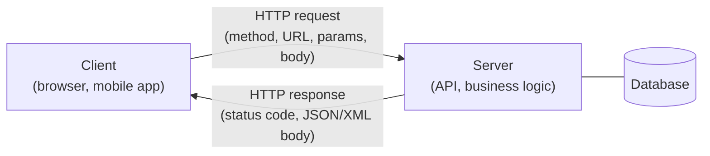
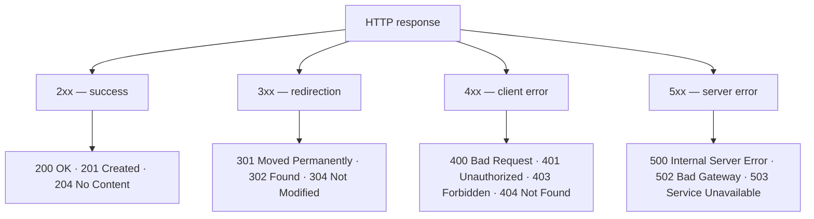

# API Testing

API questions are a mandatory part of almost every QA interview: modern
applications are built around client-server communication, and a tester who can
only work "through the UI by hand" checks just the tip of the iceberg. You are
expected to explain in your own words what an API is, name the basic HTTP
methods and status code families, walk through a couple of practical cases (a
wrong password, for instance), and show that you have actually used Postman or
a similar tool.

## Client-server architecture and what an API is

**Client-server architecture** is a model in which an application is split into
two parts: the **client** (a browser, a mobile app, a desktop program) sends
requests, and the **server** receives them, processes them (business logic,
database access) and returns responses. Client and server communicate over the
network, most often via HTTP/HTTPS.

**API (Application Programming Interface)** is a contract: a set of rules and
descriptions that lets one program talk to another. In simple words, an API is
the server's "menu" — the list of operations (endpoints), the request and
response formats the client is allowed to use. The client doesn't need to know
how the server works inside; knowing the contract is enough.

**The 60-second interview answer.** "The application is split into a client and
a server. The client sends HTTP requests to the server's endpoints; the server
runs the logic and returns a response with a status code and a body. An API is
the contract of this interaction: which endpoints exist, which methods and
parameters they accept, and in which format they respond. By testing the API I
verify that contract directly, bypassing the UI."

## Why test the API separately from the UI

A frequent question: "If you can test through the UI, why test the API on its
own?" The answers:

- **Earlier and cheaper.** The API is ready before the interface, so bugs are
  found at an early stage, when fixing them is cheap (see [the test pyramid and Shift Left](topic:qa-pyramid-shift-left)).
- **Precise localization.** If a UI test fails, it's unclear whether the
  frontend or the backend is at fault. A direct API call immediately shows
  where the defect is.
- **Broader coverage.** Through the API you can easily send boundary and
  invalid data that the UI validates and simply won't let through (empty
  fields, huge strings, wrong types, missing required parameters).
- **Speed and stability.** API tests run in milliseconds and don't break when
  the layout is redrawn, which is why they are automated most often (see [test automation](topic:qa-automation)).

## HTTP methods: the four basic ones

Naming four confidently is enough (sometimes you're also asked about PATCH):

- **GET** — retrieve data (read a resource). Must not change server state;
  idempotent and safe.
- **POST** — create a new resource or submit data for processing (data goes in
  the request body). Not idempotent: a repeated call usually creates another
  record.
- **PUT** — fully update/replace an existing resource (or create one with a
  known identifier). Idempotent: a repeated call leaves the same state.
- **DELETE** — remove a resource. Idempotent: deleting an already deleted
  resource changes nothing.

**PATCH** (partial update — change one field without sending the whole object)
is a nice bonus to the answer.

**Typical follow-up questions.** "What is idempotency?" — repeating the call
does not change the system's state after the first execution (GET, PUT, DELETE
are idempotent; POST is not). "How does PUT differ from PATCH?" — PUT replaces
the resource entirely, PATCH modifies part of it.

## GET vs POST and URL parameters

This is a separate favourite question, conveniently answered with a table:

| Criterion | GET | POST |
|---|---|---|
| Purpose | Retrieve data | Submit data, create a resource |
| Where parameters go | In the URL, via query string | In the request body |
| Idempotency | Yes | No |
| Caching | Response may be cached | Not cached by default |
| Data size limit | Limited by URL length | Practically unlimited |
| Bookmarks/history | URL with parameters can be saved | Body is not saved in history |

**Can you pass parameters in GET?** Yes — right in the URL through the query
string after the question mark, pairs separated by ampersands:
`https://api.example.com/users?param1=key1&param2=key2`. Here `param1=key1` and
`param2=key2` are query parameters.

**Trap.** "So can login and password be sent via GET?" — no: URL parameters end
up in server logs, browser history and bookmarks, so secrets get exposed.
Credentials go in the request body (POST) over HTTPS.

## Status codes: the 2xx/3xx/4xx/5xx families

A status code is a three-digit number in the server's response; the first digit
defines the class:

- **2xx — success.** `200 OK` — the request was processed successfully;
  `201 Created` — a resource was created (a typical POST response);
  `204 No Content` — success with no response body (typical for DELETE).
- **3xx — redirection.** `301 Moved Permanently` — the resource moved for good;
  `302 Found` — temporary redirect; `304 Not Modified` — data hasn't changed,
  use the cache.
- **4xx — client error.** `400 Bad Request` — invalid request (broken JSON, a
  missing required field); `401 Unauthorized` — missing or wrong credentials;
  `403 Forbidden` — authenticated but lacking permissions; `404 Not Found` —
  resource not found; `405 Method Not Allowed` — the endpoint doesn't support
  this method.
- **5xx — server error.** `500 Internal Server Error` — an unhandled server
  failure; `502 Bad Gateway` — an upstream service failed; `503 Service
  Unavailable` — the server is overloaded or down for maintenance.

### Case study: wrong login and password

A classic: "You enter an incorrect login and password on the client, and the
server returns an error. What status code is it?" The correct answer is
**401 Unauthorized** (other 4xx codes also count as a reasonable answer if you
can justify them, but 401 is what's expected). Don't mix it up here: `401`
means "I don't know who you are" (an authentication problem), while `403` means
"I know who you are, but access is denied" (an authorization problem). `400` is
possible if the request is formally invalid (an empty password field, say), but
a well-formed request with a wrong login/password pair is a 401.

**Trap.** Never call a wrong-password error a 5xx: 5xx means the server is at
fault, whereas invalid credentials are a client-side problem.

## XML vs JSON

Both formats describe structured data, but JSON has displaced XML in web APIs:

- **Syntax.** XML uses tags with opening and closing elements
  (`<user><name>Ivan</name></user>`); JSON uses key-value pairs
  (`{"name": "Ivan"}`).
- **Compactness.** JSON is lighter and shorter — less markup overhead, faster
  to parse.
- **Data types.** JSON has built-in types (number, string, boolean, null,
  array, object); in XML everything is a string, with types defined by a
  schema (XSD).
- **Readability and tooling.** JSON is natively supported by JavaScript and
  all modern languages; XML is stronger where strict schemas, namespaces,
  comments and attributes are needed — for example, in SOAP and enterprise
  integrations.

## REST vs SOAP and WSDL

- **REST (REST API)** — an architectural style on top of HTTP: resources are
  addressed by URLs, operations are expressed via HTTP methods
  (GET/POST/PUT/DELETE), and data is usually JSON. Lightweight, flexible, the
  de facto standard for web and mobile applications.
- **SOAP** — a formal protocol for exchanging XML messages (an Envelope with a
  header and a body); it can run over protocols other than HTTP. A strict
  contract, built-in security and transaction standards (WS-*), common in
  banking, government systems and legacy integrations.
- **WSDL (Web Services Description Language)** — an XML document describing a
  SOAP service: which operations exist, which messages they accept and return,
  and at which address the service is available. Tools (e.g. SoapUI) generate
  request stubs automatically from a WSDL. For REST, the same role is played
  by OpenAPI/Swagger.

## Authentication over HTTP

Schemes you should be able to list:

- **Basic Auth** — login and password in Base64 in the `Authorization` header
  (only over HTTPS; Base64 is not encryption).
- **Bearer Token** — a token in the `Authorization: Bearer <token>` header;
  the most common option for APIs.
- **API Key** — a key in a header or a query parameter.
- **OAuth 2.0 / JWT** — delegated authorization: the client obtains an access
  token (often a JWT) from an authorization server and presents it to the API.
- **Cookies / sessions** — the classic web application approach: the server
  sets a session cookie after login.

## Synchronous vs asynchronous

A **synchronous call** — the client sends a request and waits for the response,
blocked: it doesn't continue until the server replies. An **asynchronous** one —
the client sends the request and keeps working; the response arrives later (a
callback, polling, WebSocket, a message queue). The difference is practical for
a tester: asynchronous operations can't be verified with an immediate follow-up
request — you must wait for the result with a timeout and repeated polls,
otherwise you get flaky tests.

## Tools for API testing

- **Postman** — the most popular: request collections, environments, variables,
  JavaScript tests, automated runs via Newman.
- **Swagger UI / OpenAPI** — interactive REST API documentation from which you
  can send requests.
- **SoapUI** — for SOAP services (and REST too).
- **curl** — the command line, quick checks and examples from documentation.
- **Browser DevTools (the Network tab)** — peek at the requests the frontend
  sends and replay them.
- For automation: **REST Assured** (Java), **requests** (Python), Karate,
  Playwright/Supertest — see [test automation](topic:qa-automation).

**The 60-second interview answer** to "what did you use to test APIs": "Mostly
Postman: I built collections per endpoint, configured environments and
variables, wrote checks for status codes and response bodies, and ran negative
scenarios. I inspected requests in DevTools and read the docs in Swagger. For
SOAP I used SoapUI against the WSDL."
