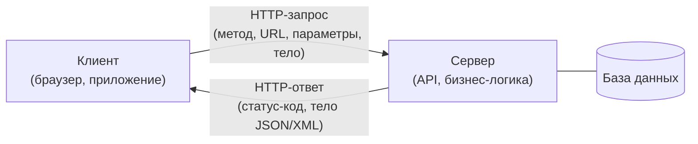
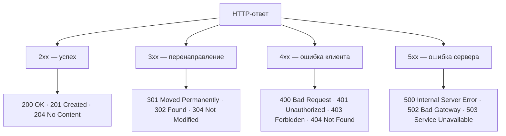

# Тестирование API

Вопросы про API — обязательный блок почти любого собеседования на QA: современные
приложения строятся вокруг клиент-серверного взаимодействия, и тестировщик,
который умеет работать только «руками через UI», проверяет лишь верхушку айсберга.
От вас ждут, что вы свободно объясните, что такое API своими словами, назовёте
базовые HTTP-методы и группы статус-кодов, разберёте пару прикладных кейсов
(например, неверный пароль) и покажете, что держали в руках Postman или аналог.

## Клиент-серверная архитектура и что такое API

**Клиент-серверная архитектура** — модель, в которой приложение разделено на две
части: **клиент** (браузер, мобильное приложение, десктопная программа) отправляет
запросы, а **сервер** их принимает, обрабатывает (бизнес-логика, обращения к базе
данных) и возвращает ответы. Клиент и сервер общаются по сети, чаще всего по
протоколу HTTP/HTTPS.

**API (Application Programming Interface)** — это контракт, набор правил и
описаний, по которым одна программа может обращаться к другой. Своими словами:
API — это «меню» сервера: список операций (endpoint'ов), форматы запросов и
ответов, которые клиенту разрешено использовать. Клиенту не нужно знать, как
сервер устроен внутри, — достаточно знать контракт.

**Ответ на собесе за 60 секунд.** «Приложение разделено на клиента и сервера.
Клиент шлёт HTTP-запросы на endpoint'ы сервера, сервер выполняет логику и
возвращает ответ со статус-кодом и телом. API — это контракт этого
взаимодействия: какие endpoint'ы есть, какие методы и параметры они принимают и
в каком формате отвечают. Тестируя API, я проверяю этот контракт напрямую,
минуя UI».

## Зачем тестировать API отдельно от UI

Частый вопрос: «Если можно тестировать сразу через UI, зачем отдельно тестировать
API?» Ответы:

- **Раньше и дешевле.** API готов раньше, чем интерфейс, — баги находят на ранней
  стадии, когда их исправление стоит дёшево (см. [пирамиду тестирования и Shift Left](topic:qa-pyramid-shift-left)).
- **Точнее локализация.** Если тест через UI упал, непонятно, виноват фронтенд
  или бэкенд. Прямой вызов API сразу показывает, где дефект.
- **Больше покрытие.** Через API легко подать граничные и некорректные данные,
  которые UI валидирует и просто не даёт отправить (пустые поля, огромные строки,
  неверные типы, пропущенные обязательные параметры).
- **Скорость и стабильность.** API-тесты выполняются за миллисекунды и не ломаются
  от перерисовки верстки, поэтому именно их чаще всего автоматизируют (см. [автоматизацию тестирования](topic:qa-automation)).

## HTTP-методы: четыре базовых

Достаточно уверенно назвать четыре (иногда спрашивают ещё про PATCH):

- **GET** — получить данные (чтение ресурса). Не должен изменять состояние
  сервера; идемпотентен и безопасен.
- **POST** — создать новый ресурс или отправить данные на обработку (данные
  передаются в теле запроса). Не идемпотентен: повторный вызов обычно создаёт
  ещё одну запись.
- **PUT** — полностью обновить/заменить существующий ресурс (или создать с
  известным идентификатором). Идемпотентен: повторный вызов даёт то же состояние.
- **DELETE** — удалить ресурс. Идемпотентен: повторное удаление уже удалённого
  ресурса не меняет результат.

**PATCH** (частичное обновление — поменять одно поле, не присылая весь объект) —
хороший бонус к ответу.

**Типовые follow-up вопросы.** «Что такое идемпотентность?» — повторный вызов
метода не меняет состояние системы после первого выполнения (GET, PUT, DELETE —
идемпотентны, POST — нет). «Чем PUT отличается от PATCH?» — PUT заменяет ресурс
целиком, PATCH меняет часть.

## GET vs POST и параметры в URL

Это отдельный любимый вопрос, удобно отвечать таблицей:

| Критерий | GET | POST |
|---|---|---|
| Назначение | Получение данных | Отправка данных, создание ресурса |
| Где параметры | В URL, через query string | В теле запроса |
| Идемпотентность | Да | Нет |
| Кэширование | Ответ может кэшироваться | По умолчанию не кэшируется |
| Ограничение на размер данных | Ограничено длиной URL | Практически не ограничено |
| Закладки/история | URL с параметрами можно сохранить | Тело в истории не сохраняется |

**Можно ли передавать параметры в GET?** Да — прямо в URL через query string
после знака вопроса, пары разделяются амперсандом:
`https://api.example.com/users?param1=key1&param2=key2`. Здесь `param1=key1` и
`param2=key2` — query-параметры.

**Ловушка.** «Значит, логин и пароль можно отправлять GET'ом?» — нет: параметры
в URL попадают в логи сервера, историю браузера и закладки, то есть секреты
«засвечиваются». Учётные данные передают в теле запроса (POST) по HTTPS.

## Статус-коды: группы 2xx/3xx/4xx/5xx

Статус-код — трёхзначное число в ответе сервера, первая цифра задаёт класс:

- **2xx — успех.** `200 OK` — запрос успешно обработан; `201 Created` — ресурс
  создан (типичный ответ на POST); `204 No Content` — успех без тела ответа
  (типично для DELETE).
- **3xx — перенаправление.** `301 Moved Permanently` — ресурс переехал навсегда;
  `302 Found` — временный редирект; `304 Not Modified` — данные не изменились,
  берите из кэша.
- **4xx — ошибка клиента.** `400 Bad Request` — невалидный запрос (битый JSON,
  нет обязательного поля); `401 Unauthorized` — нет или неверны учётные данные;
  `403 Forbidden` — аутентификация есть, но прав не хватает; `404 Not Found` —
  ресурс не найден; `405 Method Not Allowed` — метод не поддерживается
  endpoint'ом.
- **5xx — ошибка сервера.** `500 Internal Server Error` — необработанная ошибка
  на сервере; `502 Bad Gateway` — сбой вышестоящего сервиса; `503 Service
  Unavailable` — сервер перегружен или на обслуживании.

### Кейс: неверные логин и пароль

Классика: «Вы вводите на клиенте некорректные логин и пароль, сервер отдаёт
ошибку. Какой статус-код?» Правильный ответ — **401 Unauthorized** (другие 4xx
тоже засчитывают как разумный ответ, если умеете обосновать, но ожидают именно
401). Здесь же важно не перепутать: `401` — «не знаю, кто ты» (проблема
аутентификации), `403` — «знаю, кто ты, но доступ запрещён» (проблема
авторизации). `400` возможен, если запрос формально невалиден (например, пустое
поле пароля), но валидный запрос с неверной парой логин/пароль — это 401.

**Ловушка.** Не называйте ошибку неверного пароля пятисотой: 5xx означает, что
виноват сервер, а неверные учётные данные — проблема на стороне клиента.

## XML vs JSON

Оба формата описывают структурированные данные, но JSON вытеснил XML в веб-API:

- **Синтаксис.** XML — теги с открывающими и закрывающими элементами
  (`<user><name>Ivan</name></user>`), JSON — пары ключ-значение
  (`{"name": "Ivan"}`).
- **Компактность.** JSON легче и короче — меньше служебных символов, быстрее
  парсится.
- **Типы данных.** В JSON есть типы из коробки (число, строка, boolean, null,
  массив, объект); в XML всё — строки, типы задаются схемой (XSD).
- **Читаемость и инструменты.** JSON нативно поддерживается JavaScript и всеми
  современными языками; XML сильнее там, где нужны строгие схемы, пространства
  имён, комментарии, атрибуты — например, в SOAP и корпоративных интеграциях.

## REST vs SOAP и WSDL

- **REST (REST API)** — архитектурный стиль поверх HTTP: ресурсы адресуются URL,
  операции выражаются HTTP-методами (GET/POST/PUT/DELETE), данные обычно в JSON.
  Лёгкий, гибкий, стандарт де-факто для веб- и мобильных приложений.
- **SOAP** — формальный протокол обмена XML-сообщениями (конверт Envelope с
  заголовком и телом), может работать не только поверх HTTP. Строгий контракт,
  встроенные стандарты безопасности и транзакций (WS-*), встречается в банках,
  госсистемах и legacy-интеграциях.
- **WSDL (Web Services Description Language)** — XML-документ, описывающий
  SOAP-сервис: какие операции есть, какие сообщения принимают и возвращают, по
  какому адресу доступен. По WSDL инструменты (например, SoapUI) автоматически
  генерируют заготовки запросов. У REST аналогичную роль играет OpenAPI/Swagger.

## Аутентификация через HTTP

Способы, которые стоит уметь перечислить:

- **Basic Auth** — логин и пароль в Base64 в заголовке `Authorization`
  (только по HTTPS, Base64 — это не шифрование).
- **Bearer Token** — токен в заголовке `Authorization: Bearer <token>`;
  самый распространённый вариант для API.
- **API Key** — ключ в заголовке или query-параметре.
- **OAuth 2.0 / JWT** — делегированная авторизация: клиент получает у
  авторизационного сервера access token (часто в формате JWT) и предъявляет его API.
- **Cookies / сессии** — классика веб-приложений: сервер ставит session cookie
  после логина.

## Синхронность и асинхронность

**Синхронный вызов** — клиент отправил запрос и ждёт ответа, блокируясь: пока
сервер не ответил, клиент не продолжает работу. **Асинхронный** — клиент
отправил запрос и продолжает работать; ответ придёт позже (callback, polling,
WebSocket, очередь сообщений). Для тестировщика разница практическая: асинхронные
операции нельзя проверять мгновенным повторным запросом — результат нужно ждать
с таймаутом и повторными опросами, иначе получите мерцающие (flaky) тесты.

## Инструменты для тестирования API

- **Postman** — самый популярный: коллекции запросов, окружения, переменные,
  тесты на JavaScript, автопрогоны через Newman.
- **Swagger UI / OpenAPI** — интерактивная документация REST API, из которой
  можно отправлять запросы.
- **SoapUI** — для SOAP-сервисов (и REST тоже).
- **curl** — командная строка, быстрые проверки и примеры из документации.
- **DevTools браузера (вкладка Network)** — подсмотреть, какие запросы шлёт
  фронтенд, и воспроизвести их.
- Для автоматизации: **REST Assured** (Java), **requests** (Python), Karate,
  Playwright/Supertest — см. [автоматизацию тестирования](topic:qa-automation).

**Ответ на собесе за 60 секунд** на «чем тестировали API»: «В основном Postman:
собирал коллекции по endpoint'ам, настраивал окружения и переменные, писал
проверки статус-кодов и тел ответов, гонял негативные сценарии. Запросы
подсматривал в DevTools, документацию — в Swagger. Для SOAP использовал SoapUI
по WSDL».
