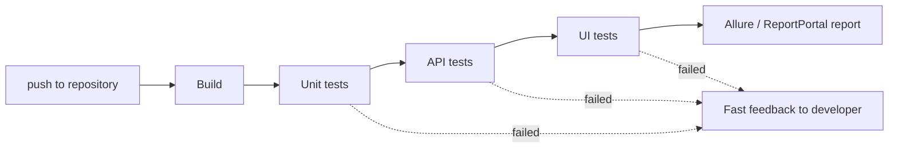

# Test Automation

Automation is the most "technical" part of a QA interview: it checks not only whether
you know the definitions, but whether you have actually written and maintained automated
tests. A typical block of questions moves in a spiral: why automate → what a good
automated test looks like → how to run the whole suite in CI fast and reliably. Below is
that entire path in order, including the interviewers' favorite situational puzzle about
the pizzeria.

## When and why to automate

You don't automate "everything" — you automate what pays off:

- **regression testing** — the same checks run on every release;
- **smoke checks** — a fast verification that the build is alive at all;
- **stable, rarely changing functionality** — an automated test against a "floating" UI
  costs more to maintain than manual checking;
- **routine scenarios with large data volumes** (data-driven).

One-off checks, exploratory testing, and anything that changes every sprint are not
automated. How tests are distributed across levels (unit / API / UI) and why UI tests
should be the fewest is covered in the topic
[Test Pyramid and Shift Left](topic:qa-pyramid-shift-left).

> **The 60-second interview answer.** We automate what is repeatable, stable, and
> critical: regression and smoke first of all. The goal is fast feedback on build
> quality and freeing testers from routine work for exploratory testing. Payback logic:
> an automated test is worth it if the scenario will run dozens of times unchanged.

## PageObject

**PageObject** is a pattern where each page (or screen) of the application is described
by its own class: element locators and the methods that work with them are encapsulated
inside, while the test operates only with business actions
(`loginPage.enterCredentials().submit()`) and knows nothing about CSS/XPath.

It is used in UI automation (Selenium for web, Appium for mobile). What it gives you:

- a locator changed — you fix one place instead of thirty tests;
- tests read like a scenario in the "domain language";
- no duplicated element-handling code.

> **Typical follow-up questions:** how does PageObject differ from Page Factory (the
> factory is just a lazy element-initialization mechanism inside a PageObject)? Where do
> shared elements go — into a base page class?

## CI and the problem it solves

**CI (Continuous Integration)** is the practice where every code change is automatically
built and run through tests. The problem it solves is late discovery of breakage:
without CI, code piles up in branches for weeks, and conflicts and bugs surface at
release time ("but it worked on my machine"). CI gives fast feedback: you broke
something — you know within minutes of the push.

Automated tests are built into the pipeline: commit → build → unit tests → API tests →
UI tests → report. Tools: Jenkins, GitLab CI, GitHub Actions, TeamCity.

## Appium vs native tools

A classic mobile-automation question: cross-platform Appium or native frameworks
(Espresso for Android, XCUITest for iOS).

| Criterion | Appium | Native (Espresso / XCUITest) |
|---|---|---|
| Codebase | One codebase for both platforms | Separate code for Android and iOS |
| Speed | Slower (WebDriver layer in between) | Faster, run inside the app |
| Location | Separate project | Live in the app code; developers can write them |
| Support | Weaker: lags behind new OS versions, flaky locators | Maintained by Google / Apple |
| Maintenance cost | Lower: one framework | Twice as hard: two codebases, two stacks |

In short: **Appium pros** — cross-platform, one codebase for both platforms; **cons** —
poor support and slow execution. **Native pros** — speed, and tests live in the code so
developers can write them; **cons** — separate codebases, twice the maintenance. The
choice depends on the team: many platforms and few resources — Appium; speed and
stability are critical — native. For the broader mobile testing context see
[Mobile Application Testing](topic:qa-mobile-testing).

## Automating payments and analytics

Two "think about it" questions that check whether you understand that not everything can
be clicked through the real UI:

- **Payments.** Real money is never used in tests. Options: test cards and the payment
  provider's sandbox mode (Stripe, CloudPayments, etc. provide test environments),
  mocking the payment gateway, a dedicated test merchant. You verify both success and
  declines (insufficient funds, wrong CVV) — sandboxes support that.
- **Analytics.** Analytics events are invisible in the UI. They are verified by
  intercepting traffic: a proxy (Charles/Proxyman), logs on a test build with analytics
  debug mode, or a mock server that receives events and lets you compare the payload
  (event name, parameters).

## Reporting: Allure and ReportPortal

An automated test without a report is just noise. The standard set:

- **Allure** — a rich report of the run: steps, screenshots, attachments, failure
  categories, history. Generated from test framework results.
- **ReportPortal** — a centralized store of all run results: trends, automatic failure
  analysis (matches failures against already-filed bugs), dashboards for management.

> **Typical follow-up:** what must a report contain so that someone without access to
> the code can work with it? — test steps, a screenshot at the moment of failure, the
> stack trace / server response, the environment and the build version.

## A good automated test: the checklist

The question "what should a good automated test look like from a technical standpoint"
is asked almost verbatim. Answer with a list:

- **fixtures / preconditions** — the test prepares its own data and environment, with no
  "manual" setup;
- **postconditions** — cleans up after itself (data cleanup, teardown);
- **atomicity** — verifies a single scenario, independent of other tests and of run
  order;
- **one assert** — one logical check per test: when it fails, it's immediately clear
  what broke;
- **no flakiness** — stable across repeated runs;
- **readable** — the name and steps say what is being verified;
- **clear error messages** — the failure shows what was expected and what was received.

## Locator types

A locator is a way to find an element on a page/screen. The main types:

- **id** — the fastest and most reliable; on mobile — `accessibility id` / resource-id;
- **name, className** — simple, but often not unique;
- **CSS selector** — fast, readable, flexible (classes, attributes, hierarchy);
- **XPath** — the most powerful (search by text, navigation up the tree), but the
  slowest and most fragile: the markup changes — the XPath breaks;
- **linkText / partialLinkText** — for links, by their text.

The difference expected in the answer: **speed and stability**. Practical priority:
id → CSS → XPath (XPath is the last resort when nothing else reaches the element).

## Situational puzzle: the pizzeria at night

A favorite "how do you think" question. The setup: automated tests run at night against
a clean database. To order a pizza you need an open pizzeria, but at night all pizzerias
are closed. What do you do?

The ideal answer — **mock the data**: a test must not depend on the real time of day or
real restaurants. Options in descending order of elegance:

1. **Mock/stub the service** that returns a list of "open" pizzerias — the test fully
   controls its data.
2. **Prepare data via API** — before the test, call the API/admin panel and create an
   open pizzeria with the needed schedule.
3. **Write directly to the DB** — seeding test data (works, but is more fragile: the
   test is coupled to the database schema).
4. Mock the **time** (clock) if the open/closed logic is computed on the backend.

Here the interviewer is watching your approach to data setup: a good automated test
creates its own preconditions (see the checklist above) instead of hoping that
"something exists in the database".

> **The trap.** Answering "let's move the run to daytime" or "we'll wait for opening
> hours" is a failure: tests must be deterministic and independent of when they run.

## Asserts and their kinds

An **assert** is a check that compares the actual result with the expected one and fails
if they don't match. Typical kinds (JUnit/TestNG/AssertJ examples):

- `assertTrue` / `assertFalse` — a condition is true/false;
- `assertEquals` / `assertNotEquals` — value equality;
- `assertNull` / `assertNotNull`;
- `assertThrows` — the code throws the expected exception.

A separate distinction: **hard assert** — the test fails on the first failed check — and
**soft assert** (e.g. `SoftAssertions` in AssertJ) — collects all mismatches and fails at
the end, showing everything at once; handy for forms with many fields. Tools: built-in
JUnit/TestNG asserts, AssertJ, Hamcrest (matchers), Rest Assured for APIs.

## Flaky tests

A **flaky test** is a test that passes and fails without any code changes. Causes: race
conditions and unstable waits (sleep instead of explicit waits), order dependence,
external services, unstable locators, data shared between tests.

What to do with them: **stabilize or kill**. A flaky test is worse than no test: it
teaches the team to ignore failures, and a real bug drowns in the noise. The practice:
quarantine (a separate suite outside the blocking pipeline), root-cause analysis, a fix —
or deletion if the test's value doesn't justify its instability.

## Speeding up runs: parallelization

As a run grows, it is accelerated with **parallelization**. Then comes the tricky
follow-up: how does a parallel run differ from a distributed one?

- **Parallel run** — the same set of tests runs simultaneously on different
  devices/environments (verification across many configurations).
- **Distributed run** — the whole test set is split into parts that execute
  simultaneously on different machines (reducing wall-clock time).

Other speed-ups: shrinking the share of slow UI tests (see the
[test pyramid](topic:qa-pyramid-shift-left)), explicit waits instead of sleeps,
splitting into smoke (fast, on every commit) and full regression (nightly).

**Optimal UI run time.** There is no single standard, but the benchmark expected in an
interview: a UI run in CI should fit within **15–30 minutes** — otherwise feedback
arrives too late and developers stop reacting to it. Longer than that — trim the suite
or parallelize it.

> **Typical follow-up questions:** how many parallel threads to choose (depends on the
> infrastructure; make sure tests don't fight over shared data)? What to do when
> parallel tests conflict (data isolation, unique users/entities per thread)?
