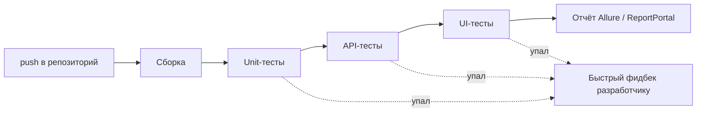

# Автоматизация тестирования

Автоматизация — самая «техническая» часть собеседования на QA: здесь проверяют не только
знание определений, но и то, доводилось ли тебе реально писать и поддерживать автотесты.
Типичный блок вопросов идёт по спирали: зачем автоматизировать → как устроен хороший
автотест → как это всё гонять в CI быстро и стабильно. Ниже — весь этот путь по порядку,
включая любимую ситуационную задачу интервьюеров про пиццерию.

## Когда и зачем автоматизировать

Автоматизируют не «всё подряд», а то, что окупается:

- **регрессионное тестирование** — одни и те же проверки гоняются на каждый релиз;
- **smoke-проверки** — быстрая проверка, что сборка вообще жива;
- **стабильный, редко меняющийся функционал** — автотест на «плавающий» UI дороже
  поддерживать, чем проверять руками;
- **рутинные сценарии с большими объёмами данных** (data-driven).

Не автоматизируют разовые проверки, исследовательское тестирование и то, что меняется
каждый спринт. О том, как автотесты раскладываются по уровням (unit / API / UI) и почему
UI-тестов должно быть меньше всего, — в теме
[Пирамида тестирования и Shift Left](topic:qa-pyramid-shift-left).

> **Ответ на собесе за 60 секунд.** Автоматизируем повторяемое, стабильное и критичное:
> прежде всего регресс и smoke. Цель — быстрый фидбек о качестве сборки и освобождение
> тестировщиков от рутины под исследовательское тестирование. Окупаемость считаем так:
> автотест выгоден, если сценарий будет прогоняться десятки раз без изменений.

## PageObject

**PageObject** — паттерн, при котором каждая страница (или экран) приложения описывается
отдельным классом: локаторы элементов и методы работы с ними инкапсулированы внутри, а
тест оперирует только бизнес-действиями (`loginPage.enterCredentials().submit()`), не
зная о CSS/XPath.

Применяется в UI-автоматизации (Selenium для web, Appium для mobile). Что даёт:

- изменился локатор — правим одно место, а не тридцать тестов;
- тесты читаются как сценарий на «языке предметной области»;
- нет дублирования кода работы с элементами.

> **Типовые follow-up вопросы:** чем PageObject отличается от Page Factory (фабрика —
> просто механизм ленивой инициализации элементов внутри PageObject)? Куда выносить
> общие элементы — в базовый класс страницы?

## CI и какую проблему он решает

**CI (Continuous Integration)** — практика, при которой каждое изменение кода
автоматически собирается и прогоняется через тесты. Решаемая проблема — позднее
обнаружение поломок: без CI код копится в ветках неделями, а конфликты и баги
всплывают в момент релиза («а у меня на машине работало»). CI даёт быстрый фидбек:
сломал — узнал через минуты после push.

Автотесты встроены в pipeline: коммит → сборка → unit-тесты → API-тесты → UI-тесты →
отчёт. Инструменты: Jenkins, GitLab CI, GitHub Actions, TeamCity.

## Appium vs нативные инструменты

Классический вопрос про мобильную автоматизацию: кроссплатформенный Appium или нативные
фреймворки (Espresso для Android, XCUITest для iOS).

| Критерий | Appium | Нативные (Espresso / XCUITest) |
|---|---|---|
| Кодовая база | Один код для обеих платформ | Отдельный код под Android и iOS |
| Скорость | Медленнее (прослойка WebDriver) | Быстрее, работают внутри приложения |
| Расположение | Отдельный проект | Лежат в коде приложения, могут писать разработчики |
| Поддержка | Хуже: лагает обновление под новые OS, flaky-локаторы | Поддерживаются Google / Apple |
| Стоимость поддержки | Ниже: один фреймворк | В 2 раза сложнее: две кодовые базы, два стека |

Коротко: **плюсы Appium** — кроссплатформенность, один код для обеих платформ;
**минусы** — плохая поддержка и медленная работа. **Плюсы нативных** — скорость и то,
что тесты живут в коде и их могут писать разработчики; **минусы** — разная кодовая
база, поддержка в два раза дороже. Выбор зависит от команды: много платформ и мало
ресурсов — Appium; критична скорость и стабильность — нативные. Подробнее про контекст
мобильного тестирования — в теме [Тестирование мобильных приложений](topic:qa-mobile-testing).

## Автоматизация оплаты и аналитики

Два вопроса «на подумать», где проверяют, понимаешь ли ты, что не всё можно кликать
настоящим UI:

- **Оплата.** Реальные деньги в тестах не гоняют. Варианты: тестовые карты и
  sandbox-режим платёжного провайдера (Stripe, CloudPayments и т.п. дают тестовые
  окружения), моки платёжного шлюза, отдельный тестовый мерчант. Проверяем и успех, и
  отказы (недостаточно средств, неверный CVV) — sandbox это умеет.
- **Аналитика.** События аналитики (Analytics events) не видны в UI. Проверяют,
  перехватывая трафик: proxy (Charles/Proxyman), логи на тестовой сборке с debug-режимом
  аналитики, либо мок-сервер, который принимает события и позволяет сверить payload
  (имя события, параметры).

## Отчёты: Allure и ReportPortal

Автотест без отчёта — это шум. Стандартный набор:

- **Allure** — красивый отчёт о прогоне: шаги, скриншоты, вложения, категории падений,
  история. Генерируется из результатов тест-фреймворка.
- **ReportPortal** — централизованное хранилище результатов всех прогонов: тренды,
  автоанализ падений (сопоставляет падение с уже заведёнными багами), дашборды для
  менеджмента.

> **Типовой follow-up:** что должно быть в отчёте, чтобы по нему разбирался человек без
> доступа к коду? — шаги теста, скриншот в момент падения, стектрейс/ответ сервера,
> окружение и версия сборки.

## Хороший автотест: чек-лист

Вопрос «какой должен быть хороший автотест с технической точки зрения» задаётся почти
дословно. Отвечай списком:

- **фикстуры / прекондишены** — тест сам готовит данные и окружение, не зависит от
  «ручной» подготовки;
- **постусловия** — за собой убирает (очистка данных, teardown);
- **атомарность** — проверяет один сценарий, не зависит от других тестов и порядка
  запуска;
- **один assert** — одна логическая проверка на тест: упал — сразу ясно, что сломалось;
- **не флакует** — стабилен при повторных прогонах;
- **легко читается** — название и шаги говорят, что проверяется;
- **понятные сообщения об ошибке** — из падения видно, что ожидалось и что получили.

## Виды локаторов

Локатор — способ найти элемент на странице/экране. Основные виды:

- **id** — самый быстрый и надёжный; в mobile — `accessibility id` / resource-id;
- **name, className** — простые, но часто не уникальны;
- **CSS-селектор** — быстрый, читаемый, гибкий (классы, атрибуты, иерархия);
- **XPath** — самый мощный (поиск по тексту, навигация вверх по дереву), но самый
  медленный и хрупкий: меняется вёрстка — ломается XPath;
- **linkText / partialLinkText** — для ссылок по тексту.

Разница, которую ждут в ответе: **скорость и стабильность**. Приоритет на практике:
id → CSS → XPath (XPath — последняя инстанция, когда по-другому не достучаться).

## Ситуационная задача: пиццерия ночью

Любимый вопрос на «как мыслишь». Формулировка: автотесты запускаются на чистой базе,
ночью. Для заказа пиццы нужна открытая пиццерия, а ночью все пиццерии закрыты. Что
делать?

Идеальный ответ — **мокировать данные**: тест не должен зависеть от реального времени
суток и реальных ресторанов. Варианты по убыванию элегантности:

1. **Мок/стаб сервиса**, отдающего список «открытых» пиццерий, — тест полностью
   контролирует данные.
2. **Подготовка данных через API** — перед тестом дернуть API/админку и создать
   открытую пиццерию с нужным расписанием.
3. **Прямая запись в БД** — сидирование тестовых данных (работает, но хрупче: тест
   привязан к схеме базы).
4. Мокировать **время** (clock), если логика «открыто/закрыто» считается на бэкенде.

Здесь интервьюер смотрит именно на подход к сетапу данных: хороший автотест сам создаёт
себе прекондишены (см. чек-лист выше), а не надеется, что «в базе что-то есть».

> **Ловушка.** Ответ «перенесём прогон на день» или «будем ждать открытия» — провал:
> тесты обязаны быть детерминированными и независимыми от времени запуска.

## Assert и его виды

**Assert** — проверка, которая сравнивает фактический результат с ожидаемым и падает,
если они не совпали. Типичные виды (на примере JUnit/TestNG/AssertJ):

- `assertTrue` / `assertFalse` — условие истинно/ложно;
- `assertEquals` / `assertNotEquals` — равенство значений;
- `assertNull` / `assertNotNull`;
- `assertThrows` — код выбрасывает ожидаемое исключение.

Отдельно различают **hard assert** — тест падает на первой же неудачной проверке, и
**soft assert** (например, `SoftAssertions` в AssertJ) — собирает все несовпадения и
падает в конце, показывая всё сразу; удобен для форм с кучей полей. Инструменты:
встроенные asserts JUnit/TestNG, AssertJ, Hamcrest (matcher'ы), Rest Assured для API.

## Flaky-тесты

**Flaky-тест** — тест, который без изменений кода то проходит, то падает. Причины:
гонки и нестабильные ожидания (sleep вместо явных wait), зависимость от порядка,
внешние сервисы, нестабильные локаторы, общие данные между тестами.

Что с ними делать: **стабилизировать или убить**. Flaky-тест хуже отсутствующего: он
учит команду игнорировать падения, и реальный баг тонет в шуме. Практика: карантин
(отдельный набор вне блокирующего pipeline), разбор причины, исправление — или
удаление, если ценность теста не окупает его нестабильность.

## Ускорение прогонов: параллелизация

Когда прогон разрастается, его ускоряют **параллелизацией**. Дальше идёт каверзный
follow-up: чем параллельный прогон отличается от распределённого?

- **Параллельный прогон** — один и тот же набор тестов одновременно гоняется на
  разных устройствах/окружениях (проверка на многих конфигурациях).
- **Распределённый прогон** — весь набор тестов делится на части, которые одновременно
  выполняются на разных машинах (сокращение wall-clock времени).

Кроме этого прогоны ускоряют: уменьшением доли медленных UI-тестов (см.
[пирамиду тестирования](topic:qa-pyramid-shift-left)), явными ожиданиями вместо sleep,
разбиением на smoke (быстрый, на каждый коммит) и full regression (ночной).

**Оптимальное время UI-прогона.** Однозначного стандарта нет, но ориентир, который ждут
на собесе: UI-прогон в CI должен укладываться в **15–30 минут** — иначе фидбек
приходит слишком поздно и разработчики перестают на него реагировать. Дольше — режем
набор или распараллеливаем.

> **Типовые follow-up вопросы:** сколько потоков параллелизации выбрать (зависит от
> инфраструктуры; следить, чтобы тесты не дрались за общие данные)? Что делать, если
> параллельные тесты конфликтуют (изоляция данных, уникальные пользователи/сущности на
> поток)?
