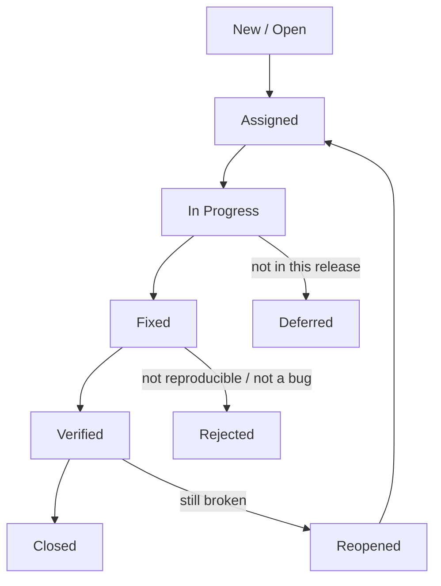

# Bug Report and Working with Defects

A **bug report** is the document a QA engineer uses to tell the team about a
defect they found. It is the main "product" of QA work: from it, a developer
understands what broke and how to reproduce it, and a manager understands how
urgent it is. At interviews, "what does a bug report consist of?" is asked of
almost every junior: it checks whether you can not just "find bugs" but write
them up so they can be fixed without ten follow-up questions in a chat.

A reminder of the terminology: the defect (bug) itself is a discrepancy between
the system's actual and expected behavior, while the bug report is merely its
description in a bug tracker (Jira, YouTrack, etc.). For the difference between
error, defect, and failure, see
[Error, Defect, and Failure](topic:qa-error-defect-failure).

## Structure of a Good Bug Report

The classic set of fields:

- **Summary (title)** — a short "what — where — under which conditions"
  formula. Bad: "Button doesn't work." Good: "The 'Pay' button is disabled in
  the cart when the order total exceeds $100." The summary alone should tell
  what the bug is about, without opening the ticket.
- **Steps to reproduce** — a numbered list of actions, starting from
  preconditions (which user, which data). The steps are written so that a
  person unfamiliar with the context can repeat them and see the same result.
  If the bug is not always reproducible, honestly state the frequency
  ("3 times out of 5").
- **Expected result** — how the system should behave according to the
  requirements.
- **Actual result** — what actually happens. The expected/actual pair is
  mandatory: without it, the developer cannot tell why this is a bug at all.
- **Environment** — application version, OS, browser and its version, the
  environment (test/stage/prod), device model for mobile. Many bugs live only
  in a specific environment.
- **Attachments** — screenshots, screencasts (screen recordings), logs, stack
  traces, HAR files, API responses. Logs and stack traces are especially
  valuable for backend errors: they immediately point to the place in the code
  where things fall over.
- **Severity and priority** — how harmful the bug is and how soon it should be
  fixed. Covered in detail in
  [Severity vs Priority](topic:qa-severity-vs-priority).

> **The 60-second interview answer.** A bug report is a description of a
> defect in a bug tracker. The mandatory minimum: a clear summary, steps to
> reproduce, expected and actual results, environment, severity and priority.
> Plus attachments — screenshots, screencasts, logs and stack traces — so the
> developer can reproduce and localize the problem without extra questions.

## Defect Prioritization

There are always more defects than time to fix them, so they are ranked along
two dimensions:

- **Severity** — the degree of impact on the system: from blocker (the system
  is down, data is lost) to trivial (cosmetic issues). Set by the tester, who
  assesses the technical impact.
- **Priority** — the order of fixing, a business decision. Set or adjusted by
  the manager or product owner.

The classic example of divergence: a crash on a rare scenario — high severity
but low priority (few users affected). A typo in the company name on the home
page right before a demo for investors — low severity but high priority.

## Bug Life Cycle

After asking about the report's contents, interviewers often ask what happens
to a bug next. The typical status flow:

QA opens a bug (New), a developer picks it up (In Progress) and marks it as
Fixed, then the tester **retests** it: if fixed — Verified/Closed, if not —
Reopened, and the cycle repeats. Separate branches: Rejected (not a bug,
duplicate, not reproducible) and Deferred (postponed).

## Situational Question: "A Critical Bug Reached Production — Who Is to Blame and What Do We Do?"

This is a favorite question for checking a candidate's maturity. The trap is to
start looking for a culprit ("the tester missed it!"). Quality is the whole
team's responsibility, and the interviewer expects a three-step answer model:

1. **Put out the fire first — don't look for someone to blame.** The priority
   is minimizing damage to users: roll back the release (rollback) or ship a
   hotfix, temporarily disable the broken functionality behind a feature flag,
   notify stakeholders.
2. **Then analyze the causes.** Once the incident is closed, run a blameless
   postmortem: how did the bug pass through every filter? Was there no test
   case? Was the scenario missing from regression? Did the test environment
   differ from production? Was the problem in the requirements?
3. **Fix the process, not the person.** The postmortem should produce concrete
   actions: add a test case to the regression suite, strengthen release smoke
   checks, improve monitoring and alerts, change the deployment procedure.

> **Trap.** Answering "the tester who missed it is to blame" is a red flag.
> A tester cannot guarantee the absence of bugs; if a critical defect reached
> production, it is a failure of the whole team's process (requirements,
> development, review, testing, release process), not of one person.

> **Typical follow-up questions.** What is a hotfix and how does it differ
> from a regular release? How would you write a bug report for a production
> defect when you don't know the reproduction steps? What helps prevent such
> bugs from slipping through (regression, smoke testing, monitoring,
> requirements testing)?

## How Not To: Signs of a Bad Report

- A "nothing works" summary with no specifics.
- No steps, or steps that start in the middle ("click the button" — which one,
  where?).
- Expected and actual results are mixed up, or the expected result is missing.
- No environment — and the bug "is not reproducible" on the developer's
  different version.
- Several independent problems in one report — the rule: one bug = one report.
- Emotions and judgments instead of facts ("terrible broken screen").

A good bug report saves the whole team's time: the developer immediately sees
where to look, the manager sees how urgent it is, and the tester can verify
the fix by following the same steps during retesting.
