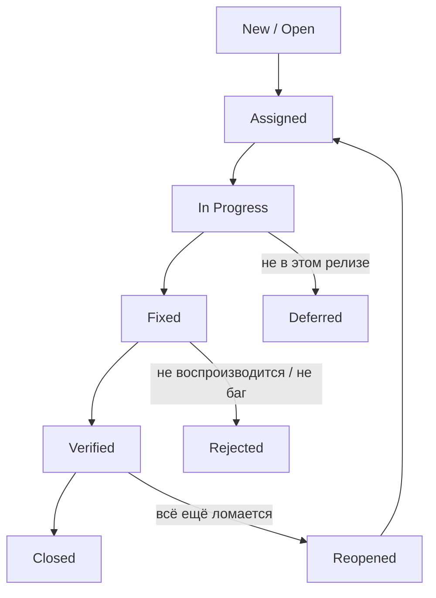

# Баг-репорт и работа с дефектами

**Баг-репорт** — это документ, которым тестировщик сообщает команде о найденном
дефекте. Это главный «продукт» работы QA: по нему разработчик понимает, что
сломалось и как это воспроизвести, а менеджер — насколько это срочно. На
собеседовании вопрос «из чего состоит баг-репорт?» задают почти каждому джуну:
он проверяет, умеешь ли ты не просто «находить баги», а оформлять их так, чтобы
их можно было исправить без десяти уточняющих вопросов в мессенджере.

Напомним терминологию: сам дефект (bug, defect) — это расхождение фактического
поведения системы с ожидаемым, а баг-репорт — лишь его описание в баг-трекере
(Jira, YouTrack и т.п.). О разнице между error, defect и failure см. тему
[Ошибка, дефект и отказ](topic:qa-error-defect-failure).

## Структура хорошего баг-репорта

Классический набор полей:

- **Заголовок (summary)** — короткая формула «что — где — при каких условиях».
  Плохо: «Не работает кнопка». Хорошо: «Кнопка "Оплатить" неактивна в корзине
  при сумме заказа больше 10 000 ₽». По заголовку должно быть понятно, о чём
  баг, без открытия карточки.
- **Шаги воспроизведения (steps to reproduce)** — нумерованный список действий,
  начиная с предусловий (какой пользователь, какие данные). Шаги пишутся так,
  чтобы человек, не знакомый с контекстом, мог повторить их и увидеть тот же
  результат. Если баг воспроизводится не всегда — честно указываем частоту
  («3 раза из 5»).
- **Ожидаемый результат (expected result)** — как система должна себя вести по
  требованиям.
- **Фактический результат (actual result)** — что происходит на самом деле.
  Пара «ожидаемый/фактический» обязательна: без неё разработчик не понимает,
  почему это вообще баг.
- **Окружение (environment)** — версия приложения, ОС, браузер и его версия,
  стенд (test/stage/prod), модель устройства для мобильных. Многие баги
  живут только в конкретном окружении.
- **Приложения (attachments)** — скриншоты, скринкасты (записи экрана), логи,
  стектрейсы, HAR-файлы, ответы API. Логи и стектрейсы особенно ценны для
  backend-ошибок: они сразу показывают место падения в коде.
- **Severity и priority** — насколько баг вреден и как скоро его чинить.
  Подробно разбираются в теме
  [Severity vs Priority](topic:qa-severity-vs-priority).

> **Ответ на собесе за 60 секунд.** Баг-репорт — это описание дефекта в
> баг-трекере. Обязательный минимум: понятный заголовок, шаги воспроизведения,
> ожидаемый и фактический результат, окружение, severity и priority. Плюс
> вложения — скриншоты, скринкасты, логи и стектрейсы, — чтобы разработчик мог
> воспроизвести и локализовать проблему без лишних вопросов.

## Приоритизация дефектов

Дефектов всегда больше, чем времени на их исправление, поэтому их сортируют.
Два измерения:

- **Severity** (серьёзность) — степень влияния на работу системы: от blocker
  (система не работает, данных теряются) до trivial (косметика). Выставляет
  тестировщик — он оценивает техническое влияние.
- **Priority** (приоритет) — очерёдность исправления, бизнес-решение. Выставляет
  или корректирует менеджер/владелец продукта.

Классический пример расхождения: падение приложения на редком сценарии —
высокий severity, но низкий priority (мало кто пострадает). А опечатка в названии
компании на главной странице перед презентацией инвесторам — низкий severity,
но высокий priority.

## Жизненный цикл бага

На собесе после состава репорта часто спрашивают, что происходит с багом
дальше. Типовой поток статусов:

QA открывает баг (New), разработчик берёт в работу (In Progress) и отмечает
как исправленный (Fixed), тестировщик **ретестит** его: если исправлено —
Verified/Closed, если нет — Reopened, и цикл повторяется. Отдельные ветки:
Rejected (не баг, дубликат, не воспроизводится) и Deferred (отложено).

## Ситуационный вопрос: «На прод ушёл критический баг — кто виноват и что делать?»

Это любимый вопрос на проверку зрелости кандидата. Ловушка — начать искать
виноватого («тестировщик пропустил!»). Качество — ответственность всей команды,
и интервьюер ждёт модель ответа в три шага:

1. **Сначала гасим пожар, а не ищем виноватых.** Приоритет — минимизировать
   ущерб пользователям: откатить релиз (rollback) или выпустить hotfix,
   временно отключить сломанную функциональность за feature flag, предупредить
   заинтересованных лиц.
2. **Затем анализируем причины.** Когда инцидент закрыт, проводим разбор
   (postmortem) без поиска козла отпущения: как баг прошёл через все фильтры?
   Не было тест-кейса? Сценарий не покрыт регрессом? Тестовое окружение
   отличалось от прода? Проблема в требованиях?
3. **Исправляем процесс, а не человека.** По итогам разбора — конкретные
   действия: добавить тест-кейс в регресс, усилить smoke-проверки релиза,
   дополнить мониторинг и алерты, поменять процедуру выкатки.

> **Ловушка.** Ответ «виноват тестировщик, который не нашёл» — красный флаг.
> Тестировщик не может гарантировать отсутствие багов; если критический дефект
> дошёл до прода, это сбой процесса всей команды (требования, разработка,
> ревью, тестирование, релизный процесс), а не одного человека.

> **Типовые follow-up вопросы.** Что такое hotfix и чем он отличается от
> обычного релиза? Как ты составишь баг-репорт на дефект с прода, если не
> знаешь шаги воспроизведения? Что помогает не пропускать такие баги
> (регресс, smoke, мониторинг, тестирование требований)?

## Как не надо: признаки плохого репорта

- Заголовок «ничего не работает» без конкретики.
- Нет шагов, или они начинаются с середины («нажми кнопку» — какую, где?).
- Смешаны ожидаемый и фактический результат, или ожидаемый отсутствует.
- Нет окружения — и баг «не воспроизводится» у разработчика на другой версии.
- Несколько независимых проблем в одном репорте — правило: один баг = один
  репорт.
- Эмоции и оценки вместо фактов («ужасный кривой экран»).

Хороший баг-репорт экономит время всей команде: разработчик сразу видит, где
искать, менеджер — насколько это срочно, а тестировщик при ретесте может
проверить исправление по тем же шагам.
