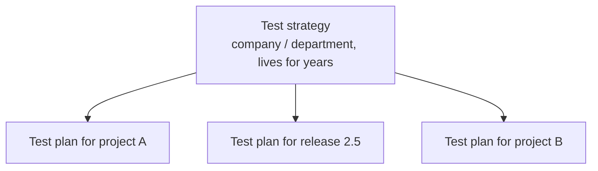
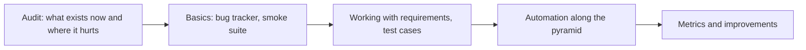

# Coverage, Test Strategy vs Test Plan

This is the middle-level "process" block of a QA interview: it tests not
textbook definitions but your ability to think like an engineer responsible
for quality as a whole. The interviewer wants to know whether you can prove
the product is covered by tests, whether you distinguish strategic decisions
from tactical ones, and whether you can improve a process yourself instead of
just following it. As a bonus, there are a couple of classic traps like email
validation, where the "correct" textbook answer diverges from practice.

## How to assess that everything is covered by tests

An honest answer starts with an admission: 100% coverage does not exist —
there are infinitely many possible tests and finite time. So coverage is
measured not in absolutes but as managed confidence:

- **Coverage / traceability matrix (Requirements Traceability Matrix, RTM)** —
  a table mapping every requirement to test cases. It answers: are there
  requirements without a single test? which tests break if a specific
  requirement changes? what should be regressed when a feature is modified?
- **Code coverage** — a useful metric for unit tests, but by itself it proves
  nothing: a line may be executed without its result ever being asserted.
- **Risk analysis** — coverage is distributed unevenly: critical and risky
  areas (payments, authentication) are tested deeper than unlikely scenarios.
- **Indirect signals** — production bug statistics by module: if defects keep
  surfacing in one area, coverage there is insufficient.

> **60-second interview answer:** "There is no such thing as 100% coverage,
> so I assess it through a traceability matrix: every requirement is linked
> to test cases, and gaps are immediately visible. I also look at code
> coverage as a supporting metric, distribute testing depth by risk, and
> track where production bugs come from."

**Typical follow-up questions:**

- If a requirement changes, how do you know which tests to update? (answer:
  via the traceability matrix)
- Code coverage is 90% — can we release? (no: it says nothing about the
  quality of assertions or about requirement coverage)
- Who keeps the RTM up to date, and doesn't it turn into bureaucracy?

## Test strategy vs test plan

A classic question on distinguishing two documents:

- **Test strategy** — a long-lived document at the company or department
  level. It describes the overall approach: which test types we apply and at
  which levels, which tools and environments we use, how roles are
  distributed, what our quality standards and "well covered" criteria are.
  It changes rarely.
- **Test plan** — a tactical document for a specific project or release. It
  describes: what exactly we test (scope and out of scope), who does it and
  when, which resources and environments are needed, entry and exit criteria,
  risks and schedule. It lives shortly — until the end of the release.

Strategy answers "how do we test in general"; plan answers "what and when do
we test in this release". The plan inherits the strategy and makes it
concrete:

More on what other documents a QA maintains and why — in the
[test documentation](topic:qa-test-documentation) topic.

**Trap:** don't confuse strategy with a "test policy" — that sits one level
higher (why the company cares about quality at all) and appears less often.
And never say a strategy is written per project — that is a common junior
mistake.

## Have you participated in process improvements?

A tricky question: answering "no, I just executed tasks" sounds weak at the
middle level. Process improvement is not necessarily a reform — it is any
change after which the team is better off. A working answer pattern is
problem → action → measurable result.

Example: "Bugs were regularly found during manual regression a day before
the release. I suggested moving the critical scenarios into an automated
smoke suite and running it in CI on every merge. Manual regression shrank
from two days to half a day, and blockers started surfacing the day they
appeared instead of right before the release."

Other typical examples: introduced blameless post-mortems of production bugs,
agreed on a definition of done with testing criteria, started test case
reviews, added a release checklist.

## How to check email validity? (a classic trap)

The intuitive answer — "write a regex" — is exactly the trap. Formally, email
syntax is defined by RFC 5322, and it is so broad (quoted strings, comments,
IP literals in the domain) that a fully compliant regex takes a page. But
even a perfect regex only checks *syntax*, not *existence*:
`valid-format@nonexistent-domain-12345.com` passes any check.

**The only working way to make sure an address is valid is to send a
verification message** with a confirmation link or code. Only the fact of
delivery and the user's reaction prove that the mailbox exists and belongs
to them.

What is done in practice, layer by layer:

- **Client-side validation** — deliberately loose (has `@`, a dot in the
  domain, no spaces): its job is not to reject "RFC-invalid" addresses but to
  catch typos. A too-strict regex will reject real addresses — that is a bug.
- **Server-side validation** — basic syntax, length, optionally blocking
  disposable domains.
- **Delivery confirmation** — a verification email; until confirmed, the
  account stays inactive.

> **60-second interview answer:** "Syntax can be checked with a simple regex,
> but RFC 5322 is too complex, and more importantly — syntax does not
> guarantee the mailbox exists. So the only reliable way is to send an email
> with a confirmation link. And I would test both layers: that the UI catches
> typos without rejecting valid exotic addresses, and that the confirmation
> flow works."

**Typical follow-up questions:** which test cases would you write for an
email field? (positive, typos, boundary lengths, unicode, empty value); how
do you test email sending without spamming? (a test SMTP like Mailtrap,
mail service sandboxes).

## How to build a testing process in a new team

This question checks systematic thinking and pragmatism. A bad answer is "I
will write a test plan and hire automation engineers". A good one is
iterative, driven by the team's pain:

1. **Audit** — understand the product, the stack, the release cycle; find out
   where the team loses the most (production bugs? slow regression? vague
   requirements?).
2. **Minimal foundation** — set up a bug tracker and a single report format,
   assemble a smoke suite for critical scenarios, agree on readiness criteria.
3. **Ordering** — join requirement discussions (shift left), introduce test
   cases where they pay off, not "for the record".
4. **Automation** — start with the cheapest layer of the test pyramid and wire
   the runs into CI/CD. See the
   [pyramid and shift left](topic:qa-pyramid-shift-left) topic.
5. **Metrics and feedback loop** — track production bugs and regression time,
   and regularly improve the process at retrospectives.

The key idea for the answer: a process is built for a specific team and
product, in small steps, with the effect measured — not by copying an "ideal"
process from a book.
