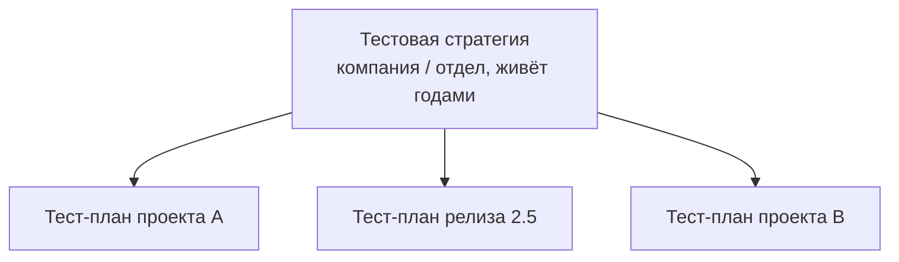
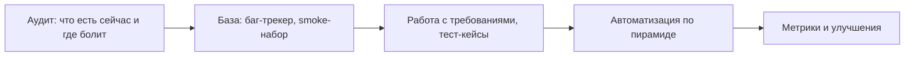

# Покрытие, стратегия и тест-план

Это блок «процессных» вопросов уровня middle: здесь проверяют не знание
терминов из учебника, а умение мыслить как инженер, отвечающий за качество
целиком. Собеседующий хочет понять: умеете ли вы доказать, что продукт
покрыт тестами, отличаете ли стратегические решения от тактических, можете
ли сами улучшать процесс, а не только следовать ему. Бонусом — пара
известных ловушек вроде валидации email, где «правильный» ответ из учебника
расходится с практикой.

## Как оценить, что всё покрыто тестами

Честный ответ начинается с признания: 100% покрытия не существует — тестов
бесконечно много, а время конечно. Поэтому покрытие оценивают не абсолютом,
а управляемой уверенностью:

- **Матрица покрытия / трассировки (Requirements Traceability Matrix, RTM)** —
  таблица, где каждому требованию сопоставлены тест-кейсы. Она отвечает на
  вопросы: есть ли требования без единого теста? какие тесты упадут, если
  изменится конкретное требование? что регрессировать при правке фичи?
- **Покрытие кода (code coverage)** — полезная метрика для unit-тестов, но
  сама по себе ничего не доказывает: строка может быть выполнена, но её
  результат никем не проверен.
- **Анализ рисков** — покрытие распределяют неравномерно: критичные и
  рискованные места (платежи, авторизация) покрывают глубже, чем маловероятные
  сценарии.
- **Косвенные сигналы** — статистика багов с продакшена по модулям: если
  дефекты стабильно вылезают в одной области, покрытие там недостаточно.

> **Ответ на собесе за 60 секунд:** «Стопроцентного покрытия не бывает, поэтому
> я оцениваю его через матрицу трассировки: каждое требование связано с
> тест-кейсами, и сразу видно дыры. Плюс смотрю на покрытие кода как на
> вспомогательную метрику, распределяю глубину тестирования по рискам и
> отслеживаю, откуда приходят баги с прода».

**Типовые follow-up вопросы:**

- Что будет, если требование изменится — как поймёте, какие тесты
  актуализировать? (ответ: по матрице трассировки)
- Покрытие кода 90% — можно релизить? (нет: это не говорит ни о качестве
  проверок, ни о покрытии требований)
- Кто поддерживает RTM в актуальности и не превращается ли она в
  бюрократию?

## Тестовая стратегия vs тест-план

Классический вопрос на различение двух документов:

- **Тестовая стратегия** — долгоживущий документ уровня компании или отдела.
  Описывает общий подход: какие виды тестирования применяем и на каких
  уровнях, какие инструменты и окружения используем, как распределяем роли,
  какие у нас стандарты качества и критерии «хорошо покрыто». Меняется редко.
- **Тест-план** — тактический документ под конкретный проект или релиз.
  Описывает: что именно тестируем (scope и out of scope), кто и когда,
  какие ресурсы и окружения нужны, входные и выходные критерии (entry/exit
  criteria), риски и график. Живёт недолго — до конца релиза.

Стратегия отвечает на вопрос «как мы вообще тестируем», план — «что и когда
мы тестируем в этом релизе». План наследует стратегию и конкретизирует её:

Подробнее о том, какие ещё документы ведёт QA и зачем — в теме
[тестовой документации](topic:qa-test-documentation).

**Ловушка:** не путайте с «тестовой политикой» — она ещё выше уровнем (зачем
компании качество вообще) и встречается реже. И не говорите, что стратегия
пишется под каждый проект — это частая ошибка джунов.

## Участвовали ли вы в улучшении процессов?

Вопрос с подвохом: ответ «нет, я просто выполнял задачи» на уровне middle
звучит слабо. Улучшение процесса — это не обязательно реформы, это любое
изменение, после которого команде стало лучше. Рабочая схема ответа —
проблема → действие → измеримый результат.

Пример: «Баги регулярно находились на регрессе вручную за день до релиза.
Я предложил вынести критичные сценарии в автоматический smoke-набор и
запускать его в CI на каждый merge. Ручной регресс сократился с двух дней
до половины дня, а блокеры стали всплывать в день появления, а не перед
релизом».

Другие типичные примеры: ввели разбор багов с прода (post-mortem без поиска
виноватых), договорились о definition of done с критериями тестирования,
начали ревью тест-кейсов, добавили чек-лист релиза.

## Как проверить валидность email? (известная ловушка)

Интуитивный ответ — «написать regex» — и есть ловушка. Формально синтаксис
email описан в RFC 5322, и он настолько широк (кавычки, комментарии,
IP-литералы в домене), что полный regex под него занимает страницу. Но даже
идеальный regex проверяет только *синтаксис*, а не *существование* адреса:
`valid-format@nonexistent-domain-12345.com` пройдёт любую проверку.

**Единственный рабочий способ убедиться, что адрес валиден, — отправить на
него проверочное письмо** со ссылкой или кодом подтверждения. Только факт
доставки и реакция пользователя доказывают, что ящик существует и принадлежит
ему.

Что при этом делают на практике по слоям:

- **Клиентская валидация** — намеренно упрощённая (есть `@`, точка в домене,
  нет пробелов): её задача не отсеять «невалидные по RFC» адреса, а поймать
  опечатки. Слишком строгий regex отвергнет реальные адреса — это баг.
- **Серверная валидация** — базовый синтаксис, длина, запрет одноразовых
  доменов (опционально).
- **Подтверждение доставкой** — verification email; до подтверждения аккаунт
  считается неактивным.

> **Ответ на собесе за 60 секунд:** «Синтаксис можно проверить простым regex,
> но RFC 5322 слишком сложен, а главное — синтаксис не гарантирует, что ящик
> существует. Поэтому единственный надёжный способ — отправить письмо со
> ссылкой подтверждения. А тестировать стоит оба слоя: что UI ловит опечатки,
> но не режет валидные экзотические адреса, и что flow подтверждения работает».

**Типовые follow-up вопросы:** какие тест-кейсы напишете на поле email?
(позитивные, опечатки, граничные длины, юникод, пустое значение); как
тестировать отправку писем, не рассылая спам? (тестовый SMTP вроде Mailtrap,
песочницы почтовых сервисов).

## Как построить процесс тестирования в новой команде

Вопрос проверяет системность и прагматизм. Плохой ответ — «напишу тест-план
и найму автоматизаторов». Хороший — итеративный, от боли команды:

1. **Аудит** — разобраться в продукте, стеке, релизном цикле; выяснить, где
   команда теряет больше всего (баги с прода? долгий регресс? размытые
   требования?).
2. **Минимальная база** — завести баг-трекер и единый формат репортов,
   собрать smoke-набор на критичные сценарии, договориться о критериях
   готовности.
3. **Упорядочивание** — подключиться к обсуждению требований (shift left),
   завести тест-кейсы там, где они окупаются, а не «для галочки».
4. **Автоматизация** — начинать с самого дешёвого слоя по пирамиде тестирования,
   встроить прогоны в CI/CD. Подробнее — в теме
   [пирамиды и shift left](topic:qa-pyramid-shift-left).
5. **Метрики и петля обратной связи** — следить за багами с прода, временем
   регресса, и регулярно улучшать процесс на ретроспективах.

Ключевая мысль для ответа: процесс строится под конкретную команду и продукт,
маленькими шагами, с измерением эффекта — а не копированием «идеального»
процесса из книжки.
