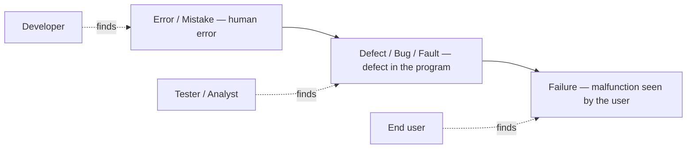

# Error, Defect, Failure

One of the most common warm-up questions at a QA interview is to explain the
difference between **error**, **defect** (a.k.a. **bug**, **fault**) and
**failure**. This is not empty terminology: behind the three words lies a
simple but important idea — the same problem exists at different stages of the
product's life, and depending on **who found it and when**, it gets different
names. Understanding this chain is the foundation on which bug reports,
quality metrics, and the whole professional vocabulary of a tester are built.

## The "cause → effect" chain

The logic is as follows:

1. **Error (mistake)** — a human error. A developer (or an analyst, or an
   architect) makes a wrong action or a wrong decision while writing code,
   designing, or specifying a task. This is the *cause*, the root of the
   problem, and it lives in a person's head and actions.
2. **Defect (bug, fault)** — the consequence of the error. The wrong action
   materializes in the program: an incorrect line of code, a missing check, a
   misunderstood requirement baked into the logic. If this fragment is found
   by a **tester, an analyst, or anyone inside the team** — this is the
   "bug" that gets logged into the bug tracker.
3. **Failure** — when the **end user** runs into the defective code in
   production, the system actually deviates from its expected behavior: it
   crashes, computes wrong results, loses data. The defect "survived" all the
   way to operation and manifested itself as a malfunction.

In short: **the cause and its effect, discovered at different stages, are
named differently**:

- a problem found by the developer (in their own actions/code before
  verification) — *mistake, error*;
- a problem found by the tester (in the program itself) — *defect, bug,
  fault*;
- a problem found by the end user — *failure*.

An important nuance: **not every defect leads to a failure**. A defect can sit
in the code for years and never execute (for example, in a rarely used branch
of the logic) — a failure only occurs when the defective code actually runs
and shows up on the outside.

> **The 60-second interview answer.** "An error is a human mistake made while
> writing code or specifying a task — the cause. Its consequence inside the
> program is a defect (bug, fault); if a tester or an analyst finds it, we
> call it a bug. And if the end user hits the same defect and the system
> deviates from expected behavior — that's a failure. So the same problem is
> named differently depending on the stage and on who discovered it. Also, not
> every defect becomes a failure — a defect may never manifest in operation."

## Where bugs come from: typical causes

The next logical interview question is "so where do bugs come from at all?".
Typical causes:

- **Human errors** — at the design stage and at the implementation stage.
  People always make mistakes: typos, wrong logic, a forgotten edge case.
- **Changing requirements** while the software is under development or under
  test — the code was written against one set of rules but is verified against
  another.
- **Misunderstanding of requirements and specifications** — the developer
  built something other than what the customer meant, because the requirement
  was read differently or formulated ambiguously.
- **Lack of time** — tight deadlines force cutting corners: fewer reviews,
  fewer checks, more haste.
- **Poor test prioritization** — the wrong things were tested in the wrong
  order: critical scenarios got no attention while effort went into secondary
  ones.
- **Poor orientation in software versions** — confusion about which version is
  deployed where and what exactly was tested; the fix exists, but not in that
  build.
- **Complexity of the software itself** — the more connections, states, and
  integrations, the easier it is to miss a non-obvious interaction.

> **Trap.** Don't reduce everything to "developers are sloppy". The interview
> expects a systemic answer: a large share of bugs is born **before** any code
> — in requirements, communication, planning, and version management. That is
> exactly why testing starts as early as possible, not only on finished code
> (see [Testing stages and working with requirements](topic:qa-testing-stages-requirements)).

> **Typical follow-up questions.** "Give an example of a failure not caused by
> a defect" (e.g., an environment outage: a server went down, a cable was cut —
> the code is irrelevant). "Can there be a defect without an error?" (yes — if
> the requirement itself was wrong while the code implements it exactly).
> "How do you classify a problem reported by a user that is actually intended
> behavior per the requirements?" — a good moment to recall how a
> [bug report](topic:qa-bug-report) is written and what goes into it.

## How this connects to the rest of the tester's vocabulary

Once a defect is found, the working process kicks in: it is described in a bug
report, its impact on the system and the business is assessed — and that is
already the story of severity versus urgency of the fix (see
[Severity and Priority](topic:qa-severity-vs-priority)). The cause/effect pair
is also handy because it explains why a single user-facing failure can hide
several defects, while a single human error can spawn a whole cluster of
defects in different parts of the system.
