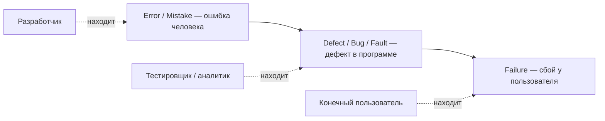

# Ошибка, дефект, сбой

Один из самых частых «разогревающих» вопросов на собеседовании QA — попросить
объяснить разницу между **error**, **defect** (он же **bug**, **fault**) и
**failure**. Это не пустая терминология: за тремя словами стоит простая и
важная идея — одна и та же проблема существует на разных этапах жизни
продукта, и в зависимости от того, **кто и когда её обнаружил**, она получает
разные имена. Понимание этой цепочки — база, на которой строятся отчёты о
дефектах, метрики качества и весь профессиональный словарь тестировщика.

## Цепочка «причина → следствие»

Логика такая:

1. **Error (mistake)** — человеческая ошибка. Разработчик (или аналитик, или
   архитектор) при написании кода, проектировании или постановке задачи
   допускает неверное действие или неверное решение. Это *причина*, корень
   проблемы, и существует она в голове и действиях человека.
2. **Defect (bug, fault)** — дефект, следствие ошибки. Неверное действие
   материализуется в программе: неправильная строка кода, пропущенная проверка,
   неверно понятое требование, заложенное в логику. Если этот фрагмент находит
   **тестировщик, аналитик или кто-то внутри команды** — это и есть тот самый
   «баг», который заводят в баг-трекер.
3. **Failure** — сбой. Если на дефектный фрагмент кода натыкается **конечный
   пользователь** в проде, система реально отклоняется от ожидаемого поведения:
   падает, считает неправильно, теряет данные. Дефект «дожил» до эксплуатации
   и проявился как отказ.

Короче: **причина и следствие, выявленные на разных этапах, называются
по-разному**:

- проблема, найденная разработчиком (ещё в его действиях/коде до проверки) —
  *mistake, error*;
- проблема, найденная тестировщиком (в самой программе) — *defect, bug, fault*;
- проблема, найденная конечным пользователем — *failure*.

Важный нюанс: **не каждый дефект приводит к сбою**. Дефект может годами лежать
в коде и никогда не выполниться (например, в редко используемой ветке логики) —
failure наступает только тогда, когда дефектный код реально исполнился и
проявился снаружи.

> **Ответ на собесе за 60 секунд.** «Error — это человеческая ошибка при
> написании кода или постановке задачи, причина. Её следствие в самой
> программе — defect (bug, fault); если его находит тестировщик или аналитик,
> мы называем это багом. А если на тот же дефект натыкается конечный
> пользователь и система отклоняется от ожидаемого поведения — это failure,
> сбой. То есть одна и та же проблема называется по-разному в зависимости от
> этапа и того, кто её обнаружил. При этом не каждый defect становится
> failure — дефект может так и не проявиться в эксплуатации».

## Почему баги появляются: типовые причины

Следующий логичный вопрос собеседования — «а откуда вообще берутся баги?».
Типовые причины:

- **Человеческие ошибки** — на этапе проектирования и на этапе реализации.
  Люди ошибаются всегда: опечатки, неверная логика, забытый граничный случай.
- **Изменение требований**, пока ПО находится в разработке или под испытанием —
  код писался под одни правила, а проверяется уже по другим.
- **Непонимание требований и спецификаций** — разработчик реализовал не то,
  что имел в виду заказчик, потому что требование было прочитано по-своему или
  сформулировано двусмысленно.
- **Отсутствие времени** — сжатые сроки вынуждают резать углы: меньше ревью,
  меньше проверок, больше спешки.
- **Плохая приоритизация тестирования** — проверялось не то и не в том порядке:
  критичные сценарии остались без внимания, а усилия ушли на второстепенное.
- **Плохая ориентация в версиях ПО** — путаница в том, какая версия где
  развёрнута и что именно тестировалось; фикс есть, но не в той сборке.
- **Сложность самого ПО** — чем больше связей, состояний и интеграций, тем
  легче упустить неочевидное взаимодействие.

> **Ловушка.** Не сводите всё к «разработчики криворукие». На собесе ждут
> системного ответа: значительная часть багов рождается **до** кода — в
> требованиях, коммуникации, планировании и управлении версиями. Именно поэтому
> тестирование начинают как можно раньше, а не только на готовом коде
> (см. [Стадии тестирования и работа с требованиями](topic:qa-testing-stages-requirements)).

> **Типовые follow-up вопросы.** «Приведи пример failure, который не был
> вызван defect» (например, отказ из-за окружения: упавший сервер, оборванный
> кабель — код ни при чём). «Может ли быть defect без error?» (да — если
> требование само было неверным, а код реализован строго по нему). «Как
> классифицировать проблему, которую нашёл пользователь, но по факту это
> особенность требований?» — это повод вспомнить, как оформляется
> [баг-репорт](topic:qa-bug-report) и что в нём указывается.

## Связь с остальным словарём тестировщика

Когда дефект найден, дальше включается рабочий процесс: его описывают в
баг-репорте, оценивают влияние на систему и на бизнес — а это уже история про
критичность и срочность исправления (см. [Severity и Priority](topic:qa-severity-vs-priority)).
Сама терминологическая пара «причина/следствие» удобна ещё и тем, что объясняет,
почему один баг-репорт на failure у пользователя может скрывать несколько
defect-ов, а один error человека — породить целую гроздь дефектов в разных
местах системы.
