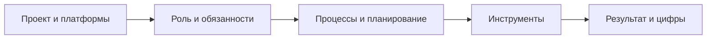

# Рассказ об опыте на собеседовании

«Расскажите про ваш опыт» — это первый блок почти любого собеседования на
QA-инженера. До теории и задач интервьюер хочет понять, кто перед ним: за 3–5
минут вашего рассказа он формирует рабочую гипотезу о грейде, реальности опыта
и зрелости процессов, в которых вы работали. Все последующие вопросы — лишь
проверка этой гипотезы. Поэтому рассказ об опыте нельзя импровизировать: его
нужно подготовить заранее и отрепетировать вслух.

## Что интервьюер вычленяет из вашего рассказа

Пока вы говорите, интервьюер параллельно отвечает себе на несколько вопросов:

- **Реальный ли это опыт?** Конкретика (названия фич, числа, названия
  инструментов, примеры багов) отличает человека, который работал, от человека,
  который прочитал о работе.
- **Какой грейд?** Junior перечисляет, что делал по указке; middle рассказывает,
  как сам планировал процесс и принимал решения; senior говорит о влиянии на
  процессы команды.
- **Насколько зрелые процессы он видел?** Релизный цикл, тестовая модель,
  работа с бэклогом багов — по этим ответам понятно, придётся ли вас учить
  базовым вещам.
- **Подходит ли стек?** Платформы (web, mobile, API), тип приложения и
  инструменты сопоставляются с нуждами вакансии.
- **Как человек коммуницирует?** Структурность, честность, отсутствие негатива —
  это уже проверка soft skills.

## Структура сильного рассказа

Рабочий каркас ответа на «расскажите про опыт» — пять блоков по порядку:

### Проект и платформы

Начните с контекста: «Работал в продуктовой компании X, тестировал мобильное
приложение Y под iOS и Android, плюс админку на web». Обязательно назовите
**специфику проекта** — она определяет, какое тестирование было нужно:
высоконагруженный сервис — акцент на нагрузочном и отказоустойчивости,
финтех — на безопасности и точности расчётов, маркетплейс — на интеграциях и
консистентности данных. Специфика показывает, что вы понимали, *зачем*
тестировали именно так.

### Роль и обязанности

Перечислите обязанности как на проекте, так и «фоновые»: функциональное
тестирование новых фич, регресс перед релизами, дежурства, разбор обращений от
пользователей и техподдержки, заведение и верификация багов. Если были
обязанности выше грейда (планировали релизный регресс, оценивали сроки,
менторили новичка) — скажите об этом отдельно, это двигает вас вверх по шкале.

### Процессы и планирование

Это сердце ответа для middle-позиции. Будьте готовы развернуть каждый пункт:

- **Планирование процесса тестирования**: с чего начинаете работу над фичей
  (анализ требований), какие этапы включаете (тест-анализ, тест-дизайн,
  подготовка окружения и данных, прогон, отчёт).
- **Как определяете, какие тесты нужны**: smoke — на критический путь после
  каждой сборки, regression — на стабильную функциональность перед релизом,
  exploratory — на новые и рискованные места, где тестовой модели ещё нет.
  Подробнее про отбор кейсов см. [отбор кейсов в smoke и регресс](topic:qa-smoke-regress-selection),
  про виды в целом — [виды тестирования](topic:qa-test-types).
- **Релизный цикл и роль тестирования**: «Релизы раз в две недели, за неделю —
  кодовая заморозка, дальше регресс на release-ветке, хотфиксы проходят
  сокращённый цикл». Покажите, что понимаете своё место в цикле: тестирование
  даёт команде информацию для решения «релизим или нет».
- **Тестовая модель и документация**: где хранились кейсы (TestRail, Confluence,
  чек-листы), как поддерживалась актуальность. См. [тестовая документация](topic:qa-test-documentation).
- **Отчёты**: что готовили по итогам — статус прогона, покрытие, список
  открытых дефектов с приоритетами, риски релиза.
- **Распределение задач и бэклог багов**: задачи брались из спринта по приоритету
  или закреплялись за тестировщиком направления; за бэклогом следил лид или
  вся команда на регулярном разборе — расскажите, как было у вас, честно.

### Инструменты

Называйте стек связно с задачами, а не списком: «Задачи и баги — Jira, кейсы —
TestRail, API тестировал в Postman, трафик мобильного приложения смотрел через
Charles Proxy, логи и сборки — Xcode и Android Studio». К каждому инструменту
будьте готовы ответить на follow-up «а как именно вы им пользовались».

### Результат

Закройте рассказ измеримым итогом: «За год снизили число пропущенных в прод
критических багов, покрыли регрессом 80% критичной функциональности, внедрил
чек-листы на смежные интеграции». Даже одна честная цифра сильно выделяет
ответ.

> **Ответ на собесе за 60 секунд**
> «Последние два года тестирую мобильное приложение маркетплейса под iOS и
> Android плюс web-админку. Отвечал за функциональное тестирование фич от
> анализа требований до релиза, вёл регресс перед каждым релизом, дежурил —
> разбирал обращения пользователей. Процесс строил так: анализ требований,
> тест-дизайн, кейсы в TestRail, smoke на каждую сборку, полный регресс на
> release-ветке раз в две недели. Из инструментов — Jira, TestRail, Postman,
> Charles Proxy, Xcode, Android Studio. За это время мы покрыли регрессом всю
> критичную функциональность, и число критических багов в проде заметно
> снизилось».

## Вопросы о смене работы

Завершающая часть блока — три связанных вопроса: **«Почему меняешь работу?»**,
**«Что ждёшь от нового проекта/компании?»**, **«Какие критерии выбора нового
места?»**. Они проверяют мотивацию и прогнозируют, не уйдёте ли вы через полгода.

Модель сильного ответа:

- **Причина ухода — про рост, а не про конфликт.** «Вырос из текущих задач,
  хочу более сложный продукт и сильную команду» — хорошо. «Конфликт с
  руководителем, всё плохо» — красный флаг, даже если это правда. Негатив о
  бывшем работодателе почти всегда играет против кандидата.
- **Ожидания — конкретные и совпадающие с вакансией.** Прочитайте описание
  позиции и говорите о том, что компания реально может дать: интересный домен,
  автоматизация, влияние на процессы.
- **Критерии выбора — осознанные.** Технологический стек, зрелость процессов,
  команда, возможности роста. Ответ «главное — зарплата» честен, но закрывает
  разговор о мотивации.

> **Что хочет услышать интервьюер**
> Связную историю, где прошлый опыт логично приводит к этой вакансии: «делал X,
> вырос, хочу Y — а у вас как раз Y». Это значит, что кандидат выбирал осознанно
> и с высокой вероятностью задержится.

## Типовые ошибки кандидата

- **Общие слова без конкретики.** «Тестировал, искал баги, писал кейсы» — это
  описание профессии, а не вашего опыта. Нужны платформы, фичи, цифры.
- **Пересказ должностной инструкции.** Обязанности перечислены, но ни один
  follow-up («как именно планировали?», «приведите пример отчёта») не раскрыт.
- **Нет истории про процессы.** Не может описать релизный цикл, распределение
  задач и судьбу бэклога багов — выглядит как человек, который «просто кликал».
- **Инструменты списком без контекста.** Назвал десяток инструментов, но не
  может рассказать ни про один.
- **Негатив о прошлом месте.** Жалобы на команду и менеджмент читаются как
  прогноз будущих конфликтов.
- **Неподготовленный ответ про мотивацию.** «Просто захотелось сменить» без
  критериев выбора сигналит о случайном поиске.
