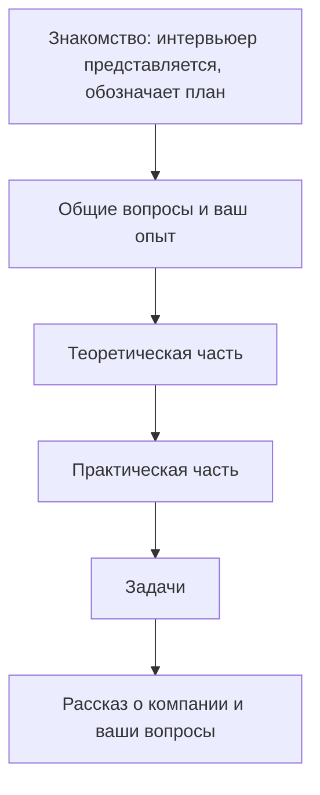

# Как устроен технический собес на QA

Техническое собеседование на QA почти всегда устроено по одному шаблону —
например, у интервьюеров Wildberries есть явный скрипт: представиться, договориться
о переходе на «ты», обозначить план на час. Знание этой карты снимает половину
стресса: вы понимаете, что сейчас проверяют и что будет дальше, и не тратите
силы на догадки. Ниже — типовая структура часа, что оценивается на каждом этапе
и как под неё готовиться.

## Карта типового часа

Реальный скрипт интервьюера (по материалам WB): «Наше собеседование займёт 1 час.
Сначала будут общие вопросы, потом теоретическая и практическая части, далее
порешаем задачки, и в конце я расскажу про нас и постараюсь ответить на твои
вопросы». Внутри компаний порядок и пропорции меняются, но скелет один и тот же.

## Этап 1. Знакомство и общие вопросы (5–10 минут)

Интервьюер представляется, спрашивает, можно ли на «ты», рассказывает план.
Дальше — разогрев: как вы пришли в тестирование, краткий рассказ об опыте,
почему меняете работу, чего ждёте от нового места.

**Что оценивают:** вменяемость и коммуникабельность, умение структурированно
говорить о себе, адекватность мотивации. Технических ловушек здесь нет, но
именно здесь складывается первое впечатление, которое потом сложно переломить.

**Как готовиться:** отрепетируйте рассказ об опыте на 2–3 минуты: что
тестировали (платформы, тип приложения), специфика проекта, обязанности,
инструменты, как был устроен процесс тестирования и релизный цикл. Подробный
разбор этого блока — в теме
[рассказ об опыте на собеседовании](topic:qa-interview-experience-story).

## Этап 2. Теоретическая часть (10–15 минут)

Вопросы на знание основ: виды и уровни тестирования, тестовая документация,
жизненный цикл бага, severity/priority, техники тест-дизайна, методологии
разработки (waterfall, agile, scrum/kanban и роли в scrum).

**Что оценивают:** базовый словарь профессии и системность знаний. Здесь важна
скорость и уверенность: теорию ждут «с листа», а долгие паузы на вопросе «что
такое регресс» — красный флаг.

## Этап 3. Практическая часть (10–15 минут)

Теория, привязанная к вашему опыту и инструментам: чем пользовались (Jira,
TestRail, Postman, Selenium, Appium, Charles, Xcode, Android Studio), как
писали и ревьюили автотесты, как была устроена тестовая модель, стенды и
заглушки, как готовили отчёты.

**Что оценивают:** правда ли вы делали то, что написано в резюме. Кандидата с
реальным опытом легко отличить по деталям: «как решали, что покрывать
автотестами в первую очередь?», «как был настроен билд-сервер?».

## Этап 4. Задачи (10–15 минут)

Практические мини-задачи: составить чек-лист для фичи, протестировать
«поисковую строку», найти баг в описании, оценить сроки тестирования,
ситуационные сценарии.

**Что оценивают:** ход рассуждений, а не финальный ответ. Главное правило —
думать вслух: задавать уточняющие вопросы, проговаривать гипотезы и
приоритеты. Молчаливое «подумаю минуту и скажу ответ» почти всегда проигрывает
живому рассуждению с ошибками, но с логикой.

## Этап 5. Рассказ о компании и ваши вопросы (5–10 минут)

Интервьюер рассказывает о компании, команде, процессах (состав отдела, релизный
цикл, инструменты, девайсы) — и это тоже источник пользы: слушайте внимательно,
потому что там зашиты ответы на вопрос «какие вопросы задать».

**Вопросы кандидата — часть оценки.** «У меня нет вопросов» читается как
«мне всё равно, куда я иду». Хорошие вопросы показывают, что вы выбираете
место работы осознанно:

- Как устроен процесс тестирования фичи от идеи до релиза?
- Как выглядит релизный цикл и роль QA в нём?
- Какое соотношение ручного тестирования и автоматизации, куда движется команда?
- Как ставятся и распределяются задачи, кто ведёт бэклог багов?
- Какие ожидания от человека на этой позиции в первые 3 месяца?

## Метки уровней: как читать MIDDLE и SENIOR

В базах вопросов для подготовки часто стоят метки сложности:

- **без пометки** — общий вопрос или уровень junior: то, что должен знать любой
  кандидат;
- **MIDDLE** — вопрос повышенной сложности: требует не только знания, но и
  опыта применения (как был устроен процесс на вашем проекте, как решали
  нестандартную ситуацию);
- **SENIOR** — крайне сложный вопрос: архитектура процессов, влияние на
  команду, глубокие технические темы.

**Как использовать при подготовке:** сначала закройте все вопросы без метки —
они составляют обязательный минимум, провал в них фатален на любом грейде.
Затем вопросы целевого уровня. Если идёте на middle — senior-вопросы
просмотрите, но не паникуйте: там важно показать направление мысли, а не дать
энциклопедический ответ. Метки также помогают оценить себя: уверенно отвечаете
на все middle-вопросы, но плывёте на senior — вы и есть крепкий middle.

## Дополнительная часть: про что ещё спросят

В конце интервьюер обычно закрывает организационные вопросы:

- **Mac и девайсы** — на мобильных позициях (особенно iOS) уточняют, есть ли у
  вас оборудование: во многих командах тестируют на личных девайсах и
  эмуляторах, а для сборок iOS нужен Xcode, то есть Mac. Это не ловушка, а
  практический вопрос логистики.
- **Зарплатные ожидания и дата выхода** — фиксируют для оффера и планирования.
  Заранее определите для себя диапазон и нижнюю границу; дату выхода считайте
  с учётом отработки.
- **Есть ли другие предложения** — вопрос о вашей востребованности и сроках
  принятия решения. Честный ответ «есть оффер, жду до такого-то числа» — это
  нормально и даже ускоряет процесс; блефовать несуществующими офферами не
  стоит.

## Типовые ошибки кандидата

- Прийти без структуры в голове: удивляться сменам этапов и терять темп.
- Затягивать разогрев: 15-минутный рассказ об опыте съедает время теории и
  задач — а оценивают в основном их.
- Угадывать в теории вместо честного «не знаю, но предположу, что…» — второе
  оценивают выше.
- Решать задачи молча: интервьюер не видит хода мысли и не может помочь
  наводящим вопросом.
- Не задать ни одного вопроса в конце или спросить только про зарплату и
  отпуска — вопросы про процесс и команду работают на ваш образ лучше.
