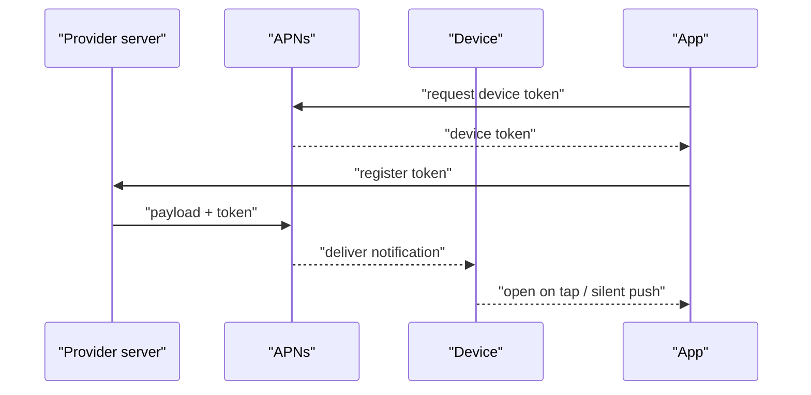
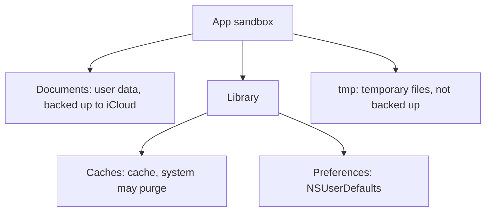

# iOS Testing Deep Dive

This is the senior-level block of a mobile QA interview — sometimes called "iOS Hell":
a rapid-fire set of questions about how an iOS app works under the hood. Nobody asks
"what is a test case" here — they check whether you actually understand the platform you
test: the app lifecycle, the sandbox and data storage, UI framework specifics, and the
performance budget. The mobile-testing basics are covered in
[Mobile Testing](topic:qa-mobile-testing); this topic is what separates senior from middle.

## Devices and iOS / iPadOS versions

A classic warm-up question: which devices support a given OS version. For iOS 14 (the
historical reference from the source material): iPhone 6S and newer, iPhone SE 1st and 2nd
generation, iPod Touch 7th generation. For iPadOS 14: iPad Air 2nd generation and up, iPad
5th generation and up, any iPad Pro, iPad mini 4th generation and up.

Why a QA cares: the supported-device matrix defines your test device and simulator pool.
The oldest supported devices (say, an iPhone 6S) are a deliberate target for performance
and small-screen layout checks. At the interview, the exact model list matters less than
the reasoning: minimum supported OS version (deployment target) → device list → test
priorities.

## Lifecycle: launch, background, memory

**What happens when an iOS app launches.** The system loads the binary into memory, `main()`
runs and starts `UIApplicationMain`, which creates the `UIApplication` object and the main
run loop. Then the delegate callbacks fire: `application(_:didFinishLaunchingWithOptions:)` —
the point where the app initializes services, analytics, and restores state. After that the
window (UIWindow) and the root view controller are created, and the app becomes active.

App states: **Not Running → Inactive → Active → Background → Suspended**. Inactive is a short
transitional phase (incoming call, control center). In Background the app can still finish
brief work (complete a file download); in Suspended it is frozen in memory and executes no
code — the system can purge it at any moment without warning.

**Background execution.** iOS strictly limits background work: you cannot "run forever".
Only specific background modes are allowed: audio, location, VoIP, background downloads
(background URLSession), Background Fetch / Background Tasks scheduled by the system, and
push-notification handling. For QA this means: test state transitions (app switcher swipe,
incoming call, screen lock), correct state preservation when the app is purged from memory,
and behavior after it is revived.

**Memory limits.** An app can use roughly up to 4 GB of RAM (on devices with more memory,
e.g. iPad Pro 2021+, limits are higher and entitlement-dependent). Exceed the limit and the
system kills the app — from the user's perspective it looks like a "crash with no error".
Check: memory footprint in Xcode/Instruments, behavior on low-RAM devices, leaks.

**60-second interview answer:** "On launch iOS loads the binary, starts the run loop via
`UIApplicationMain`, calls `didFinishLaunching`, creates the window — the app becomes Active.
In the background it quickly moves to Suspended and runs no code unless it has permitted
background modes. Memory is capped — roughly 4 GB per app; past that the system kills it, so
we test the footprint and state transitions."

## Push notifications in iOS

The delivery chain looks like this:

The app obtains a **device token** from APNs (Apple Push Notification service) and passes it
to its backend. The backend sends a payload to APNs, and APNs delivers it to the device.
There are **alert pushes with content** (banner, sound, badge) and **silent pushes**
(`content-available`) that wake the app in the background to refresh data. Testing nuances:
the simulator historically did not support pushes (nowadays you can drag a JSON payload onto
it); tokens change; notification permission is requested from the user; you need to test
deep links from pushes, behavior with permissions off, and delivery in every app state.

**Trap:** silent push is not guaranteed — the system throttles it based on battery and user
activity. Never build critical business logic on it.

## Data storage and the file system

**Storage options:** UserDefaults (small settings, flags — not for secrets, not for large
data), Keychain (secrets: tokens, passwords; system-encrypted), files in the sandbox,
databases.

**Database types in iOS apps:** SQLite (raw SQL), CoreData (an object graph on top of
SQLite), Realm (a third-party object database), Firebase Realtime Database / Firestore
(cloud NoSQL).

**The sandbox** — each app's isolated directory:

- **Documents/** — user data, visible via the Files app, included in backups.
- **Library/Caches/** — cache; the system may clear it under storage pressure; not backed up.
- **tmp/** — temporary files; cleaned by the system, not backed up.

The path to the simulator's sandbox can be obtained via `NSHomeDirectory()` — handy when you
need to see what the app actually wrote to disk.

**What survives app deletion.** The sandbox (Documents, Caches, tmp, UserDefaults) is removed
together with the app. **The Keychain remains** — tokens and passwords survive a reinstall
(a common cause of the "magical" auto-login after reinstalling). Data outside the sandbox
also remains: photos in the gallery, contacts — anything the user explicitly saved through
system sharing.

**Typical follow-up questions:**
- "Where do you put a 500 MB downloaded offline map?" — Documents (or Library if no backup is
  needed), but not Caches: the system may wipe it.
- "Why is the user still logged in after a reinstall?" — the token lived in the Keychain.
- "How do you test database work?" — pull the container from the device/simulator, inspect
  the SQLite file, verify schema migrations on app upgrade.

## UI: nativeness, frameworks, windows, themes

**How to tell whether an app is native.** Look closely at the details: transition animations,
inertial scrolling, the "rubber-band" bounce, keyboard behavior, standard gestures (edge swipe
to go back). Non-native (cross-platform, WebView) solutions usually give themselves away with
simplified animations, custom fonts, and non-standard controls. Plus indirect signs: bundle
size, the web inspector for WebViews.

**UIKit vs SwiftUI in testing.** There is almost no difference: you test the same things with
the same tools (XCUITest, screenshots, accessibility). One observed nuance: when the font size
changes via Dynamic Type, SwiftUI interfaces tend to stay stable "out of the box", while on
UIKit layout under large fonts is a frequent source of bugs.

**Two UIWindows.** There is usually one window, but the system creates additional ones: the
keyboard, share/activity sheets, system alerts and dialogs, AirPlay. This matters for QA in UI
automation: keyboard and alert elements live in a different window, so you search the whole
app's element tree, not just the main window.

**URL schemes.** An app can detect installed third-party apps via `canOpenURL` against a list
of known url schemes (since iOS 9 the schemes must be declared in Info.plist —
`LSApplicationQueriesSchemes`, limited to ~50 entries). Test: deep links from push/email,
opening when the target app is missing, universal links as the modern replacement for schemes.

**Light/dark theme.** Approaches: snapshot tests in both themes, switching the theme in system
settings and inside the app, reviewing color attributes in code (dynamic colors instead of
hardcoded ones). Typical bugs: hardcoded colors, unreadable text, images without a dark variant.

**Widget automation.** Yes, it is possible: WidgetKit widgets are accessible in the Springboard
element tree, and XCUITest can work with the home screen via
`XCUIApplication(bundleIdentifier: "com.apple.springboard")`. You verify adding the widget,
the displayed data, and the deep link on tap. More on automation approaches in
[Test Automation](topic:qa-automation).

**60-second interview answer:** "Nativeness shows in the details: scroll inertia, bounce,
keyboard, gestures — non-native is usually simpler. UIKit and SwiftUI are tested almost
identically; SwiftUI behaves more stably under Dynamic Type. The second UIWindow is the
keyboard, alerts, share sheets, AirPlay. I test themes with snapshot tests and light/dark
switching."

## Performance: 60 fps and the 16 ms budget

"The app is laggy" — make it concrete: dropped frames. For smooth 60 fps, rendering one frame
has a budget of **16.6 ms** (on 120 Hz ProMotion screens — 8 ms). If the main thread is busy
longer, a frame is dropped and the user sees stutter.

How to check:
- profiling: Instruments (Time Profiler, Core Animation FPS), metrics in Xcode Organizer;
- **always on the oldest supported devices** — a flagship may show no lag at all;
- heavy scenarios: long scrolling lists, animations, image loading.

How 60 fps is achieved (what to listen for in developers' answers and what to verify): moving
work off the main thread, asynchronous image loading and decoding, cell reuse, avoiding
transparent layer overlays and heavy shadows, lazy content loading.

**Trap:** OS version numbers, memory limits (≈4 GB), the watch-app size limit (historical
75 MB) — all of these change over time. At the interview, show that you understand the
principle ("a limit exists and you must know it for your target platform") rather than
quoting outdated numbers as gospel.
