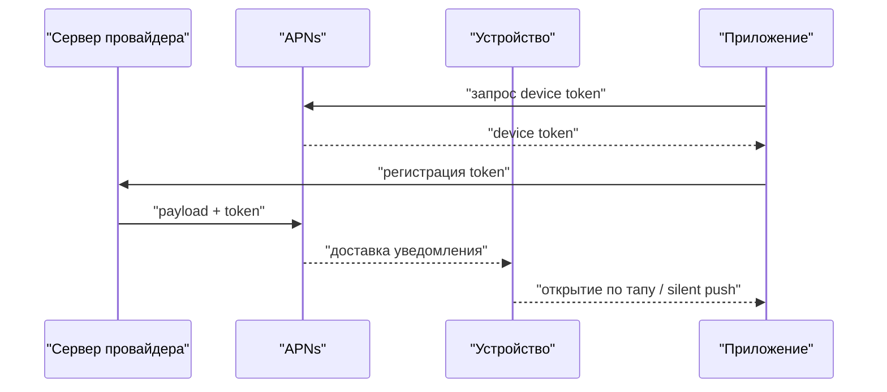
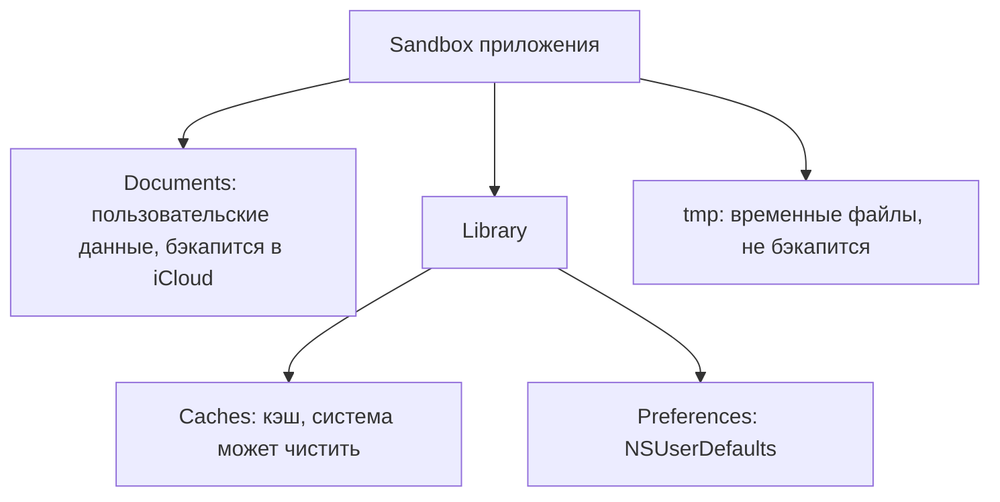

# iOS: глубокое погружение

Это senior-блок собеседования по мобильному тестированию — его иногда называют «iOS Hell»:
серия вопросов «на зубок» о том, как iOS-приложение устроено изнутри. Здесь уже не спрашивают
«что такое тест-кейс» — проверяют, понимаешь ли ты платформу, которую тестируешь: жизненный
цикл приложения, sandbox и хранение данных, особенности UI-фреймворков и бюджет производительности.
Базовая подготовка по мобильному тестированию разобрана в теме
[Мобильное тестирование](topic:qa-mobile-testing); тут — то, что отличает senior от middle.

## Устройства и версии iOS / iPadOS

Классический разогревочный вопрос — какие устройства поддерживает конкретная версия ОС.
Для iOS 14 (исторический ориентир из источника): iPhone 6S и новее, iPhone SE 1-го и 2-го
поколения, iPod Touch 7-го поколения. Для iPadOS 14: iPad Air со 2-го поколения, iPad с 5-го
поколения, любой iPad Pro, iPad mini с 4-го поколения.

Зачем это QA: матрица поддерживаемых устройств определяет парк тестовых девайсов и симуляторов.
Старые поддерживаемые устройства (условный iPhone 6S) — это целенаправленная проверка
производительности и верстки на маленьких экранах. На собесе важен не точный список моделей,
а умение рассуждать: минимальная поддерживаемая версия ОС (deployment target) → список
устройств → приоритеты проверок.

## Жизненный цикл: запуск, фон, память

**Что происходит при запуске iOS-приложения.** Система загружает бинарник в память, вызывается
`main()`, которая запускает `UIApplicationMain` — создаётся объект `UIApplication` и главный
run loop. Затем вызываются методы делегата: `application(_:didFinishLaunchingWithOptions:)` —
точка, где приложение инициализирует сервисы, аналитику, восстанавливает состояние. После этого
создаётся окно (UIWindow) и корневой контроллер, и приложение становится активным.

Состояния приложения: **Not Running → Inactive → Active → Background → Suspended**.
Inactive — короткая переходная фаза (входящий звонок, шторка). В Background приложение ещё
может недолго дорабатывать (завершить загрузку файла), в Suspended — заморожено в памяти и
не выполняет код; система может выгрузить его в любой момент без предупреждения.

**Фоновая работа.** iOS жёстко ограничивает фон: «вечно крутиться» нельзя. Разрешены
ограниченные режимы (background modes): аудио, геолокация, VoIP, фоновая загрузка
(URLSession background), Background Fetch / Background Tasks по расписанию системы,
обработка push-нотификаций. Для QA это значит: тестируем переходы состояний (свайп в
многозадачность, звонок, блокировка экрана), корректность сохранения состояния при выгрузке
из памяти и поведение после «оживления».

**Лимиты памяти.** Приложение может использовать порядка 4 ГБ ОЗУ (на устройствах с большим
объёмом памяти, например iPad Pro 2021+, лимиты выше и зависят от entitlement). При превышении
лимита система убивает приложение — со стороны пользователя это выглядит как «вылет без ошибки».
Проверять: memory footprint в Xcode/Instruments, поведение на устройствах с малым ОЗУ, утечки.

**Ответ на собесе за 60 секунд:** «При запуске iOS грузит бинарник, стартует run loop через
`UIApplicationMain`, дёргает `didFinishLaunching`, создаёт окно — приложение становится Active.
В фоне приложение быстро уходит в Suspended и не исполняет код, если нет разрешённых background
modes. Память ограничена — примерно до 4 ГБ на приложение; при превышении система его убивает,
поэтому тестируем footprint и переходы состояний».

## Push-нотификации в iOS

Цепочка доставки устроена так:

Приложение получает у APNs (Apple Push Notification service) **device token** и передаёт его
своему бэкенду. Бэкенд шлёт payload на APNs, APNs доставляет на устройство. Различают
**alert/push с контентом** (баннер, звук, бейдж) и **silent push** (`content-available`) —
будит приложение в фоне для обновления данных. Нюансы для тестирования: на симуляторе push
исторически не работал (сейчас можно перетащить JSON-payload в симулятор); токены меняются;
права на уведомления запрашиваются у пользователя; нужно проверять диплинки из пуша, поведение
при выключенных разрешениях и доставку в разных состояниях приложения.

**Ловушка:** silent push не гарантирован — система троттлит его в зависимости от заряда и
активности пользователя. Нельзя строить на нём критичную бизнес-логику.

## Хранение данных и файловая система

**Способы хранения:** UserDefaults (мелкие настройки, флаги — не для секретов и не для больших
объёмов), Keychain (секреты: токены, пароли; шифруется системой), файлы в sandbox, базы данных.

**Типы БД в iOS-приложениях:** SQLite (чистый SQL), CoreData (объектный граф поверх SQLite),
Realm (сторонняя объектная БД), Firebase Realtime Database / Firestore (облачная NoSQL).

**Sandbox** — изолированная директория каждого приложения:

- **Documents/** — пользовательские данные, видимы через Files, попадают в бэкап.
- **Library/Caches/** — кэш; система может очистить при нехватке места; не бэкапится.
- **tmp/** — временные файлы; чистится системой, не бэкапится.

Путь до sandbox симулятора можно получить через `NSHomeDirectory()` — полезно, когда нужно
посмотреть, что приложение реально записало на диск.

**Что остаётся после удаления приложения.** Sandbox (Documents, Caches, tmp, UserDefaults)
удаляется вместе с приложением. **Остаётся Keychain** — токены и пароли переживают
переустановку (это частая причина «магического» автологина после реинсталла). Также остаются
данные вне sandbox: фото в галерее, контакты — то, что пользователь явно сохранил через
системные шаринги.

**Типовые follow-up вопросы:**
- «Куда положишь скачанную офлайн-карту на 500 МБ?» — Documents (или Library, если не нужен
  бэкап), но не Caches: система может её стереть.
- «Почему после переустановки пользователь остался залогинен?» — токен жил в Keychain.
- «Чем тестируешь работу с БД?» — выгрузка контейнера с устройства/симулятора, просмотр SQLite,
  проверка миграций схемы при обновлении приложения.

## UI: нативность, фреймворки, окна, темы

**Как определить нативность приложения.** Внимательно смотреть на мелочи: анимации переходов,
скролл с инерцией, «резиновые» отскоки, поведение клавиатуры, стандартные жесты (свайп назад
от края). Ненативные (кроссплатформенные, WebView) решения обычно выдают упрощённые анимации,
свои шрифты и нестандартные контролы. Плюс косвенные признаки: размер бандла, веб-инспектор
для WebView.

**UIKit vs SwiftUI при тестировании.** Разницы почти нет: тестируем то же самое через те же
инструменты (XCUITest, скриншоты, accessibility). Замеченный нюанс: при изменении размера
шрифта через Dynamic Type SwiftUI-интерфейсы обычно ведут себя стабильнее «из коробки», тогда
как на UIKit вёрстка под большие шрифты — частый источник багов.

**Два UIWindow.** Окон обычно одно, но система создаёт дополнительные: клавиатура, шторки
share/activity, системные алерты и диалоги, AirPlay. Для QA это важно при UI-автотестах:
элементы клавиатуры и алертов живут в другом окне, и искать их надо по дереву всего приложения,
а не только главного окна.

**URL-схемы.** Приложение может проверить наличие сторонних приложений через `canOpenURL` по
списку известных url-схем (с iOS 9 список схем нужно декларировать в Info.plist — `LSApplicationQueriesSchemes`,
лимит ~50 схем). Тестируем: диплинки из push/почты, открытие при отсутствии целевого приложения,
universal links как современную замену схем.

**Светлая/тёмная тема.** Подходы: snapshot-тесты в обеих темах, переключение темы в настройках
системы и внутри приложения, просмотр атрибутов цвета в коде (динамические цвета вместо
хардкода). Типовые баги: хардкоженные цвета, нечитаемый текст, картинки без тёмного варианта.

**Автотесты на виджеты.** Да, можно: виджеты (WidgetKit) доступны в дереве Springboard,
XCUITest умеет работать с home screen через `XCUIApplication(bundleIdentifier: "com.apple.springboard")`.
Проверяем добавление виджета, отображение данных, deep link по тапу. Подробнее про подходы к
автоматизации — в теме [Автоматизация тестирования](topic:qa-automation).

**Ответ на собесе за 60 секунд:** «Нативность видно по мелочам: инерция скролла, отскоки,
клавиатура, жесты — ненатив обычно проще. UIKit и SwiftUI тестируются почти одинаково;
у SwiftUI стабильнее поведение при Dynamic Type. Второй UIWindow — это клавиатура, алерты,
share-шторки, AirPlay. Тему тестирую snapshot-тестами и переключением light/dark».

## Производительность: 60 fps и бюджет 16 мс

«Приложение тормозит» — конкретизируем: пропуск кадров. Для плавных 60 fps на отрисовку одного
кадра есть **16,6 мс** (на 120 Гц-экранах ProMotion — 8 мс). Если main thread занят дольше —
кадр пропускается, пользователь видит рывки.

Как проверять:
- профилирование: Instruments (Time Profiler, Core Animation FPS), метрики в Xcode Organizer;
- **обязательно на старых устройствах** минимальной поддерживаемой конфигурации — на флагмане
  тормозов может не быть;
- тяжёлые сценарии: длинные списки со скроллом, анимации, загрузка изображений.

Как достигают 60 fps (что слушать в ответах разработчиков и что проверять): вынос работы с
main thread, асинхронная загрузка и декодирование изображений, переиспользование ячеек,
избегание прозрачных наложений слоёв и тяжёлых теней, ленивая загрузка контента.

**Ловушка:** цифры версий ОС, лимиты памяти (≈4 ГБ), размер watch-приложения (исторический
лимит 75 МБ) — со временем меняются. На собесе показывай, что понимаешь принцип («лимит есть
и его надо знать для своей целевой платформы»), а не цитируй устаревшие числа как догму.
