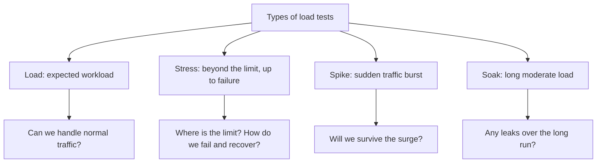

# Load Testing

**Load testing** is the practice of subjecting a system to its expected and
elevated workload to see how it behaves under real traffic: how fast it
responds, how many requests it can handle, and where it breaks. Functional
tests answer "does the system work correctly?" — load tests answer "does it
stay fast and stable when many users show up?". Interviewers love this topic
because it quickly separates someone who has seen a live production system from
someone who only knows checklists.

## Why teams run load tests

The main goals:

- **Find bottlenecks** — slow database queries, memory leaks, an overloaded
  connection pool, an inefficient serializer. Under load these surface first.
- **Check degradation under load** — how response time and error rate grow as
  the number of users increases. Systems rarely fail instantly: latency and
  error rate drift first.
- **Verify SLA/NFR compliance** — e.g. "p95 response time < 500 ms at
  1000 RPS".
- **Capacity planning** — figure out how much hardware / how many pods are
  needed for peak season (a sale, holiday traffic).
- **Validate scaling** — does adding instances actually increase throughput
  linearly?

> **60-second interview answer.** "Load testing checks how a system behaves
> under expected and elevated load. The goals: find bottlenecks, make sure
> response time and error rate stay within SLA at target traffic, and plan
> capacity. I run a scenario via JMeter/k6, watch RPS, latency percentiles and
> error rate, find the point where metrics start degrading, and localize the
> bottleneck using monitoring."

## Types of load tests

Four basic types you must distinguish in an interview:

- **Load testing** — testing under the *expected* load: typical and peak, but
  normal traffic. The question: "can we handle normal operation?"
- **Stress testing** — load is pushed *beyond* the design limit, up to failure.
  The question: "where is the limit, and does the system fail gracefully or
  cascade? Does it recover once the load is removed?"
- **Spike testing** — a sudden burst of load (a flash sale, a push notification
  to a million users). The question: "will the system survive an abrupt surge,
  will autoscaling react in time?"
- **Soak testing (endurance)** — moderate load, but for a *long* time (hours,
  days). It catches problems invisible in short runs: memory leaks,
  fragmentation, log and disk overflow.

> **Trap.** "Load" and "stress" testing are not synonyms. Load works inside the
> designed capacity, stress goes beyond it. If you answer "they're the same
> thing", the follow-up will be "then how is spike different?" — and the answer
> falls apart.

## Tools

What interviewers actually ask about and what you should know:

- **JMeter** — the industry classic, Java, GUI + headless mode, a huge plugin
  ecosystem. The de facto standard, most common in job postings.
- **Gatling** — scenarios as code in Scala/Kotlin/Java, high performance of the
  load generator itself, nice HTML reports.
- **k6** — a modern tool, scenarios in JavaScript, CLI-first, easy to embed
  into CI/CD.
- **Locust** — scenarios in Python, distributed load generation out of the box.

Additionally people mention cloud services (Gatling Enterprise, k6 Cloud,
BlazeMeter) and the monitoring stack: Grafana + Prometheus/InfluxDB, APMs like
New Relic or Datadog — without server-side monitoring a load test turns into
"it's slow, but no idea why".

> **Typical follow-up questions.** "Have you actually run load tests? Tell us
> about your experience"; "Which tools did you use and why?"; "How did you
> build the load profile — where did the numbers come from?" If you have no
> hands-on experience, honestly describe how you would do it: take scenarios
> from [API testing](topic:qa-api-testing), ramp up load in k6 and watch the
> metrics.

## Core metrics

The minimum you must be able to read:

- **Throughput / RPS** — requests per second the system actually processes.
- **Latency (response time)** — look at **percentiles**, not the average: p50,
  p90, p95, p99. The average hides the "tail" of slow requests: p95 means 95%
  of requests are faster than this value.
- **Error rate** — the share of failed responses (HTTP 5xx, timeouts). A rising
  error rate under load is the first sign of degradation.
- **Resource utilization** — CPU, memory, disk, network on the server: helps
  localize the bottleneck.
- **Concurrent users / VU (virtual users)** — how many virtual users the load
  generator emulates.

> **Trap.** Don't confuse concurrent users with RPS: 1000 virtual users with
> 10 seconds of think time produce ≈100 RPS, not 1000. Interviewers check this
> directly.

## What the process looks like

1. Build a load profile: real scenarios and operation ratios from production
   analytics/logs.
2. Define target metrics (SLA/NFR): RPS, p95 latency, error rate.
3. Prepare an environment as close to production as possible, plus test data.
4. Write scenarios in the chosen tool (see [test types](topic:qa-test-types)
   for where load testing sits in the overall classification).
5. Run load → stress → spike → soak, collecting both application and hardware
   metrics.
6. Localize bottlenecks, hand them to the team, re-verify after fixes.

> **60-second interview answer.** "I take the load profile from real analytics:
> top endpoints and their ratios. I run scenarios in stages — first the
> expected load, then ramp-up to failure. I watch RPS, p95/p99 latency and
> error rate, and in parallel check CPU/memory/DB in Grafana. The point where
> latency climbs while RPS stays flat — that's the bottleneck."
