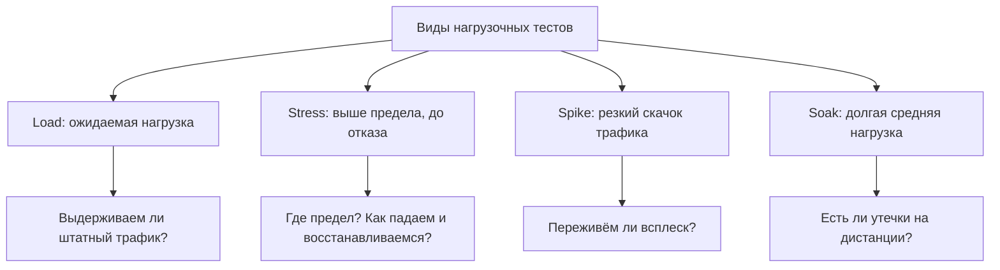

# Нагрузочное тестирование

**Нагрузочное тестирование** (performance/load testing) — это вид тестирования,
при котором систему подвергают ожидаемой и повышенной нагрузке, чтобы проверить,
как она ведёт себя под реальным трафиком: как быстро отвечает, сколько запросов
переваривает и где «срывается». Функциональные тесты отвечают на вопрос «работает
ли система правильно», нагрузочные — «работает ли она достаточно быстро и
стабильно, когда пользователей много». На собеседовании тему любят, потому что
она быстро отделяет человека, который видел живой прод, от человека, который
знает только checklist-ы.

## Зачем проводят нагрузочное тестирование

Основные цели:

- **Найти узкие места (bottlenecks)** — медленные запросы к БД, утечки памяти,
  перегруженный connection pool, неэффективный сериализатор. Под нагрузкой они
  всплывают первыми.
- **Проверить деградацию под нагрузкой** — как растёт время ответа и доля ошибок
  при увеличении числа пользователей. Система редко падает мгновенно: сначала
  «плывут» latency и error rate.
- **Подтвердить соответствие SLA/NFR** — например, «p95 времени ответа < 500 мс
  при 1000 RPS».
- **Спланировать ёмкость (capacity planning)** — понять, сколько железа/подов
  нужно под пиковый сезон (распродажа, новогодний трафик).
- **Проверить масштабирование** — действительно ли добавление инстансов линейно
  увеличивает пропускную способность.

> **Ответ на собесе за 60 секунд.** «Нагрузочное тестирование — это проверка
> поведения системы под ожидаемой и повышенной нагрузкой. Цели: найти узкие
> места, убедиться, что время ответа и доля ошибок остаются в рамках SLA при
> целевом трафике, и спланировать ёмкость. Я запускаю сценарий через JMeter/k6,
> смотрю RPS, перцентили latency и процент ошибок, нахожу точку, где метрики
> начинают деградировать, и локализую bottleneck по мониторингу».

## Виды нагрузочных тестов

Четыре базовых вида, которые нужно различать на собеседовании:

- **Load testing (нагрузочное)** — проверка под *ожидаемой* нагрузкой: типичный
  и пиковый, но штатный трафик. Вопрос: «выдерживаем ли мы нормальную работу?»
- **Stress testing (стрессовое)** — нагрузку поднимают *выше* расчётной, вплоть
  до отказа. Вопрос: «где предел и как система падает — gracefully или каскадно?
  И восстановится ли после снятия нагрузки?»
- **Spike testing (пиковое)** — резкий скачок нагрузки (flash-распродажа, пуш
  миллиону пользователей). Вопрос: «переживёт ли система внезапный всплеск,
  успеет ли сработать autoscaling?»
- **Soak testing (тест на выносливость, endurance)** — средняя нагрузка, но
  *долго* (часы, сутки). Ловит проблемы, которые не видны на коротких прогонах:
  утечки памяти, фрагментацию, переполнение логов и дисков.

> **Ловушка.** «Нагрузочное» и «стрессовое» — не синонимы. Load работает внутри
> проектной нагрузки, stress — за её пределами. Если отвечаешь «это одно и то
> же», следующий вопрос будет «а чем тогда spike отличается?» — и ответ
> развалится.

## Инструменты

Что реально спрашивают на собеседовании и что стоит знать:

- **JMeter** — классика индустрии, Java, GUI + headless-режим, огромная база
  плагинов. Де-факто стандарт, чаще всего встречается в вакансиях.
- **Gatling** — сценарии кодом на Scala/Kotlin/Java, высокая производительность
  самого генератора нагрузки, красивые HTML-отчёты.
- **k6** — современный инструмент, сценарии на JavaScript, CLI-first, удобно
  встраивается в CI/CD.
- **Locust** — сценарии на Python, распределённая генерация нагрузки из коробки.

Дополнительно упоминают облачные сервисы (Gatling Enterprise, k6 Cloud, BlazeMeter)
и связку с мониторингом: Grafana + Prometheus/InfluxDB, APM вроде New Relic или
Datadog — без мониторинга серверной стороны нагрузочный тест превращается в
«медленно, но непонятно почему».

> **Типовые follow-up вопросы.** «Приходилось ли проводить нагрузочное
> тестирование? Расскажите про опыт»; «Какие инструменты использовали и почему
> именно их?»; «Как строили профиль нагрузки — откуда брали числа?» Если опыта
> нет, честно опиши, как бы ты его построил: взял бы сценарии из [тестирования
> API](topic:qa-api-testing), поднял бы нагрузку в k6 и смотрел бы метрики.

## Базовые метрики

Минимум, который нужно уметь читать:

- **Throughput / RPS** — запросов в секунду, которые система реально обрабатывает.
- **Latency (время ответа)** — смотрят не среднее, а **перцентили**: p50, p90,
  p95, p99. Среднее прячет «хвост» медленных запросов: p95 говорит, что 95%
  запросов быстрее этого значения.
- **Error rate** — доля ошибочных ответов (HTTP 5xx, таймауты). Рост error rate
  под нагрузкой — первый сигнал деградации.
- **Utilization ресурсов** — CPU, память, диск, сеть на сервере: помогает
  локализовать bottleneck.
- **Concurrent users / VU (virtual users)** — сколько виртуальных пользователей
  эмулирует генератор нагрузки.

> **Ловушка.** Не путай concurrent users и RPS: 1000 виртуальных пользователей с
> think time 10 секунд дают ≈100 RPS, а не 1000. На собеседовании это проверяют
> прямо.

## Как выглядит процесс

1. Собрать профиль нагрузки: реальные сценарии и пропорции операций из
   аналитики/логов прода.
2. Определить целевые метрики (SLA/NFR): RPS, p95 latency, error rate.
3. Подготовить стенд, максимально похожий на прод, и тестовые данные.
4. Написать сценарии в выбранном инструменте (см. [виды тестирования](topic:qa-test-types)
   для общего контекста, где нагрузочное стоит в классификации).
5. Прогнать load → stress → spike → soak, собирая метрики приложения и железа.
6. Локализовать bottlenecks, передать команде, перепроверить после исправлений.

> **Ответ на собесе за 60 секунд.** «Профиль нагрузки беру из реальной
> аналитики: топовые эндпоинты и их пропорции. Гоняю сценарии ступенями — сначала
> ожидаемая нагрузка, потом рост до отказа. Слежу за RPS, p95/p99 latency и error
> rate, параллельно смотрю CPU/память/БД в Grafana. Точка, где latency уходит
> вверх при неизменном RPS, — и есть bottleneck».
