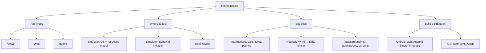

# Mobile Testing Basics

Mobile testing is functional and non-functional testing of applications on
smartphones and tablets, taking into account the specifics of mobile
platforms: limited resources, unstable networks, a huge variety of device
models, and constant interruptions (calls, SMS, pushes). Interviewers bring
this topic up almost whenever the role involves a mobile client: a candidate
is expected to know the types of mobile apps, explain the difference between
an emulator and a simulator, justify the choice of test devices, and list
bugs that occur only on mobile.

## Types of mobile applications

The first classic question is: what types of mobile applications do you know?
The answer: **native, web, and hybrid**.

- **Native** — written for a specific platform in its language (Kotlin/Java
  for Android, Swift/Objective-C for iOS) and installed from a store. They
  provide full access to hardware and OS APIs (camera, GPS, Bluetooth, push
  notifications), the best performance, and a "native" UI. Downsides: two
  separate codebases and two release cycles.
- **Web apps (mobile web)** — essentially websites adapted for a mobile
  browser. They are not installed, run everywhere, but have limited hardware
  access and do not work offline. Tested like regular web plus mobile
  specifics (gestures, orientation, screen sizes).
- **Hybrid** — web content wrapped in a native shell (WebView), or
  cross-platform frameworks like Flutter/React Native. One codebase for both
  platforms, access to some native APIs via plugins. The trade-off:
  performance and UI "nativeness" are worse, and bugs are often specific to
  the "framework + particular OS" combination.

The app type drives the testing strategy: for native apps both platforms and
hardware are critical; for web — browsers and resolutions; for hybrid — all
of the above.

## Emulator vs simulator vs real device

This is the second mandatory question, and people often get confused. The key
difference:

- An **emulator** reproduces the entire device — it builds an exact model,
  including "hardware" (CPU, memory), on top of which a real OS runs. The
  classic example is the Android Emulator from Android Studio.
- A **simulator** only imitates the system's behavior and its interface —
  individual processes, without an exact hardware model. An app under the iOS
  Simulator in Xcode is compiled for the computer's architecture and runs in
  the macOS environment.
- A **real device** is a physical phone or tablet with actual hardware, a
  battery, sensors, and a live network.

| Criterion | Emulator (Android) | Simulator (iOS) | Real device |
|---|---|---|---|
| What it reproduces | OS + hardware model (exact device model) | OS behavior and interface, no hardware model | Real hardware and OS |
| Execution speed | Slower than a simulator | Fast (code runs on the host) | Real performance |
| Hardware dependencies | Partially emulated | Cannot be tested (camera, Touch ID, etc. are limited) | Fully available |
| Interruptions and network | Can be simulated (call, SMS, GPS, network) | Limited | Real calls, SMS, Wi-Fi ↔ LTE switching |
| Battery, heating, gestures | No | No | Yes |
| Cost | Free | Free (requires macOS) | Expensive: device fleet or device farm |

**Which is preferable in practice?** The right answer is a combination: run
the bulk of regression on emulators/simulators (fast, cheap, easy to automate
in CI/CD), and verify critical scenarios plus everything tied to hardware
(camera, Bluetooth, performance, interruptions, weak-network behavior) on
real devices without exception. The final pre-release smoke test — on live
devices only.

> **The 60-second interview answer.** An emulator builds an exact model of a
> device and runs a real OS (Android Emulator); a simulator merely imitates
> the system's behavior and interface without a hardware model (iOS
> Simulator). A real device is needed wherever hardware, battery, network,
> and interruptions matter. In practice we combine them: regression and
> automated tests on emulators/simulators, critical scenarios and release
> smoke on real devices.

## How to choose devices for testing

Keeping the entire device zoo is impossible, so the matrix is chosen
deliberately:

- **User statistics**: which models, OS versions, and screen resolutions your
  product's audience actually uses (store analytics, Firebase, AppMetrica).
- **Popularity in the target market**: the top models of the region where the
  product operates.
- **OS version coverage**: the minimum supported version, the current one,
  and, if accessible, the next beta.
- **Form-factor diversity**: different screen sizes and resolutions, camera
  cutouts (notch), foldable devices, tablets if supported.
- **Different Android manufacturers**: Samsung, Xiaomi, Pixel, etc. — vendor
  skins (One UI, MIUI) behave differently, especially with background
  processes, permissions, and push notifications.

In practice you assemble a short list of 5–15 devices: a couple of flagships,
a couple of budget models, an old device on the minimum OS, a tablet. The
gaps are covered by emulators and cloud device farms (Firebase Test Lab,
BrowserStack).

## Mobile testing specifics: interruptions and mobile-only bugs

This is the core of the answer to "what are the specifics of mobile testing."
A mobile app lives in a hostile environment where the user can be distracted
at any moment, and network and resources are unpredictable.

**Client-server interaction and network:**

- switching from Wi-Fi to mobile data and back right in the middle of a
  request;
- total loss of connectivity, weak signal, high latency (2G/3G, airplane
  mode);
- app behavior under timeouts, interrupted downloads, and request retries
  (no duplicated orders/payments).

**Interruptions (interrupt testing):** an incoming call, an SMS, a push
notification on top of the app, an alarm, low battery, plugging in a charger
or headphones, minimizing the app and opening another one, then returning. In
all these scenarios the app must pause correctly and resume without losing
data or state (e.g., text entered in a form, position in a list, an
unfinished payment).

**Hardware and platform:**

- dozens of screen sizes and resolutions, camera cutouts, foldable devices —
  broken layouts, overlapping elements;
- orientation change (portrait/landscape) — loss of screen state, crashes;
- different manufacturers and custom Android firmware — the app gets killed
  by "battery optimizers," pushes never arrive;
- permissions: denial of camera/geolocation access, revocation of a
  permission in settings while the app is running;
- low memory: the system kills the app in the background — does it restore
  correctly;
- gestures, multitouch, touch targets on small screens.

> **Interrupt testing — examples.** A typical checklist: while filling in a
> form, a call comes in → answer it → return (is the data still there?);
> while downloading a file, turn off Wi-Fi → switch to mobile data (did the
> download resume or fail gracefully?); during a video call, a push arrives
> from another app; minimize the app on a payment screen and come back after
> 10 minutes (is the session alive? was the payment not duplicated?).

> **The trap.** Do not limit your answer to "check on different screens."
> The interviewer expects exactly a list of mobile-specific scenarios:
> interruptions, network, backgrounding, permissions, hardware. A candidate
> who remembers a call during a payment and the system killing the app looks
> noticeably stronger.

## Installing test builds

Being able to install a build on a device is a basic skill, and it is asked
about directly.

**Android:**

- download the APK/AAB from CI/CD (a build artifact from Jenkins/GitLab CI)
  and install it manually;
- `adb install app.apk` — installation via Android Debug Bridge from a
  computer;
- run a build directly from Android Studio on a connected device or
  emulator;
- distribution services: Firebase App Distribution, App Center (formerly
  HockeyApp).

**iOS:**

- **TestFlight** — Apple's standard way: the developer uploads a build, the
  tester receives an invitation and installs it via the TestFlight app;
- via Xcode — build and install onto a connected device;
- the same Firebase/App Center services, but for iOS you still need
  provisioning profiles and UDID registration for the device.

The tooling is covered in more detail in the
[mobile testing tools](topic:qa-mobile-tools) topic.

## Differences between iOS and Android

The final question of the block: how do the platforms differ from a tester's
point of view:

- **Guidelines and stores.** Apple has strict Human Interface Guidelines and
  tough App Store review — an app can be rejected for non-compliance. Google
  Play is more lenient and publishes faster.
- **Closedness.** iOS is a more closed system: one manufacturer, a limited
  set of devices, predictable behavior. Android is open, with custom firmware
  and vendor skins.
- **Fragmentation.** Android has enormous diversity in devices, resolutions,
  camera cutouts, and foldable form factors — hence the bulk of layout and
  compatibility problems. The iOS device pool is small.
- **Navigation.** Android historically had a hardware/on-screen Back button;
  iOS does not — gestures and Back buttons are drawn by the app itself; this
  must be considered in UX tests.
- **Technologies.** Different languages (Kotlin/Java vs Swift/Objective-C),
  different OSes and stores — which means separate builds, separate bug
  reports, and often separate development teams.

> **Typical follow-up questions.** How does an emulator differ from a
> simulator? What other interruption examples can you give? How do you
> install a build on an iPhone without the store? Why is Android harder to
> test than iOS? How would you pick 10 devices for regression?
