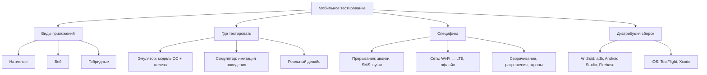

# Основы мобильного тестирования

Мобильное тестирование — это функциональное и нефункциональное тестирование
приложений на смартфонах и планшетах с учётом специфики мобильных платформ:
ограниченных ресурсов, нестабильной сети, кучи моделей устройств и постоянных
прерываний (звонки, SMS, пуши). На собеседовании эту тему задают почти всегда,
если в вакансии есть мобильный клиент: от кандидата ждут, что он знает виды
приложений, умеет объяснить разницу между эмулятором и симулятором, может
обосновать выбор устройств для тестирования и перечислить баги, которые
встречаются только на мобильных.

## Виды мобильных приложений

Первый классический вопрос — какие виды мобильных приложений вы знаете.
Ответ: **нативные, веб и гибридные**.

- **Нативные (native)** — написаны под конкретную платформу на её языке
  (Kotlin/Java для Android, Swift/Objective-C для iOS) и устанавливаются из
  стора. Дают полный доступ к железу и API ОС (камера, GPS, Bluetooth,
  push-уведомления), лучшую производительность и «родной» UI. Минусы: две
  отдельные кодовые базы и два релизных цикла.
- **Веб-приложения (mobile web)** — по сути сайты, адаптированные под мобильный
  браузер. Не устанавливаются, работают везде, но ограничены в доступе к
  железу и не работают офлайн. Тестируются как обычный веб плюс
  мобильно-специфика (жесты, ориентация, размеры экранов).
- **Гибридные (hybrid)** — веб-контент, завёрнутый в нативную оболочку
  (WebView), либо кроссплатформенные фреймворки вроде Flutter/React Native.
  Одна кодовая база на обе платформы, доступ к части нативных API через
  плагины. Компромисс: производительность и «нативность» UI хуже, а баги
  часто специфичны для связки «фреймворк + конкретная ОС».

От типа приложения зависит и стратегия тестирования: для нативного критичны
обе платформы и железо, для веб — браузеры и разрешения, для гибридного —
и то, и другое.

## Эмулятор vs симулятор vs реальный девайс

Это второй обязательный вопрос, и здесь часто путаются. Ключевая разница:

- **Эмулятор** воспроизводит работу устройства целиком — создаёт точную
  модель, включая «железо» (процессор, память), поверх которой запускается
  настоящая ОС. Классический пример — Android Emulator из Android Studio.
- **Симулятор** имитирует только поведение системы и её интерфейс — отдельные
  процессы, без точной модели железа. Приложение под симулятор iOS в Xcode
  компилируется под архитектуру компьютера и работает в среде macOS.
- **Реальный девайс** — физический телефон или планшет с настоящим железом,
  батареей, сенсорами и живой сетью.

| Критерий | Эмулятор (Android) | Симулятор (iOS) | Реальный девайс |
|---|---|---|---|
| Что воспроизводит | ОС + модель железа (точная модель устройства) | Поведение ОС и интерфейс, без модели железа | Настоящее железо и ОС |
| Скорость работы | Медленнее симулятора | Быстро (код выполняется на хосте) | Реальная производительность |
| Железные зависимости | Частично эмулируются | Не проверить (камера, Touch ID и т.п. ограничены) | Полностью доступны |
| Прерывания и сеть | Можно имитировать (звонок, SMS, GPS, сеть) | Ограниченно | Реальные звонки, SMS, переключение Wi-Fi ↔ LTE |
| Батарея, нагрев, жесты | Нет | Нет | Да |
| Стоимость | Бесплатно | Бесплатно (нужен macOS) | Дорого: парк устройств или device farm |

**Что предпочтительнее в работе?** Правильный ответ — комбинация: основной
объём регресса гонять на эмуляторах/симуляторах (быстро, дёшево, легко
автоматизировать в CI/CD), а критичные сценарии и то, что завязано на железо
(камера, Bluetooth, производительность, прерывания, поведение на слабой
сети), — обязательно проверять на реальных девайсах. Финальный смоук перед
релизом — только на живых устройствах.

> **Ответ на собесе за 60 секунд.** Эмулятор создаёт точную модель устройства
> и запускает настоящую ОС (Android Emulator), симулятор лишь имитирует
> поведение системы и интерфейс без модели железа (iOS Simulator). Реальный
> девайс нужен там, где важны железо, батарея, сеть и прерывания. В работе
> совмещаем: регресс и автотесты — на эмуляторах/симуляторах, критичные
> сценарии и релизный смоук — на живых девайсах.

## По какому принципу выбирать девайсы для тестирования

Держать весь зоопарк устройств невозможно, поэтому матрицу выбирают
осознанно:

- **Статистика пользователей**: какие модели, версии ОС и разрешения экранов
  реально использует аудитория продукта (аналитика сторов, Firebase, AppMetrica).
- **Популярность на целевом рынке**: топ-модели региона, где работает продукт.
- **Покрытие версий ОС**: минимальная поддерживаемая версия, актуальная и,
  если есть доступ, бета следующей.
- **Разнообразие форм-факторов**: разные размеры и разрешения экранов, вырезы
  под камеру (notch), складываемые устройства, планшеты, если поддерживаются.
- **Разные производители Android**: Samsung, Xiaomi, Pixel и др. — оболочки
  вендоров (One UI, MIUI) ведут себя по-разному, особенно с фоновыми
  процессами, разрешениями и push-уведомлениями.

На практике собирают короткий список из 5–15 устройств: пара флагманов, пара
бюджетных, старый девайс на минимальной ОС, планшет. Пробелы закрывают
эмуляторами и облачными фермами устройств (Firebase Test Lab, BrowserStack).

## Особенности мобильного тестирования: прерывания и мобильно-специфичные баги

Это ядро ответа на вопрос «в чём особенности мобильного тестирования».
Мобильное приложение живёт в агрессивной среде, где пользователя в любой
момент что-то отвлекает, а сеть и ресурсы непредсказуемы.

**Клиент-серверное взаимодействие и сеть:**

- переключение с Wi-Fi на мобильный интернет и обратно прямо во время запроса;
- полное пропадание интернета, слабый сигнал, высокая задержка (2G/3G,
  airplane mode);
- поведение приложения при таймаутах, обрывах загрузки, повторной отправке
  запросов (нет ли дублей заказов/платежей).

**Прерывания (interrupt testing):** входящий звонок, SMS, push-уведомление
поверх приложения, будильник, низкий заряд батареи, подключение зарядки или
наушников, сворачивание приложения и открытие другого, возврат обратно. Во
всех этих сценариях приложение должно корректно ставиться на паузу и
восстанавливаться без потери данных и состояния (например, введённый текст в
форме, позиция в списке, незавершённый платёж).

**Железо и платформа:**

- десятки размеров экранов и разрешений, вырезы под камеру, складываемые
  устройства — верстка «поехала», элементы налезли друг на друга;
- смена ориентации (портрет/ландшафт) — потеря состояния экрана, краши;
- разные производители и кастомные прошивки Android — приложение убивается
  «оптимизаторами батареи», не приходят пуши;
- разрешения (permissions): отказ в доступе к камере/геолокации, отзыв
  разрешения в настройках во время работы;
- мало памяти: система убивает приложение в фоне — корректно ли оно
  восстанавливается;
- жесты, multitouch, тач-зоны на маленьких экранах.

> **Тестирование на прерывания — примеры.** Типовой чек-лист: во время
> заполнения формы приходит звонок → отвечаем → возвращаемся (данные на
> месте?); во время загрузки файла выключаем Wi-Fi → включаем мобильный
> интернет (загрузка продолжилась или честно упала?); во время видеозвонка
> приходит push от другого приложения; сворачиваем приложение на экране
> оплаты и возвращаемся через 10 минут (сессия жива? платёж не задвоился?).

> **Ловушка.** Не ограничивайтесь ответом «проверить на разных экранах».
> Интервьюер ждёт именно список мобильно-специфичных сценариев: прерывания,
> сеть, сворачивание, разрешения, железо. Кандидат, который помнит про
> звонок во время оплаты и убийство приложения системой, выглядит заметно
> сильнее.

## Установка тестовых сборок

Уметь поставить сборку на девайс — базовый навык, его спрашивают прямо.

**Android:**

- скачать APK/AAB из CI/CD (артефакт сборки из Jenkins/GitLab CI) и
  установить вручную;
- `adb install app.apk` — установка через Android Debug Bridge с компьютера;
- запустить билд прямо из Android Studio на подключённом девайсе или
  эмуляторе;
- сервисы дистрибуции: Firebase App Distribution, App Center (ранее —
  HockeyApp).

**iOS:**

- **TestFlight** — штатный способ Apple: разработчик выгружает сборку,
  тестировщик получает приглашение и ставит её через приложение TestFlight;
- через Xcode — сборка и установка на подключённое устройство;
- те же сервисы Firebase/App Center, но для iOS всё равно нужны
  provisioning-профили и регистрация UDID устройства.

Инструменты подробнее разобраны в теме
[инструментов мобильного тестирования](topic:qa-mobile-tools).

## Различия между iOS и Android

Финальный вопрос блока — чем платформы отличаются с точки зрения тестировщика:

- **Гайдлайны и сторы.** У Apple строгие Human Interface Guidelines и жёсткая
  модерация App Store — приложение могут отклонить за несоответствие. Google
  Play мягче и публикует быстрее.
- **Закрытость.** iOS — более закрытая система: один производитель, ограниченный
  набор устройств, предсказуемое поведение. Android открыт, есть кастомные
  прошивки и оболочки вендоров.
- **Фрагментация.** У Android огромное разнообразие устройств, разрешений,
  вырезов под камеру, складываемых форм-факторов — отсюда основной объём
  проблем с вёрсткой и совместимостью. У iOS парк устройств маленький.
- **Навигация.** В Android исторически была аппаратная/экранная кнопка
  «назад», в iOS её нет — жесты и кнопки «назад» рисует само приложение; это
  надо учитывать в UX-тестах.
- **Технологии.** Разные языки (Kotlin/Java vs Swift/Objective-C), разные ОС и
  сторы — значит, отдельные сборки, отдельные баг-репорты и зачастую отдельные
  команды разработки.

> **Типовые follow-up вопросы.** Чем эмулятор отличается от симулятора? Какие
> ещё примеры прерываний приведёте? Как поставить сборку на iPhone без стора?
> Почему на Android тестировать сложнее, чем на iOS? Как выберете 10 девайсов
> для регресса?
