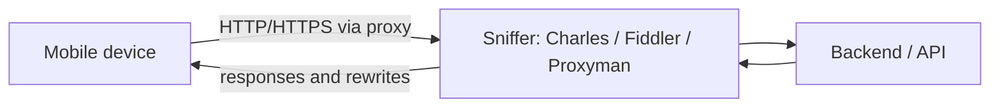

# Mobile Testing Tools

What sets a mobile QA engineer apart is the ability to look *inside* an app
on a real device: intercept network traffic, read logs, and assess the
app's health after a release. At interviews the two most practical questions
are asked almost verbatim: **"How do you inspect the requests?"** and
**"How do you read the logs?"** — how confidently and concretely you answer
(naming actual tools, not "somehow") shapes the impression of your real
experience.

## Mobile Analytics

Analytics services collect events, metrics, and audience data. A tester
needs them to verify that events are sent with the correct parameters and
to understand the product's audience.

- **Firebase (Analytics, Crashlytics)** — the de facto standard for Android
  and often for iOS: events, audiences, crash reports.
- **Flurry, MixPanel, AppAnnie (data.ai), AppsFlyer, AppSalar** — event
  analytics, install attribution (where a user came from), marketing
  metrics.
- **Yandex Metrica (AppMetrica), Google Analytics** — popular in Russian
  and international products respectively.

> **60-second interview answer.** "I've worked with Firebase: verified via
> DebugView that events fire with correct parameters, and used Crashlytics
> for crashes. I've also dealt with AppsFlyer for attribution and AppMetrica.
> To check events in real time I enable debug mode on a test device and
> filter events from my device."

## How to Inspect Requests: Traffic Sniffers

This is practical question #1. The setup is always the same: the device and
the computer are on the same network, the device is configured with a
**proxy** (the computer's IP and port), and a sniffer running on the
computer shows every HTTP/HTTPS request the app makes: URL, headers,
request/response bodies, status codes.

The main tools:

- **Charles** — the classic, paid, cross-platform; supports breakpoints
  (rewriting requests/responses on the fly), throttling (simulating a poor
  network), and rewrite rules.
- **Proxyman** — a modern Charles alternative with a convenient UI, popular
  among mobile QA.
- **Fiddler (Classic / Everywhere)** — popular in the Windows world.
- **mitmproxy** — a free console-based option, loved by automation
  engineers.
- You may also encounter **Flipper**, **Bagel**, **Stetho** (for Android).

The key detail that separates an experienced candidate: to see the contents
of **HTTPS** traffic you must install the sniffer's **root certificate** on
the device and trust it (on iOS — additionally enable full trust in
Settings). If the app uses **SSL pinning**, proxied traffic cannot be
decrypted — pinning is usually disabled in test builds.

> **Pitfall.** "I set up the proxy but see no app traffic" — typical causes:
> the certificate isn't installed/trusted, SSL pinning in the app, the
> device and computer are on different networks, or the app doesn't use
> plain HTTP (e.g. gRPC/WebSocket — sniffers show those too, but not every
> free tool does).

## How to Read Logs

The second practical question. Answer by platform — it shows systematic
thinking (the source explicitly calls this kind of answer "a big plus for
the candidate"):

- **Android**: Android Studio (**Logcat**) — the system log filtered by app
  and level (verbose/debug/error); or `adb logcat` from the console.
- **iOS**: **Xcode** (Devices / Console) and the built-in **Console** app on
  macOS — streaming logs from a connected device. Crash logs can be pulled
  directly from the device (Settings → Privacy → Analytics) or via Xcode.
- **Crashes in production**: **Crashlytics** (Firebase) and **Sentry** —
  stack traces, statistics, affected users.
- **Backend**: if you have access — server logs in **Kibana** (search by
  request id, trace id) and similar systems.

> **60-second interview answer.** "Android — Logcat in Android Studio or
> adb logcat filtered by package; iOS — Console on macOS or Xcode. For user
> crashes I check Crashlytics/Sentry, for backend logs — Kibana by request
> id. That lets me localize a bug: client, network, or server."

## The Release Is Out. How Do You Know Users Are Fine?

- Watch the **crash rate** (crash-free users/sessions in Crashlytics,
  Google Play Console, App Store Connect) — a sharp spike after a release
  means trouble.
- Check **monitoring and logs** (Sentry, Kibana, backend dashboards).
- A simple but honest move: **download the release build yourself** from
  the store and walk through the critical scenarios (smoke test on prod).

## Choosing Devices and OS Versions

"Which devices would you pick for testing in Russia? In China?" — the
answer is the same: **look at the statistics**. Either per country
(popular models, OS version shares) or, even better, for the **product's
own audience** from analytics: the top devices and OS versions among real
users. From that you build a device matrix: top models plus edge cases
(old OS, small screen, weak hardware).

A separate filter question: "What are the current iOS and Android
versions?" — it checks whether the candidate follows the market. Before an
interview, simply look up the current major versions of both platforms.

## Version Numbers: Semver Through 4.21.3

An app's version number usually follows **semantic versioning**:
`major.minor.patch`.

- **major = 4** — major changes, possibly incompatible (redesign, breaking
  API changes).
- **minor = 21** — new functionality, backward compatible.
- **patch = 3** — bug fixes only (hotfix).

So `4.21.3` reads as "the fourth generation of the app, its twenty-first
feature release, the third bugfix of that release". If a hotfix ships
tomorrow it becomes `4.21.4`; a new feature — `4.22.0`.

> **Typical follow-up questions.** "How does testing a minor release differ
> from a patch?" — a patch needs a focused check of the fix plus a quick
> sanity pass; a minor needs a full regression. "What else does a version
> have besides the number?" — a build number / versionCode (a monotonically
> increasing build identifier, which matters to the stores).

## Helper Apps

A mobile QA's everyday "Swiss army knife":

- apps showing **device information** (model, OS, memory);
- **screenshot tools and screen recorders** (built-in plus third-party) —
  for bug reports;
- apps for sending test **push notifications**;
- **fake location** tools (location spoofing);
- **file managers** — to reach app files, databases, logs.

## Testing Geolocation

It's not only about "does the map work". The standard set: spoofing
coordinates via fake location / developer options (Android) or Simulate
Location in Xcode (iOS, including the simulator); behavior with geolocation
turned off and with permission denied; moving between points and traveling;
GPS vs network accuracy; background operation. Edge cases are worth testing
too: the equator, time zone changes, coordinate "jumps".

## The App Works in 14 Countries

A senior-level question — it tests thinking, not clicking speed. What to
check:

- **Locales**: languages, date/number/currency formats, RTL languages,
  string truncation in the UI, device locale vs app locale.
- **Payments**: different countries mean different **acquirers** and
  payment methods, currencies, rounding, taxes.
- Regression across **all** countries every release is impossible — you
  pick a representative set (one country per locale/acquirer), run critical
  scenarios (registration, payment) across all key markets, and cover the
  rest with automated tests parameterized by country. Time is estimated
  from the scenario set and the number of configurations, not by
  "multiplying everything by 14".

## iOS vs iPadOS

Formally iPadOS is a separate OS, a fork of iOS. Practical differences for
a tester:

- **interface**: adaptation to the large screen, multi-column layouts,
  sidebars;
- **multitasking**: Split View and Slide Over — two apps on screen at once,
  Stage Manager on newer models;
- **stylus support** (Apple Pencil) — input, gestures, handwriting;
- its own version line: an iPadOS version doesn't have to match iOS.

If the app supports iPad, that's a full-fledged separate testing track, not
"the same thing with a bigger screen". For more on platform specifics see
[Mobile Testing](topic:qa-mobile-testing), and for the API traffic we
intercept with a sniffer — [API Testing](topic:qa-api-testing).
