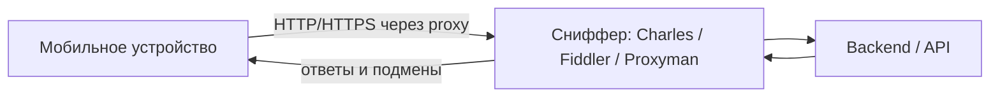

# Инструменты мобильного тестировщика

Мобильный тестировщик отличается от «просто тестировщика» тем, что умеет
заглянуть *внутрь* приложения на реальном устройстве: перехватить сетевой
трафик, прочитать логи, оценить состояние приложения после релиза. На
собеседованиях два самых практических вопроса звучат почти дословно:
**«Как посмотреть запросы?»** и **«Как посмотреть логи?»** — от того,
насколько уверенно и конкретно ты на них отвечаешь (называешь инструменты,
а не «ну как-нибудь»), зависит впечатление о реальном опыте.

## Мобильная аналитика

Сервисы аналитики собирают события, метрики и аудиторию приложения.
Тестировщику они нужны, чтобы проверять, что события (events) отправляются
с правильными параметрами, и чтобы понимать аудиторию продукта.

- **Firebase (Analytics, Crashlytics)** — стандарт де-факто для Android и
  часто для iOS: события, аудитории, краш-отчёты.
- **Flurry, MixPanel, AppAnnie (data.ai), AppsFlyer, AppSalar** — аналитика
  событий, атрибуция установок (откуда пришёл пользователь), маркетинговые
  метрики.
- **Яндекс Метрика (AppMetrica), Google Analytics** — популярны в российских
  и международных продуктах соответственно.

> **Ответ на собесе за 60 секунд.** «Работал с Firebase: проверял через
> DebugView, что события уходят с корректными параметрами, смотрел
> Crashlytics по крашам. Также сталкивался с AppsFlyer для атрибуции и
> AppMetrica. Для проверки событий в реальном времени включал debug-режим
> на тестовом устройстве и фильтровал события своего девайса.»

## Как посмотреть запросы: снифферы трафика

Это вопрос №1 на практике. Схема всегда одна: устройство и компьютер в одной
сети, на устройстве прописывается **proxy** (IP и порт компьютера), а на
компьютере запущен сниффер, который показывает все HTTP/HTTPS-запросы
приложения: URL, заголовки, тела запросов и ответов, коды статуса.

Основные инструменты:

- **Charles** — классика, платный, кроссплатформен; умеет breakpoints
  (подмену запросов/ответов на лету), throttling (эмуляция плохой сети),
  rewrite.
- **Proxyman** — современная альтернатива Charles, удобный UI, популярен у
  мобильных QA.
- **Fiddler (Classic / Everywhere)** — популярен в Windows-мире.
- **mitmproxy** — бесплатный консольный вариант, любим автоматизаторами.
- Также встречаются **Flipper**, **Bagel**, **Stetho** (для Android).

Ключевой момент, который отличает опытного кандидата: чтобы видеть содержимое
**HTTPS**-трафика, нужно установить **root-сертификат** сниффера на устройство
и доверить ему (на iOS — ещё и включить полное доверие в настройках). Если
приложение использует **SSL pinning**, трафик через proxy не расшифруется —
для тестовых сборок pinning обычно отключают.

> **Ловушка.** «Настроил proxy, а трафика приложения нет» — типичные причины:
> не установлен/не доверен сертификат, SSL pinning в приложении, устройство и
> компьютер в разных сетях, или приложение ходит не по HTTP (например, gRPC/
> WebSocket — их снифферы тоже показывают, но не всякий бесплатный инструмент).

## Как посмотреть логи

Второй практический вопрос. Отвечать стоит по платформам — это показывает
системность (источник прямо отмечает такой ответ как «большой плюс
кандидату»):

- **Android**: Android Studio (**Logcat**) — системный лог с фильтрацией по
  приложению и уровню (verbose/debug/error); либо `adb logcat` из консоли.
- **iOS**: **Xcode** (Devices / Console) и штатное приложение **Console** на
  macOS — потоковые логи подключённого устройства. Крашлоги можно выгрузить
  прямо с устройства (Settings → Privacy → Analytics) или через Xcode.
- **Краши в проде**: **Crashlytics** (Firebase) и **Sentry** — стектрейсы,
  статистика, affected users.
- **Backend**: если есть доступ — логи сервера в **Kibana** (поиск по
  request id, trace id) и подобных системах.

> **Ответ на собесе за 60 секунд.** «Android — Logcat в Android Studio или
> adb logcat с фильтром по package; iOS — Console на macOS или Xcode. Краши
> пользователей смотрю в Crashlytics/Sentry, backend-логи — в Kibana по
> id запроса. Это позволяет локализовать баг: клиент, сеть или сервер.»

## Релиз вышел. Как понять, что у пользователей всё ок?

- Следить за **крашрейтом** (crash-free users/sessions в Crashlytics,
  Google Play Console, App Store Connect) — резкий рост после релиза =
  тревога.
- Смотреть **мониторинги и логи** (Sentry, Kibana, дашборды backend).
- Простой, но честный приём: **самому скачать** релизную сборку из стора и
  пройти критичные сценарии (smoke на проде).

## Выбор устройств и версий ОС

«Какие устройства возьмёшь в тестирование для России? А для Китая?» — ответ
один: **смотрим статистику**. Либо по стране (популярные модели, доли
версий ОС), либо, ещё лучше, по **аудитории самого продукта** из аналитики:
топ устройств и версий ОС среди реальных пользователей. Из статистики
формируется device matrix: топ-модели + крайние случаи (старая ОС, маленький
экран, слабое железо).

Отдельный вопрос-фильтр: «Какие сейчас актуальные версии iOS и Android?» —
проверяют, следит ли кандидат за рынком. Перед собеседованием просто
проверь текущие мажорные версии обеих платформ.

## Номер версии: semver на примере 4.21.3

Номер версии приложения обычно строится по **semantic versioning**:
`major.minor.patch`.

- **major = 4** — крупные изменения, возможна несовместимость (редизайн,
  ломающие изменения API).
- **minor = 21** — новый функционал, обратно совместимый.
- **patch = 3** — только исправления багов (hotfix).

То есть `4.21.3` читается как «четвёртое поколение приложения, двадцать
первый функциональный релиз в нём, третий багфикс этого релиза». Если
завтра выйдет хотфикс — будет `4.21.4`; новая фича — `4.22.0`.

> **Типовые follow-up вопросы.** «Чем minor-релиз отличается от patch при
> тестировании?» — patch требует точечной проверки фикса + быстрый sanity,
> minor — полноценный регресс. «Что ещё есть у версии кроме номера?» —
> build number / versionCode (монотонно растущий номер сборки, важен для
> сторов).

## Вспомогательные приложения

Рабочий «швейцарский нож» мобильного QA:

- приложения с **информацией об устройстве** (модель, ОС, память);
- **скриншотилки и скрин-рекордеры** (системные средства + сторонние) —
  для баг-репортов;
- приложения для отправки тестовых **push-уведомлений**;
- **fake location** (подмена геолокации);
- **файловые менеджеры** — добраться до файлов приложения, баз, логов.

## Тестирование геолокации

Проверяют не только «работает ли карта». Стандартный набор: подмена
координат через fake location / developer options (Android) или
Simulate Location в Xcode (iOS, в т.ч. симулятор); поведение при выключенной
геолокации и при отказе в разрешении (permission denied); переход между
точками и движение; точность GPS vs сеть; работа в фоне. Проверять стоит и
краевые случаи: экватор, смена часового пояса, «прыжок» координат.

## Приложение работает в 14 странах

Вопрос уровня senior — проверяют мышление, а не скорость кликов. Что
проверять:

- **Локали**: языки, форматы дат/чисел/валют, RTL-языки, обрезание строк в
  UI, локаль устройства vs локаль приложения.
- **Оплата**: в разных странах — разные **эквайеры** и платёжные методы,
  валюты, округления, налоги.
- Регресс **всех** стран на каждый релиз невозможен — выбирают
  репрезентативный набор (по одной стране на локаль/эквайера), критичные
  сценарии (регистрация, оплата) прогоняют по всем важным рынкам, остальное
  покрывают автотестами с параметризацией по стране. По времени оценивают
  от набора сценариев и числа конфигураций, а не «умножением всего на 14».

## Отличие iOS от iPadOS

Формально iPadOS — отдельная ОС, ответвление iOS. Практические отличия для
тестировщика:

- **интерфейс**: адаптация под большой экран, многоколоночные layout'ы,
  sidebar;
- **многозадачность**: Split View и Slide Over — два приложения на экране
  одновременно, Stage Manager на новых моделях;
- **поддержка стилуса** (Apple Pencil) — ввод, жесты, рукописный ввод;
- отдельная строка версий: версия iPadOS не обязана совпадать с iOS.

Если приложение поддерживает iPad, это полноценное отдельное направление
тестирования, а не «то же самое, но больше экран». Подробнее о платформенных
особенностях — в теме [Мобильное тестирование](topic:qa-mobile-testing), а
про сам API-трафик, который мы перехватываем сниффером, — в
[Тестирование API](topic:qa-api-testing).
