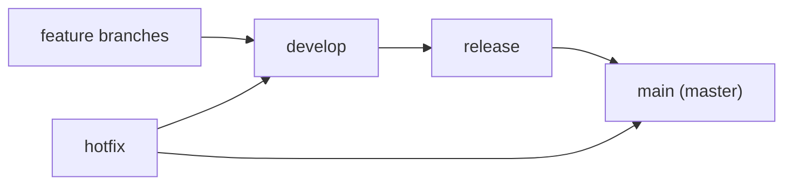

# Programming Basics for QA

Almost every QA interview includes: "What do you know about programming? What
is your experience? How would you rate yourself?" This does not mean they
expect a developer's skill level. What is actually being checked: can you read
code, write simple automated tests, speak the same language as developers, and
work with Git and CI/CD. This topic is the bridge from manual testing to
[automation](topic:qa-automation): the minimum set of concepts without which
there is no way forward.

## Variables and constants

A **variable** is a named region of memory that can hold different values and
can be changed while the program runs. A memory cell is the smallest
addressable unit of memory; a variable gives such a region a name so the code
can refer to it.

In C#, you declare a variable with an explicit type or with `var` (the compiler
infers the type from the assigned value):

```csharp
int attempts = 3;          // explicit type
var userName = "admin";    // var — the compiler infers string
attempts = 2;              // the value can change
```

A **constant** is a named value that cannot be changed after it is set.
In C#, it is declared with the `const` keyword:

```csharp
const int MaxRetries = 5;
// MaxRetries = 6; // compilation error
```

> **The 60-second interview answer.** A variable is a named memory cell with a
> changeable value (`int x = 1; x = 2;` — fine). A constant (`const`) is fixed
> at compile time and can never change. Constants are used for values that must
> not "accidentally drift": timeouts, limits, environment URLs.

**Typical follow-up questions:**

- What does `var` do? — It is not an "untyped" variable: the type is inferred
  once at compile time and stays fixed; C# remains a strongly typed language.
- When to choose a constant over a variable? — If the value is known in advance
  and must never change, use `const`.

## Data types

A type defines which values a variable can hold and which operations are valid
on it. The basic C# types you are expected to name in an interview:

| Type | What it holds | Example |
|---|---|---|
| `int` | integer number | `int age = 30;` |
| `double` | 64-bit floating-point number | `double price = 19.99;` |
| `string` | text string | `string name = "Ivan";` |
| `bool` | logical value `true` or `false` | `bool isActive = true;` |

Floating-point numbers come in different precisions: the 32-bit `float` and the
64-bit `double` — the more bits, the longer and more precise the number. In C#,
a fractional literal is a `double` by default.

### Data types in JSON

A separate favorite question: "How are different data types expressed in JSON?"
This matters because QA constantly inspects API responses (see
[API testing](topic:qa-api-testing)). In JSON, the type is visible from the
syntax:

```json
{
  "id": 42,                // number — no quotes
  "price": 19.99,          // number (fractional)
  "name": "Pizza",         // string — in double quotes
  "available": true,       // boolean — true/false without quotes
  "tags": ["hot", "new"],  // array — in square brackets
  "discount": null         // null — absence of a value
}
```

> **Trap.** `"42"` and `42` in JSON are different types: the first is a string,
> the second is a number. If an API response suddenly returns an id in quotes,
> that is a potential serialization bug. The same goes for `"true"` vs `true`.

## Loops

A **loop** is a language construct for repeating a section of a program
multiple times. Two basic kinds you must know by name:

- **for** — when the number of repetitions is known (or easy to compute) in
  advance:

```csharp
for (int i = 0; i < 5; i++)
{
    Console.WriteLine($"Attempt {i}");
}
```

- **while** — when you repeat while a condition holds and the number of
  iterations is not known in advance:

```csharp
int retries = 0;
while (retries < 3)
{
    retries++; // retry the request until attempts run out
}
```

Loops appear constantly in test code: iterating over a list of elements on a
page, repeating a request until the desired status, running through rows of a
data table.

> **Trap.** An infinite loop: if the `while` condition never becomes false (you
> forgot `retries++`), the program hangs. In an interview you may be asked to
> spot the bug in such a fragment.

## Algorithm

An **algorithm** is a finite sequence of steps for solving a problem. In the
classic view, an algorithm may consist of three parts:

1. **Getting data** — input (for example, an API response, a file with test
   data).
2. **Performing computations** — processing, comparisons, transformations.
3. **Outputting the result** — output (return a value, write a log, show
   assertion passed/failed).

Every automated test is also an algorithm: prepare the data (Arrange), perform
the action (Act), verify the result (Assert).

## Patterns and anti-patterns

A **design pattern** is a typical, proven solution to a frequently occurring
problem. It is not ready-made code but a named scheme for organizing code: by
saying "use a Singleton here" you convey an entire structure in a single word.
Especially useful for QA is **Page Object** — a pattern where each page of the
application is described by its own class and tests interact only through it
(details in the topic on [automation](topic:qa-automation)). Other well-known
examples that are good to mention in an interview: Singleton (a single instance
for the whole program), Factory Method (creating objects without naming the
exact class), Builder (step-by-step assembly of a complex object).

An **anti-pattern** is also a typical solution, but a bad one: it looks
workable yet creates problems in practice. Classic examples:

- **God Object** — one class knows and does everything.
- **Copy-paste programming** — multiplying code by copying instead of reuse.
- **Magic numbers** — unexplained numbers directly in code instead of named
  constants (`if (status == 42)` instead of `if (status == MaxAnswerLength)`).
- **Spaghetti code** — tangled logic with no structure, where the execution
  flow is impossible to trace.

## Git: basic commands, branches, Git Flow

Git is a version control system. Two commands are asked about directly:

- **Copy a repository to your machine:** `git clone <url>`
- **Upload your code to the server:** `git push` (before that, changes are
  recorded locally: `git add` + `git commit`)

A **branch** is an independent line of development within one repository: you
can build new functionality without breaking the main version, then merge the
changes back.

**Git Flow** is a popular branching model where branches have fixed roles:



- **main** — stable production code, releases.
- **develop** — the main development branch where features are merged.
- **feature branches** — individual tasks, created from develop and merged back.
- **release** — release preparation: bugfixes only, no new features.
- **hotfix** — an urgent production fix, merged into both main and develop.

> **The 60-second interview answer.** Git Flow is a branching model: main for
> production, develop for development, feature branches for tasks, release for
> release preparation, hotfix for urgent fixes. QA cares about this scheme
> because the branch determines what is tested and when: a feature is tested on
> its feature branch, regression on the release branch.

## CI/CD

**CI (Continuous Integration)** is the practice where every code change is
automatically built and verified: project build, test runs, static analysis. CI
solves the "it worked on my machine" problem and catches breakage right after
a commit, not the day before release.

**CD (Continuous Delivery / Deployment)** is the automatic delivery of a built
and verified version: to a test environment (delivery) or straight to
production (deployment).

For QA this means automated tests are built into the pipeline, and a failing
test blocks the release. Typical tools: Jenkins, GitLab CI, GitHub Actions,
TeamCity.

## GUI and CLI

The question "Which interfaces do you know?" implies two basic types:

- **GUI (Graphical User Interface)** — a graphical interface: windows, buttons,
  forms. Any familiar application — a browser, a messenger, a mobile app.
- **CLI (Command Line Interface)** — a command-line interface: commands are
  typed as text (terminal, PowerShell, bash). Examples: `git` itself, `curl`
  for API requests, `adb` for Android.

A QA engineer needs the CLI constantly: working with Git, running builds and
tests, reading logs on a server, using `curl` to check an API without Postman.

## Sniffers and DevTools

A **sniffer** is a program for intercepting and analyzing network traffic: you
can see every request and response an application sends and receives. Examples:
Charles, Fiddler, Wireshark, mitmproxy. A sniffer is indispensable when testing
mobile applications and whenever you need to inspect traffic between any
programs, not only inside a browser.

**DevTools** are the developer tools built into the browser (the Network,
Console, Elements tabs). They show only the traffic and state of the current
browser.

> **The 60-second interview answer.** DevTools is a tool built into the
> browser; it sees only browser traffic. A sniffer (Charles, Fiddler) is a
> separate proxy program that intercepts traffic from any application,
> including mobile ones, and can substitute responses and throttle the
> connection. For the web, DevTools is usually enough; for mobile apps and
> response mocking, use a sniffer.
