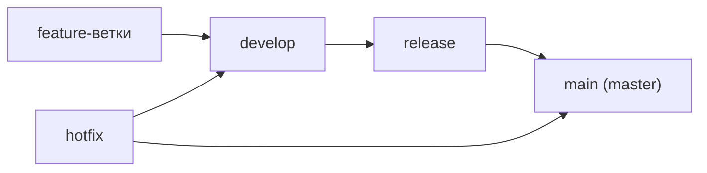

# Основы программирования для QA

На собеседовании QA-инженера почти всегда спрашивают: «Что знаешь из
программирования? Какой опыт? Как себя оцениваешь?» Это не значит, что от вас
ждут уровня разработчика. Проверяют другое: сможете ли вы читать код,
писать простые автотесты, разговаривать с разработчиками на одном языке и
работать с Git и CI/CD. Эта тема — тот самый мостик от ручного тестирования к
[автоматизации](topic:qa-automation): минимальный набор понятий, без которого
дальше двигаться некуда.

## Переменные и константы

**Переменная** — именованная область памяти, в которую можно помещать разные
значения и менять их по ходу выполнения программы. Ячейка памяти — минимальный
адресуемый элемент памяти; переменная даёт такой области имя, чтобы к ней можно
было обращаться из кода.

В C# переменную объявляют с типом или через `var` (компилятор сам выведет тип
из присвоенного значения):

```csharp
int attempts = 3;          // явный тип
var userName = "admin";    // var — компилятор выведет string
attempts = 2;              // значение можно менять
```

**Константа** — именованное значение, которое нельзя изменить после задания.
В C# её объявляют ключевым словом `const`:

```csharp
const int MaxRetries = 5;
// MaxRetries = 6; // ошибка компиляции
```

> **Ответ на собесе за 60 секунд.** Переменная — именованная ячейка памяти со
> изменяемым значением (`int x = 1; x = 2;` — ок). Константа (`const`) — значение
> фиксируется на этапе компиляции и изменить его нельзя. Константы используют
> для значений, которые не должны «случайно поплыть»: таймауты, лимиты, URL
> стендов.

**Типовые follow-up вопросы:**

- Что делает `var`? — Не «нетипизированная» переменная: тип выводится один раз
  при компиляции и дальше фиксирован, C# остаётся строго типизированным языком.
- Когда взять константу, а когда переменную? — Если значение известно заранее и
  не должно меняться никогда — `const`.

## Типы данных

Тип определяет, какие значения может хранить переменная и какие операции над
ней допустимы. Базовые типы C#, которые называют на собеседовании:

| Тип | Что хранит | Пример |
|---|---|---|
| `int` | целое число | `int age = 30;` |
| `double` | 64-битное число с плавающей точкой | `double price = 19.99;` |
| `string` | текстовая строка | `string name = "Ivan";` |
| `bool` | логическое значение `true` или `false` | `bool isActive = true;` |

Числа с плавающей точкой бывают разной точности: 32-битный `float` и 64-битный
`double` — чем больше бит, тем длиннее и точнее число. В C# по умолчанию
дробный литерал — это `double`.

### Типы данных в JSON

Отдельный любимый вопрос: «Как выделяются разные типы данных в JSON?» Это
важно, потому что QA постоянно смотрит ответы API (см.
[тестирование API](topic:qa-api-testing)). В JSON тип виден по синтаксису:

```json
{
  "id": 42,                // number — без кавычек
  "price": 19.99,          // number (дробное)
  "name": "Pizza",         // string — в двойных кавычках
  "available": true,       // boolean — true/false без кавычек
  "tags": ["hot", "new"],  // array — в квадратных скобках
  "discount": null         // null — отсутствие значения
}
```

> **Ловушка.** `"42"` и `42` в JSON — разные типы: первое — строка, второе —
> число. Если в ответе API id вдруг пришёл в кавычках — это потенциальный баг
> сериализации. То же с `"true"` против `true`.

## Циклы

**Цикл** — конструкция языка для многократного повторения участка программы.
Два базовых вида, которые надо знать по имени:

- **for** — когда заранее известно (или легко посчитать) число повторений:

```csharp
for (int i = 0; i < 5; i++)
{
    Console.WriteLine($"Попытка {i}");
}
```

- **while** — когда повторяем, пока выполняется условие, и число итераций
  заранее неизвестно:

```csharp
int retries = 0;
while (retries < 3)
{
    retries++; // повторяем запрос, пока не исчерпаем попытки
}
```

В тестовом коде циклы встречаются постоянно: перебрать элементы списка на
странице, повторить запрос до нужного статуса, прогнать данные из таблицы.

> **Ловушка.** Бесконечный цикл: если условие `while` никогда не станет
> ложным (забыли `retries++`), программа зависнет. На собесе могут попросить
> найти ошибку в таком фрагменте.

## Алгоритм

**Алгоритм** — конечная последовательность шагов для решения задачи. В
классическом виде алгоритм может состоять из трёх частей:

1. **Получение данных** — ввод (например, ответ от API, файл с тестовыми
   данными).
2. **Выполнение вычислений** — обработка, сравнения, преобразования.
3. **Вывод результата** — вывод (вернуть значение, записать лог, показать
   assertion passed/failed).

Любой автотест — это тоже алгоритм: подготовили данные (Arrange), выполнили
действие (Act), проверили результат (Assert).

## Паттерны и антипаттерны

**Паттерн проектирования** — типовое проверенное решение часто встречающейся
задачи. Это не готовый код, а именованная схема организации кода: сказав
«здесь Singleton», вы передаёте коллеге целую структуру в одном слове. Для QA
особенно полезен **Page Object** — паттерн, в котором каждая страница
приложения описывается отдельным классом, а тесты работают только через него
(подробнее — в теме про [автоматизацию](topic:qa-automation)). Другие
общеизвестные примеры, которые приятно услышать на собесе: Singleton (один
экземпляр на всю программу), Factory Method (создание объектов без явного
указания класса), Builder (пошаговая сборка сложного объекта).

**Антипаттерн** — тоже типовое решение, но плохое: оно кажется рабочим, а на
практике создаёт проблемы. Классические примеры:

- **God Object** («божественный объект») — один класс знает и делает всё.
- **Copy-paste programming** — размножение кода копированием вместо переиспользования.
- **Magic numbers** — «магические числа» прямо в коде вместо именованных констант
  (`if (status == 42)` вместо `if (status == MaxAnswerLength)`).
- **Spaghetti code** — запутанная логика без структуры, где невозможно
  проследить поток выполнения.

## Git: базовые команды, ветки, Git Flow

Git — система контроля версий. Две команды, которые спрашивают в лоб:

- **Скопировать репозиторий себе:** `git clone <url>`
- **Залить свой код на сервер:** `git push` (перед этим изменения фиксируют
  локально: `git add` + `git commit`)

**Ветка (branch)** — независимая линия разработки внутри одного репозитория:
можно вести новую функциональность, не ломая основную версию, а потом влить
изменения обратно (merge).

**Git Flow** — популярная модель ветвления, где у веток фиксированные роли:



- **main** — стабильный продакшен-код, релизы.
- **develop** — основная ветка разработки, куда сливаются фичи.
- **feature-ветки** — отдельные задачи, создаются от develop и возвращаются в него.
- **release** — подготовка релиза: только багфиксы, без новых фич.
- **hotfix** — срочное исправление прода, вливается и в main, и в develop.

> **Ответ на собесе за 60 секунд.** Git Flow — это модель ветвления: main для
> прода, develop для разработки, feature-ветки для задач, release для
> подготовки релиза, hotfix для срочных исправлений. QA важна эта схема, потому
> что от ветки зависит, что и когда тестируется: фича — на feature-ветке,
> регресс — на release.

## CI/CD

**CI (Continuous Integration, непрерывная интеграция)** — практика, при которой
каждое изменение кода автоматически собирается и проверяется: сборка проекта,
прогон тестов, статический анализ. CI решает проблему «у меня на машине
работало» и ловит поломки сразу после коммита, а не за день до релиза.

**CD (Continuous Delivery / Deployment)** — автоматическая доставка собранной и
проверенной версии: на тестовый стенд (delivery) или сразу в продакшен
(deployment).

Для QA это значит: автотесты встроены в пайплайн, и упавший тест блокирует
выкатку. Типичные инструменты: Jenkins, GitLab CI, GitHub Actions, TeamCity.

## GUI и CLI

Вопрос «Какие интерфейсы знаете?» подразумевает два базовых типа:

- **GUI (Graphical User Interface)** — графический интерфейс: окна, кнопки,
  формы. Любое привычное приложение — браузер, мессенджер, мобильное приложение.
- **CLI (Command Line Interface)** — интерфейс командной строки: команды
  вводятся текстом (терминал, PowerShell, bash). Примеры: сам `git`, `curl`
  для запросов к API, `adb` для Android.

QA-инженеру CLI нужен постоянно: работа с Git, запуск сборок и тестов, чтение
логов на сервере, `curl` для проверки API без Postman.

## Снифферы и DevTools

**Сниффер** — программа для перехвата и анализа сетевого трафика: видны все
запросы и ответы, которые приложение отправляет и получает. Примеры: Charles,
Fiddler, Wireshark, mitmproxy. Сниффер незаменим при тестировании мобильных
приложений и когда нужно посмотреть трафик между любыми программами, а не
только в браузере.

**DevTools** — встроенные инструменты разработчика в браузере (вкладки Network,
Console, Elements). Показывают только трафик и состояние текущего браузера.

> **Ответ на собесе за 60 секунд.** DevTools — это встроенный в браузер
> инструмент, видит только браузерный трафик. Сниффер (Charles, Fiddler) —
> отдельная программа-прокси, перехватывает трафик любых приложений, включая
> мобильные, умеет подменять ответы и тормозить соединение. Для веба обычно
> хватает DevTools, для мобильных приложений и подмены ответов — сниффер.
