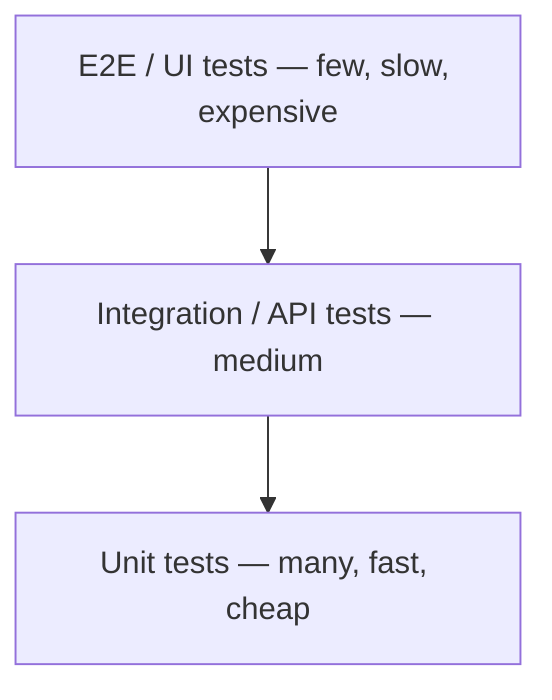
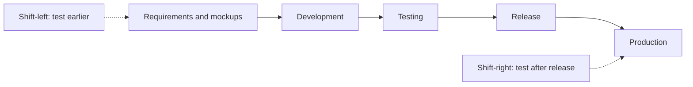

# Test Pyramid and Shift-Left/Shift-Right

This is the classic "senior block" of a QA interview: it tests not your
knowledge of terms, but your ability to build a testing process that is fast,
cheap, and still catches bugs as early as possible. Questions about the
pyramid, shift-left and shift-right almost always end with "give examples
from your project" — so every concept below should come with a ready story
from your own practice.

## The Test Pyramid

The **test pyramid** (Mike Cohn) is a model for distributing automated tests
across levels so that the base consists of many cheap, fast tests, and the
top holds only a few expensive, slow ones:

- **Unit tests** — check individual functions and classes in isolation.
  Written by developers, run in seconds, fail rarely, and point precisely at
  what broke. There should be more of these than anything else.
- **Integration / API tests** — check how components interact: service with
  database, service with service, REST API contracts. Slower and pricier
  than unit tests, but still far more stable and faster than UI tests. For a
  QA automation engineer this is usually the main working level (see
  [test types](topic:qa-test-types)).
- **E2E / UI tests** — drive the application "as a user" through the
  interface. They run long, are brittle (flaky), expensive to maintain, and
  a failure often says nothing about the root cause. So they are kept only
  for critical user journeys.

The logic of the pyramid is the economics of feedback: the lower the level,
the cheaper a test is to write and maintain, the faster it runs, and the
earlier (closer to the commit) it catches a defect. The higher the level,
the closer the test is to a real user — but the more expensive every run.

### Anti-pattern: the ice cream cone

The inverted pyramid (ice cream cone) is when almost all testing is done
through the UI: hundreds of E2E tests run for an hour, constantly fail on
instability, the team stops trusting them and re-runs "until green".
Regression becomes the release bottleneck. The cure is pushing checks
downward: everything that can be verified via API goes to the API level;
everything that can be a unit test goes to developers; through the UI you
keep only a smoke suite of critical paths.

### 60-second interview answer

"The test pyramid is a model for distributing automated tests: many fast
unit tests at the base, integration/API tests above them, and a small number
of E2E UI tests on top. The ratio is driven by cost: a unit test is cheap,
fast and stable; an E2E test is expensive, slow and flaky. On my project we
kept the bulk of checks at the API level and ran only 10–15 critical
scenarios through the UI — registration, payment — which let regression fit
into ~20 minutes in CI."

### Typical follow-up questions

- "What was the exact ratio on your project, and why?" — answer honestly
  about your project; what matters is the reasoning (architecture, team
  maturity, whether developers write unit tests), not the number.
- "What if the pyramid is already inverted?" — gradually migrate checks to
  lower levels, quarantine flaky tests, and require justification for every
  new E2E test.
- "Is the pyramid only about automation?" — primarily yes, but the idea is
  broader: manual exploratory testing is often drawn as a "cloud" above the
  pyramid's top.

## Shift-left: testing starts before development

**Shift-left** means moving testing activities leftward on the project
timeline: involving QA not when "the code is ready, go test it", but at
stages before development. Classic practices:

- **Requirements testing** — QA reviews user stories and acceptance criteria
  before the sprint: looking for contradictions, gaps, ambiguities, and
  missing negative scenarios. A bug in requirements costs an order of
  magnitude less than a bug in code (see
  [testing stages and requirements](topic:qa-testing-stages-requirements)).
- **Mockup testing** — checking design mockups before implementation: error
  states, empty states, long texts, localization, accessibility.
- **Three Amigos / grooming with QA** — discussing a task with the analyst,
  developer and tester before work starts: test scenarios and edge cases are
  fixed up front.
- Tests are written in parallel with the code (or before it — TDD/ATDD), not
  "someday after the release".

The effect: defects are found at a stage where fixing them means editing a
document, not rewriting finished code and re-running regression.

## Shift-right: testing continues after release

**Shift-right** means moving testing rightward, into production: a release is
not the end of QA's work but the start of observing the system in real
conditions. Practices:

- **Monitoring and alerting** — dashboards for errors, latency, business
  metrics; QA looks not only at "green tests" but at how the system behaves
  for real users.
- **Feedback collection and incident analysis** — every production incident
  is reviewed: why wasn't it caught, which test or check would have caught
  it — and that check is added to the regression suite.
- **Canary releases / feature flags** — rolling out to a small share of
  users while watching metrics before the full release.
- **A/B testing**, chaos engineering, testing in production with synthetic
  transactions.

### 60-second interview answer

"Shift-left is involving testing before development: reviewing requirements
and mockups, joining grooming, writing tests early. Shift-right is testing
after release: monitoring, incident and feedback analysis, canary rollouts.
For us shift-left was a mandatory QA review of acceptance criteria before
the sprint — it filtered out a noticeable share of clarifications right at
the specification stage; and shift-right was a rule: every production
incident ended with a new test case or alert."

### Traps

- **Knowing the terms without examples.** Interviewers explicitly expect
  "if the candidate says they know it — ask for project examples". Prepare
  one or two concrete stories each for shift-left and shift-right: what
  exactly you did and what changed.
- **Confusing shift-left with "testing faster".** It is not about speed but
  about the moment you join the process.
- **Thinking shift-right means "testing everything in production".** No:
  these are controlled practices (monitoring, canary, feature flags), not
  manual checks on live data without limits.

## Process improvements and business metrics

A separate senior question: "Were there process improvements that
significantly affected business metrics?" It checks whether the candidate
thinks in terms of outcomes, not just activities. A good answer follows the
pattern "problem → process change → measurable effect":

- **Fewer defects escape to production.** Mandatory incident reviews with
  new regression checks → fewer repeat incidents and support tickets.
- **Releases became more frequent.** Moving regression from UI to the API
  level and into CI → regression shrank from two days of manual work to a
  one-hour automated run → the team could release weekly instead of monthly
  (time-to-market).
- **Less rework.** QA started reviewing requirements before the sprint →
  fewer tasks bounced back for rework because "we meant something else" →
  sprint predictability improved.
- **Cheaper quality infrastructure.** Automating smoke checks freed the
  team's manual hours for exploratory testing — quality grew without
  growing headcount.

Metrics behind such stories: defects found in production, regression time,
release frequency, flaky-test rate, support ticket volume, cost of fixing a
defect at each stage.

### Traps

- **Talking about activity instead of effect.** "We introduced Allure" is
  not an answer; "reports became readable for management and failure triage
  time halved" is.
- **Claiming someone else's results.** At the senior level they expect your
  personal role: who initiated it, how you convinced the team, how you
  measured the outcome.

## Summary

- The test pyramid is the economics of feedback: many cheap unit tests, a
  moderate layer of API/integration tests, minimal E2E through the UI; the
  inverted pyramid is a typical disease of mature projects.
- Shift-left builds quality in before the code (requirements, mockups,
  grooming); shift-right verifies quality after release (monitoring,
  incidents, canary).
- At the senior level every concept is backed by a project example and a
  measurable impact on business metrics.
