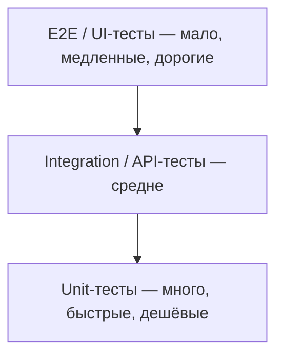
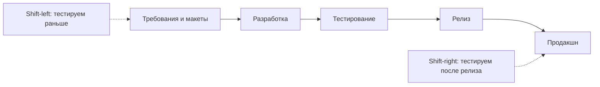

# Пирамида тестирования и shift-left/right

Это классический «senior-блок» на собеседовании QA: здесь проверяют не знание
терминов, а умение выстраивать процесс тестирования так, чтобы он был быстрым,
дёшевым и при этом ловил баги как можно раньше. Вопросы про пирамиду,
shift-left и shift-right почти всегда заканчиваются фразой «приведите примеры
с вашего проекта» — поэтому к каждой концепции ниже нужно иметь готовую
историю из практики.

## Пирамида тестирования

**Пирамида тестирования** (test pyramid, Майк Кон) — модель, которая
предлагает распределять автоматизированные тесты по уровням так, чтобы в
основании лежало много дешёвых и быстрых тестов, а на вершине — мало дорогих
и медленных:

- **Unit-тесты** — проверяют отдельные функции и классы в изоляции. Пишутся
  разработчиками, бегут за секунды, падают редко и точно показывают, где
  сломалось. Их должно быть больше всего.
- **Integration / API-тесты** — проверяют взаимодействие компонентов: сервис
  с базой, сервис с сервисом, контракты REST API. Медленнее и дороже unit, но
  всё ещё стабильнее и быстрее UI. Для QA-автоматизатора это обычно основной
  рабочий уровень (см. [виды тестирования](topic:qa-test-types)).
- **E2E / UI-тесты** — гоняют приложение «как пользователь» через интерфейс.
  Долго бегут, хрупкие (flaky), дорого поддерживать, а падение часто
  ничего не говорит о причине. Поэтому их оставляют только для критичных
  пользовательских сценариев.

Логика пирамиды — экономика обратной связи: чем ниже уровень, тем дешевле
написать и поддержать тест, тем быстрее он бежит и тем раньше (ближе к
коммиту) ловит дефект. Чем выше уровень, тем ближе тест к реальному
пользователю, но тем дороже каждый прогон.

### Анти-паттерн: «рожок мороженого»

Перевёрнутая пирамида (ice cream cone) — когда почти всё тестирование
сделано через UI: сотни E2E-тестов бегут по часу, постоянно падают по
нестабильности, команда перестаёт им верить и прогоняет «ещё разок до
зелёного». Регрессия превращается в узкое горлышко релизов. Лечение —
спускать проверки ниже: всё, что можно проверить через API, проверять через
API; всё, что можно — unit-тестами, отдавать unit-тестам; через UI оставлять
только smoke критичных путей.

### Ответ на собесе за 60 секунд

«Пирамида тестирования — это модель распределения автотестов: в основании
много быстрых unit-тестов, выше — integration/API-тесты, на вершине —
немного E2E через UI. Соотношение продиктовано стоимостью: unit-тест дёшев,
быстр и стабилен, E2E — дорог, медленен и flaky. На моём проекте мы держали
основную массу проверок на уровне API, а через UI гоняли только 10–15
критичных сценариев вроде регистрации и оплаты — за счёт этого регрессия
укладывалась в ~20 минут в CI».

### Типовые follow-up вопросы

- «А какое соотношение было именно у вас? Почему именно такое?» — отвечайте
  честно про свой проект; важно обоснование (архитектура, зрелость команды,
  наличие unit-тестов у разработчиков), а не цифра.
- «Что делать, если пирамида уже перевёрнута?» — постепенно мигрировать
  проверки на нижние уровни, вводить quarantine для flaky-тестов, не писать
  новые E2E без обоснования.
- «Пирамида — это только про автоматизацию?» — в первую очередь да, но идея
  шире: ручное exploratory-тестирование часто рисуют «облачком» над
  вершиной пирамиды.

## Shift-left: тестирование начинается до разработки

**Shift-left** — сдвиг активностей тестирования левее по временной шкале
проекта: подключать QA не когда «код готов, тестируйте», а на этапах до
разработки. Классические практики:

- **Тестирование требований** — QA ревьюит user story и критерии
  приёмки до спринта: ищет противоречия, пробелы, неоднозначности,
  неучтённые негативные сценарии. Баг в требованиях стоит в разы дешевле
  бага в коде (см. [тестирование на этапах и требования](topic:qa-testing-stages-requirements)).
- **Тестирование макетов** — проверка дизайн-макетов до верстки: состояния
  ошибок, пустые состояния, длинные тексты, локализация, доступность.
- **Three Amigos / grooming с QA** — обсуждение задачи аналитиком,
  разработчиком и тестировщиком до начала работы: сразу фиксируются
  тестовые сценарии и edge cases.
- Тесты пишутся параллельно с кодом (или до — TDD/ATDD), а не «когда-нибудь
  после релиза».

Эффект: дефекты находятся на этапе, где их исправление — это правка
документа, а не переделка готового кода и повторная регрессия.

## Shift-right: тестирование продолжается после релиза

**Shift-right** — сдвиг тестирования правее, в продакшн: релиз не конец
работы QA, а начало наблюдения за системой в реальных условиях. Практики:

- **Мониторинг и алертинг** — дашборды ошибок, latency, бизнес-метрик; QA
  смотрит не только «зелёные тесты», но и поведение системы у реальных
  пользователей.
- **Сбор обратной связи (ОС) и разбор инцидентов** — каждый продакшн-инц
  разбирается: почему не поймали, каким тестом/проверкой можно было
  поймать, и эта проверка добавляется в регрессию.
- **Canary releases / feature flags** — выкатка на малую долю пользователей
  с наблюдением за метриками перед полным релизом.
- **A/B-тестирование**, хаос-инжиниринг, тестирование в проде на synthetic-транзакциях.

### Ответ на собесе за 60 секунд

«Shift-left — подключение тестирования до разработки: ревью требований и
макетов, участие в груминге, раннее написание тестов. Shift-right —
тестирование после релиза: мониторинг, разбор инцидентов и обратной связи,
canary-выкатки. У нас shift-left выглядел как обязательный QA-ревью критериев
приёмки до спринта — это отсеяло заметную часть уточнений уже на стадии
постановки; а shift-right — как правило: каждый инцидент с прода
заканчивался новым тест-кейсом или алертом».

### Ловушки

- **Знать термины без примеров.** Интервьюер прямо ждёт «если говорит, что
  знает — попросить примеры с проекта». Готовьте по 1–2 конкретные истории
  на shift-left и на shift-right: что именно делали, что изменилось.
- **Путать shift-left с «тестировать быстрее».** Это не про скорость, а про
  момент подключения к процессу.
- **Думать, что shift-right = «тестировать в проде всё подряд».** Нет: это
  контролируемые практики (мониторинг, canary, feature flags), а не ручные
  проверки на боевых данных без ограничений.

## Улучшения процессов и бизнес-показатели

Отдельный senior-вопрос: «Были ли улучшения процессов, которые глобально
повлияли на бизнес-показатели?» Здесь проверяют, мыслит ли кандидат
категориями результата, а не только активности. Хороший ответ строится по
схеме «проблема → изменение процесса → измеримый эффект»:

- **Дефекты уходят с прода.** Внедрили обязательный разбор инцидентов с
  добавлением проверок в регрессию → снизилось число повторных инцидентов и
  обращений в поддержку.
- **Релизы стали чаще.** Перенесли регрессию с UI на API-уровень и в CI →
  регрессия с двух дней ручной работы сократилась до часа автопрогона →
  команда смогла релизиться еженедельно вместо ежемесячно (time-to-market).
- **Меньше переделок.** QA стал ревьюить требования до спринта → упало
  количество задач, возвращаемых на доработку из-за «а мы имели в виду
  другое» → выросла предсказуемость спринтов.
- **Дешевле инфраструктура качества.** Автоматизация smoke-проверок
  освободила ручные часы команды на exploratory-тестирование — качество
  выросло без роста штата.

Метрики, на которые опираются такие истории: количество дефектов на проде,
время регрессии, частота релизов, доля flaky-тестов, число обращений в
поддержку, стоимость исправления дефекта по этапам.

### Ловушки

- **Рассказывать про активность, а не про эффект.** «Мы внедрили Allure» —
  не ответ; «отчёты стали читаемыми для менеджмента, время разбора падений
  упало вдвое» — ответ.
- **Приписывать себе чужой результат.** На senior-позиции ждут именно вашу
  роль: кто инициировал, как убедили команду, чем измерили.

## Итог

- Пирамида тестирования — экономика обратной связи: много дешёвых unit,
  умеренно API/integration, минимум E2E через UI; перевёрнутая пирамида —
  типичная болезнь зрелых проектов.
- Shift-left — качество закладывается до кода (требования, макеты, груминг);
  shift-right — качество проверяется после релиза (мониторинг, инциденты,
  canary).
- На senior-уровне каждая концепция подкрепляется примером с проекта и
  измеримым влиянием на бизнес-показатели.
