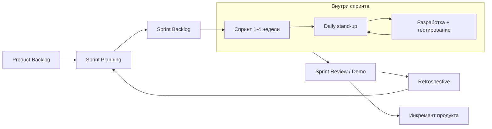

# Методологии разработки: waterfall, agile, scrum, kanban

Вопросы про методологии — обязательный блок «про процессы» почти на любом
техсобесе QA. Звучит он просто: «Какие методологии разработки вы знаете? Что
такое водопадная модель? Работали ли по agile — scrum или kanban? Какие роли
есть в scrum?». Проверяется не эрудиция, а понимание того, **как устроена
работа команды и где в ней место тестировщика**. Кандидат, который вызубрил
определения, но не может сказать, чем его рабочий день в scrum отличался бы от
рабочего дня в kanban, выглядит как человек без реального опыта в команде.

## Водопадная модель (waterfall)

Классическая каскадная модель: проект идёт по фазам строго последовательно,
каждая следующая начинается только после завершения предыдущей:

1. Сбор и фиксация требований.
2. Проектирование (архитектура, дизайн).
3. Разработка (кодирование).
4. Тестирование.
5. Внедрение и поддержка.

Возврат на предыдущую фазу формально не предусмотрен: если на тестировании
обнаружилось, что требования были ошибочными, изменение стоит очень дорого.

**Плюсы:** предсказуемость, подробная документация, понятный план и бюджет —
поэтому waterfall до сих пор уместен там, где требования стабильны и ошибка
недопустима: госзаказы, медицина, авиация, банковское ПО с жёстким
регулированием, проекты с фиксированным контрактом.

**Главный недостаток для тестировщика:** тестирование — предпоследняя фаза.
Дефекты требований и архитектуры находятся в самом конце, когда исправлять их
дороже всего. Именно из этой боли выросли agile и идея раннего тестирования —
подробнее см. [когда начинать тестировать в SDLC](topic:qa-sdlc-testing-timing).

## Agile: общая идея

Agile — не методология, а набор ценностей (Agile-манифест, 2001), который
ставят выше жёстких процессов:

- **люди и взаимодействие** важнее процессов и инструментов;
- **работающий продукт** важнее исчерпывающей документации;
- **сотрудничество с заказчиком** важнее согласования условий контракта;
- **готовность к изменениям** важнее следования первоначальному плану.

Практический смысл: продукт делается короткими итерациями, требования могут
меняться, обратная связь — постоянно. Конкретных фреймворков внутри agile два
самых распространённых — scrum и kanban; на собесе почти всегда спрашивают
именно их.

## Scrum

Scrum — фреймворк с фиксированными итерациями (**спринтами**, обычно 1–4
недели). На начало спринта команда берёт обязательство сделать выбранный набор
задач (спринт-бэклог), в конце показывает работающий инкремент продукта.

**Роли (это спрашивают прямо):**

- **Product Owner (владелец продукта)** — отвечает за «что делаем»: ведёт и
  приоритизирует бэклог продукта, формулирует требования, принимает результат.
  Для тестировщика это главный источник ответов на вопросы «а как должно
  работать?».
- **Scrum master** — отвечает за «как работаем»: следит за соблюдением
  процесса, проводит церемонии, убирает препятствия с пути команды. Это не
  начальник команды, а фасилитатор.
- **Dev team (команда разработки)** — все, кто делает инкремент: разработчики,
  тестировщики, дизайнеры, аналитики. Команда кросс-функциональная и
  самоорганизующаяся — внутри неё нет формальной иерархии.

**Церемонии:**

- **Planning** — планирование спринта: команда выбирает задачи из бэклога,
  оценивает их и декомпозирует. Тестировщик здесь задаёт вопросы по критериям
  приёмки — до начала разработки.
- **Daily (stand-up)** — ежедневная 15-минутная встреча: что сделал, что буду
  делать, что мешает. Для QA — место сказать «задача висит в тестировании
  третий день» или «жду тестовые данные».
- **Review (demo)** — демонстрация инкремента заинтересованным лицам в конце
  спринта, сбор обратной связи.
- **Retro** — ретроспектива: команда обсуждает процесс (не продукт), что
  улучшить в следующем спринте.

**Место тестировщика в scrum** — ключевой follow-up. Правильный ответ:
тестировщик — полноценный член dev team, тестирование идёт **внутри спринта**,
параллельно разработке, а не отдельной фазой после. Готовность задачи
определяется **definition of done (DoD)** — общим для команды чек-листом: код
написан, код-ревью пройдено, задача протестирована, критические баги исправлены,
документация обновлена. Задача «отдана в тестирование в последний день
спринта» — симптом «мини-водопада внутри спринта», антипаттерн, который стоит
уметь назвать. Симметрично существует **definition of ready (DoR)**: задача не
берётся в спринт, пока непонятны критерии приёмки — это прямая зона
ответственности QA на planning.

## Kanban

Kanban — метод без итераций: задачи движутся непрерывным потоком по колонкам
доски (например: Backlog → In Progress → Testing → Done). Главные механики:

- **Визуализация потока** — доска показывает все задачи и их состояние.
- **WIP-лимиты (work in progress)** — ограничение на число задач в колонке.
  Например, лимит «Testing: 3» не даёт разработчикам начинать новое, пока
  тестирование не разгребло очередь — так узкие места (а это почти всегда
  тестирование) становятся видны сразу.
- **Нет спринтов и обязательных церемоний** — планирование и релизы происходят
  по мере готовности, метрики — lead time и cycle time (время прохождения задачи
  по потоку).

Kanban хорош там, где поток задач непредсказуем и приоритеты меняются каждый
день: поддержка, багфиксы, DevOps, зрелые продукты без больших релизных циклов.

## Scrum vs kanban

| Критерий | Scrum | Kanban |
|---|---|---|
| Итерации | Фиксированные спринты | Непрерывный поток |
| Роли | PO, scrum master, dev team | Формально не заданы |
| Изменения внутри итерации | Нежелательны (спринт защищён) | Допустимы в любой момент |
| Ключевой механизм | Обязательство на спринт | WIP-лимиты |
| Церемонии | Planning, daily, review, retro | Не обязательны |
| Метрики | Velocity (скорость за спринт) | Lead time / cycle time |

На практике команды часто смешивают оба подхода («scrumban»): спринты есть, но
лимиты и доска — из kanban.

## Место тестировщика в разных методологиях

- **Waterfall:** QA — отдельная фаза в конце, отдельный отдел, вход через
  формальную передачу билда. Тестировщик работает по заранее написанной
  документации.
- **Scrum:** QA внутри команды и внутри спринта; участвует в planning и
  уточнении требований; задача не «done», пока не протестирована (DoD).
- **Kanban:** QA — колонка в потоке с WIP-лимитом; работа тянется, а не
  толкается; задержки в тестировании видны всей команде на доске.

> **Ответ на собесе за 60 секунд**
> «Знаю waterfall и agile-фреймворки — scrum и kanban. Водопад — последовательные
> фазы от требований до поддержки; уместен при стабильных требованиях и жёстком
> регулировании, но тестирование там отложено в конец, и дефекты находятся
> поздно и дорого. В scrum работал по спринтам две недели: роли — Product Owner
> отвечает за бэклог, scrum master — за процесс, dev team кросс-функциональна,
> тестировщик внутри неё. Церемонии — planning, daily, review, retro.
> Тестирование идёт внутри спринта, готовность задачи определяет definition of
> done. Kanban — поток без спринтов, доска с WIP-лимитами, подходит для
> поддержки и непредсказуемого потока задач».

**Что хочет услышать интервьюер:**
- не пересказ определений, а привязку к опыту: «мы работали двухнедельными
  спринтами, на planning я уточнял критерии приёмки»;
- понимание, что scrum master — не менеджер, а Product Owner — не тимлид;
- понимание DoD и того, что «протестируем в следующем спринте» — антипаттерн.

**Типовые ошибки кандидата:**
- назвать agile «методологией» наравне со scrum — agile это ценности, scrum и
  kanban — фреймворки внутри него;
- перепутать роли: «scrum master ставит задачи команде» (это делает команда
  сама на planning; приоритеты задаёт Product Owner);
- сказать «в scrum тестирование начинается после разработки» — это
  мини-водопад, а не scrum;
- не знать про WIP-лимиты — свести kanban к «доске с карточками».
