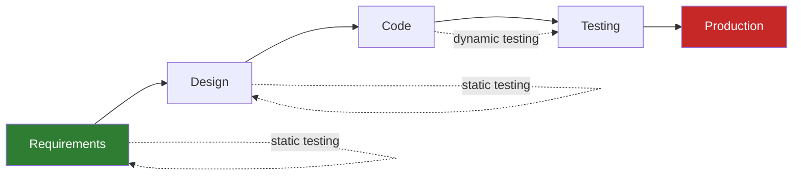

# SDLC and Testing Timing

Questions about the software development life cycle (SDLC) and about when to
start and finish testing are a staple of the first round of any QA interview.
Interviewers love them because the answer instantly shows whether a candidate
sees testing as part of the development process or believes that QA just
"receives a finished program and clicks the buttons". The key idea of this
topic: testing is not a separate stage at the end — it is an activity that runs
through the whole life cycle, and the earlier it starts, the cheaper defects
are for the company.

## The Software Development Life Cycle (SDLC)

The **software development life cycle** is the period of time that starts when
the concept (idea) of the software appears and ends when the software can no
longer be used.

The classic set of stages:

- **Concept** — the product idea, goals and target audience are formulated.
- **Requirements** — what the system must do: functional and non-functional
  requirements, business cases.
- **Design** — architecture, prototypes, mockups, data schema.
- **Implementation** — writing the code.
- **Testing** — verifying compliance with requirements, finding defects.
- **Installation and setup** — deployment at the customer's site or to
  production.
- **Operation and maintenance** — working with users, fixing bugs, updates.
- **Retirement** (not always) — migrating users, archiving, shutdown.

> **The 60-second interview answer.** The SDLC is the period from the moment a
> product idea appears until the moment the software can no longer be used. The
> main stages: concept, requirements, design, implementation, testing,
> installation and setup, operation and maintenance, and sometimes retirement.
> Important: testing as an *activity* is not confined to the stage with the
> same name — it is present at every stage, starting from requirements
> analysis.

## When Should Testing Start

The simple answer: **as soon as possible**. And this is not a slogan — it is
economics:

- At an early stage you can easily **influence the design** — changing a
  requirement or a mockup costs almost nothing compared to rewriting finished
  code.
- **The earlier a defect is found, the cheaper** it is for the company: a
  defect in requirements is fixed by editing a document; the same defect in
  production means a hotfix, a rollback and a blow to reputation.
- Testing can begin **before the software itself actually exists** — this is
  *static testing*: reviewing requirements, specifications, mockups and
  business cases. It reduces the complexity of the dynamic stage that follows.
- There is a well-founded opinion that **many defects found during dynamic
  testing could and should have been caught by static testing** — a direct
  argument for starting early.
- Studying requirements and specifications early gives a tester a **deep
  knowledge of the product**: logical and technical errors are found before
  they turn into code, saving design effort and development cost.

Early testing is also one of the seven principles of testing — see
[Seven Testing Principles](topic:qa-seven-principles); working with
requirements at early stages is covered in
[Testing Stages and Requirements](topic:qa-testing-stages-requirements).

The further left on the SDLC scale a defect is found, the cheaper it is to fix;
the further right, the more expensive (up to incidents affecting real users).
This is exactly why people talk about shifting testing "left" (shift left).

## Static vs Dynamic Testing

The distinction is fundamental:

- **Static testing** is performed **without running the code**: reviews of
  requirements, specifications, design and code. It starts long before any
  finished software exists. It catches logic errors, contradictions in
  requirements and gaps in specifications.
- **Dynamic testing** is what people usually picture when they hear "testing":
  running the program and checking its behaviour.

A typical interview trap is saying that testing starts when "developers hand
over a build". The correct answer: static testing of documentation can and
should run from the very first days of the project.

## Stopping Testing vs Finishing Testing

These are **different things**, and confusing them is a favourite interviewer
trap.

**Stopping** is a forced *pause*: the process is interrupted and testing will
resume once the cause is removed. Typical reasons:

- a **serious problem blocking further testing** has been found (a blocking
  bug — the app crashes on startup, the test environment is unavailable);
- there are **too many defects** in the software: after fixes the
  functionality will change its structure and current tests lose their value;
- **requirements have changed or been added**, altering the existing logic;
- **lack of resources**: no hardware, access rights, test environment or
  expertise;
- the **customer demanded that testing be stopped**;
- **task priority was lowered**, deadlines were moved;
- personal reasons (illness, etc.).

**Finishing** is a deliberate *completion* of the work against the exit
criteria. Testing is finished when:

- the **time allocated for testing has run out** (as sad as it is, this is a
  real criterion);
- the **task has been cancelled** — the customer abandoned the implementation;
- **software quality matches the requirements** stated at the start of
  development: all planned tests have been executed, the planned coverage has
  been reached, a risk assessment has been performed;
- there are **no blocking/critical or business-significant bugs** left.

> **The 60-second interview answer.** Stopping is a pause caused by blockers: a
> blocking bug, changed requirements, a missing environment or a customer's
> decision. Testing resumes once the obstacle is removed. Finishing means the
> exit criteria are met: the planned tests have been executed, the required
> coverage has been reached, no critical bugs remain and quality matches the
> requirements. Plus two "real-life" criteria: time ran out or the task was
> cancelled.

**Typical follow-up questions:**

- Can you ever "test everything"? (No — exhaustive testing is impossible,
  which is exactly why exit criteria and risk assessment are needed.)
- What if the time is up but critical bugs remain? (Escalate: the release
  decision is made not by the tester but by the business, based on a risk
  assessment.)
- Who decides to stop or finish? (Usually jointly: QA lead, PM, customer —
  the tester provides the quality data.)

**Traps:**

- "Testing ends when all bugs are fixed" — no: bugs are always found; testing
  ends by exit criteria, not by a zero defect count.
- Mixing up stopping and finishing: stopping ≠ finishing — after a stop, work
  continues.
- "QA starts working after development" — no: static testing starts with the
  requirements.
