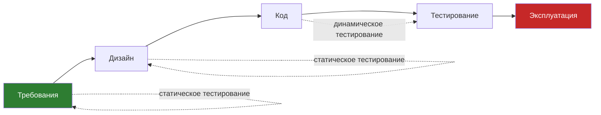

# Жизненный цикл ПО и место тестирования

Вопросы про жизненный цикл ПО (SDLC) и про то, когда начинать и заканчивать
тестирование, — классика первого этапа собеседования на QA. Их любят, потому
что по ответу сразу видно, понимает ли кандидат тестирование как часть процесса
разработки или думает, что QA «получает готовую программу и кликает по кнопкам».
Ключевая мысль темы: тестирование — не отдельный этап в конце, а деятельность,
которая идёт через весь жизненный цикл, и чем раньше она начинается, тем дешевле
компании обходятся ошибки.

## Жизненный цикл ПО (SDLC)

**Жизненный цикл программного обеспечения** — это период времени, который
начинается с момента появления концепции (идеи) ПО и заканчивается тогда, когда
использовать это ПО больше невозможно.

Классический набор этапов:

- **Концепт** — формулируется идея продукта, цели, целевая аудитория.
- **Описание требований** — что система должна делать: функциональные и
  нефункциональные требования, бизнес-кейсы.
- **Дизайн** — архитектура, прототипы, макеты, схема данных.
- **Реализация** — написание кода.
- **Тестирование** — проверка соответствия требованиям, поиск дефектов.
- **Инсталляция и наладка** — развёртывание у заказчика или на production.
- **Эксплуатация и поддержка** — работа с пользователями, исправление багов,
  обновления.
- **Вывод из эксплуатации** (не всегда) — миграция пользователей, архивация,
  отключение.

> **Ответ на собесе за 60 секунд.** SDLC — это период от появления идеи продукта
> до момента, когда им нельзя пользоваться. Основные этапы: концепт, требования,
> дизайн, реализация, тестирование, инсталляция и наладка, эксплуатация и
> поддержка, иногда — вывод из эксплуатации. Важно: тестирование как
> *деятельность* не ограничивается одноимённым этапом — оно присутствует на всех
> этапах, начиная с анализа требований.

## Когда начинать тестирование

Простой ответ: **как только это возможно**. И это не лозунг, а экономика:

- На ранней стадии можно с лёгкостью **повлиять на дизайн** — изменение
  требования или макета стоит копейки по сравнению с переписыванием готового
  кода.
- **Чем раньше обнаружена ошибка, тем дешевле** она обходится компании: дефект
  в требованиях чинится правкой документа, тот же дефект в production —
  хотфиксом, откатом и ударом по репутации.
- Тестирование может начаться **до фактического получения ПО** — это
  *статическое тестирование*: ревью требований, спецификаций, макетов,
  бизнес-кейсов. Оно снижает сложность последующей динамической стадии.
- Бытует обоснованное мнение, что **многие ошибки, найденные при динамическом
  тестировании, могли и должны были быть пойманы статическим** — это прямой
  аргумент в пользу раннего старта.
- Раннее изучение требований и спецификаций даёт тестировщику **глубокое знание
  продукта**: он находит логические и технические ошибки ещё до того, как они
  превратились в код, и экономит на дизайне и стоимости разработки.

Раннее тестирование — это также один из семи принципов тестирования, подробнее
в теме [Семь принципов тестирования](topic:qa-seven-principles), а работа с
требованиями на ранних этапах разобрана в теме
[Этапы тестирования и требования](topic:qa-testing-stages-requirements).

Чем левее на шкале SDLC найден дефект — тем дешевле его исправление; чем правее —
тем дороже (вплоть до инцидентов у реальных пользователей). Именно поэтому
говорят о сдвиге тестирования «влево» (shift left).

## Статическое и динамическое тестирование

Разделение фундаментальное:

- **Статическое тестирование** выполняется **без запуска кода**: ревью
  требований, спецификаций, дизайна, кода. Начинается задолго до появления
  готового ПО. Ловит ошибки логики, противоречия в требованиях, пробелы в
  спецификациях.
- **Динамическое тестирование** — то, что обычно представляют при слове
  «тестирование»: запуск программы и проверка её поведения.

Типовая ловушка на собеседовании — сказать, что тестирование начинается, когда
«разработчики отдали сборку». Правильный ответ: статическое тестирование
документации можно и нужно вести с первых дней проекта.

## Остановка тестирования vs конец тестирования

Это **разные вещи**, и их путаница — любимая ловушка интервьюеров.

**Остановка** — это вынужденная *пауза*: процесс прерван, тестирование
продолжится, когда причина устранится. Типичные причины:

- найдена **серьёзная проблема, блокирующая дальнейшее тестирование**
  (блокирующий баг — приложение падает на старте, недоступен стенд);
- в ПО **слишком много дефектов**: после правок функционал изменит структуру,
  и текущие тесты потеряют смысл;
- **изменились или добавились требования**, меняющие существующую логику;
- **нехватка ресурсов**: нет оборудования, доступов, стенда, компетенций;
- **заказчик потребовал остановить** тестирование;
- **снижение приоритета задачи**, перенос сроков реализации;
- личные причины (болезнь и т.п.).

**Конец (завершение)** — это осознанное *завершение* работ по критериям выхода
(exit criteria). Тестирование закончено, когда:

- **вышло время, отведённое на тестирование** (как ни грустно, это реальный
  критерий);
- **задача отменена** — заказчик отказался от реализации;
- **качество ПО соответствует требованиям**, предъявленным в начале разработки:
  выполнены все запланированные тесты, достигнуто запланированное покрытие,
  проведена оценка рисков;
- **нет блокирующих/критических и значимых для бизнеса багов**.

> **Ответ на собесе за 60 секунд.** Остановка — это пауза из-за блокеров:
> блокирующий баг, изменение требований, отсутствие стенда или решение заказчика.
> Тестирование возобновится, когда препятствие устранено. Конец — это выполнение
> критериев выхода: пройдены запланированные тесты, достигнуто нужное покрытие,
> не осталось критических багов, качество соответствует требованиям. Плюс два
> «жизненных» критерия: кончилось время или задачу отменили.

**Типовые follow-up вопросы:**

- А можно ли вообще «протестировать всё»? (Нет — исчерпывающее тестирование
  невозможно, поэтому и нужны критерии выхода и оценка рисков.)
- Что делать, если время вышло, а критические баги остались? (Эскалировать:
  решение о релизе принимает не тестировщик, а бизнес, на основе оценки рисков.)
- Кто решает об остановке и завершении? (Обычно совместно: QA-лид, PM,
  заказчик — тестировщик предоставляет данные о качестве.)

**Ловушки:**

- «Тестирование заканчивается, когда все баги исправлены» — нет: баги находятся
  всегда, заканчивается по критериям выхода, а не по нулевому числу дефектов.
- Смешение остановки и завершения: остановка ≠ конец, после остановки работа
  продолжается.
- «QA начинает работать после разработки» — нет: статическое тестирование
  начинается с требований.
