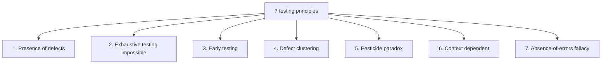

# Seven Testing Principles

The seven testing principles are a distilled body of common sense collected
by ISTQB from decades of industry experience. In interviews this is the
classic enumeration question: you will almost certainly be asked to name all
seven and then explain two or three of them. The expected answer is not rote
recitation but substance — each principle has a simple intuition and a
memorable example showing that you understand *why* it holds.

## Principle 1. Testing shows the presence of defects

Testing can show that defects are **present**, but it cannot prove that there
are **none**. Proving the absence of something is inherently hard: no matter
how many white swans we observe, that alone does not justify claiming "all
swans are white." A single black swan, however, refutes the claim instantly.
The same applies to tests: a thousand passing runs do not guarantee the
absence of bugs, but one found defect already proves defects exist in the
software.

This does not make testing useless: it reduces the probability of undiscovered
defects and increases our confidence in quality. But "no bugs found" and
"no bugs exist" are two different statements, and interviewers expect you not
to confuse them.

**60-second interview answer:** testing proves the presence of defects, not
their absence. Example — the black swan: any number of white swans does not
prove all swans are white, but one black swan disproves it. That is why we
say "testing reduces the risk of undiscovered defects," not "the product is
bug-free."

## Principle 2. Exhaustive testing is impossible

To the question "how much should we test?" the ideal answer "everything"
fails even in a toy example. An input field accepting a single digit: 10
valid values plus checking the handling of invalid ones — 26 uppercase and
26 lowercase Latin letters, punctuation marks, a space, Cyrillic characters,
special symbols — the count quickly runs into dozens. And on a realistic
screen with 15 fields of 5 allowed values each, the number of valid input
combinations is 5^15 = 30,517,578,125 tests. That fits into no release cycle.

So instead of "test everything," the test scope is chosen based on risks
(technical and business), time, and budget. Techniques like equivalence
partitioning cut the test count without losing information: testing the digit
field with values 2, 3, and 4 gives no more insight than testing with 3 alone
— they belong to the same class. See [Test Design Techniques](topic:qa-test-design) for details.

**Typical follow-up questions:**

- What limits the test scope in real life? — time, budget, and the
  requirement to give the customer ROI on testing effort.
- How do you decide what scope is sufficient? — via risk assessment: the
  higher the risk, the deeper we test.
- What are stopping factors? — exit criteria: coverage, time, pass rate,
  number of remaining open defects.

## Principle 3. Early testing

Testing activities should start as early as possible in the software
development lifecycle. The principle rests on the **cost of defect** concept:
the later a defect is found, the more expensive it is to fix. A defect caught
in requirements is cheap — edit a document. The same defect surviving to
system or acceptance testing requires changes to code, possibly architecture
and requirements, plus re-testing after the fix. A single requirements defect
can spawn many architecture and code defects. Sometimes late defects are not
fixed at all — it is simply too expensive.

The second benefit of an early start is time savings: while requirements are
being written, testers review them and design test cases, so by the first
build the tests are ready. That is why testing starts with static techniques
(requirements reviews), not with running code. How this fits into the
development lifecycle — see [SDLC and Testing Timing](topic:qa-sdlc-testing-timing).

**60-second interview answer:** early testing means starting test activities
before the first line of code, with requirements reviews. The reason is that
the cost of a defect grows along the SDLC: a requirements bug is fixed by
editing a document, while the same bug in a release means code changes,
architecture rework, and regression testing.

## Principle 4. Defect clustering

A small number of modules contains most of the defects: bugs "cluster."
Reasons include an especially complex and tangled piece of code, or a
"domino effect" from the changes being made. This is a special case of the
Pareto principle: roughly 80% of defects live in 20% of modules.

The practical consequence is risk-based planning: testers deliberately focus
on known problem areas. Clusters can be detected early, during static testing
(code review, static analysis), and then targeted with reinforced dynamic
testing. Root cause analysis is also useful: it helps eliminate the cause of
a cluster and forecast new ones.

## Principle 5. Pesticide paradox

If the same set of tests is repeated over and over, it eventually stops
finding new defects. The analogy was introduced by Boris Beizer in 1983: a
field is sprayed with a pesticide — most pests die, but resistant ones
survive; re-spraying with the same poison will not take them. The same holds
for tests: repeatedly running the same test cases leaves exactly those
defects in the product against which these tests are ineffective. Meanwhile,
the defect clusters from principle 4 "migrate" to areas your suite does not
cover.

The antidote is to regularly review and update test cases and to add new,
diverse tests exercising different parts of the system. Incidentally, this is
an argument against blind faith in a "green" regression suite: it only proves
that old bugs have not returned.

**Trap:** do not confuse the pesticide paradox with regression testing being
useless. Regression tests are necessary and important — but they must be
periodically expanded and revised, not run unchanged for years.

## Principle 6. Testing is context dependent

There is no one-size-fits-all approach to testing: a safety-critical system
(medical devices, avionics) is tested differently from an e-commerce website.
The principle rests on the notion of risk: a risk is a potential problem that
has a **likelihood** and an **impact**.

An everyday illustration is crossing the road. The likelihood of being hit by
a car depends on traffic intensity, the presence of a crosswalk, visibility,
and your own speed. The impact depends on the car's speed, your protective
clothing, age, and health. Weighing both factors, you choose a crossing
strategy: at a traffic-light crosswalk or by dashing across an empty street.
The same is true in software: different systems carry different risk levels,
defects range from trivial to ones threatening money, reputation, or even
lives — and the risk level drives the choice of methodologies, techniques,
and test types.

**60-second interview answer:** context decides everything. Banking software
and a landing page are tested differently because their risks differ — the
likelihood and impact of defects. The risk level determines which test types,
techniques, and coverage depth we choose.

## Principle 7. Absence-of-errors fallacy

Finding and fixing every defect is useless if the system is inconvenient and
does not solve the user's problems. Customers do not care about defect counts
or formal compliance with documented requirements — they care that the
product helps them do their work effectively. Even "all tests passed, no
errors found" does not guarantee the system meets user needs.

The short formula of the principle: **verification != validation**.
Verification is checking compliance with requirements ("are we building the
product right?"). Validation is checking compliance with needs and
expectations ("are we building the right product?"). Part of the testing
activities must go to verification, part to validation. In theory, if
requirements were gathered perfectly, the two coincide; in practice — alas,
they do not.

**Typical follow-up questions:**

- Give an example of a defect-free but failed system. — A product that
  precisely implements outdated or poorly gathered requirements: stable,
  but useless to anyone.
- Which activity counts as validation? — acceptance testing, beta testing,
  demos with the customer, UX research.

## How this is asked in interviews

Most often the question is literal: "Name the seven testing principles."
List all seven by number — it demonstrates systematic thinking — and then be
ready to expand on any of them with its example: the black swan (1), 5^15
tests for a 15-field screen (2), the rising cost of a defect across SDLC
stages (3), Pareto 80/20 (4), Beizer's pesticides (5), crossing the road and
risk = likelihood + impact (6), verification != validation (7). The example
matters more than the wording: it is what shows the interviewer you
understand the principle rather than memorized a list. The basic terms
"error/defect/failure" that will come up in the conversation are covered in
[Error, Defect, Failure](topic:qa-error-defect-failure).
