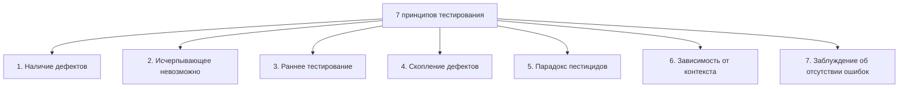

# 7 принципов тестирования

Семь принципов тестирования — это базовый свод здравого смысла, собранный
ISTQB из десятилетий индустриального опыта. На собеседовании это классический
вопрос-перечисление: вас почти наверняка попросят назвать все семь, а затем
объяснить пару-тройку на пальцах. Отвечать нужно не зубрёжкой, а сутью — у
каждого принципа есть простая интуиция и запоминающийся пример, который
показывает, что вы понимаете, *почему* принцип работает.

## Принцип 1. Тестирование показывает наличие дефектов

Тестирование может показать, что дефекты **присутствуют**, но не может
доказать, что их **нет**. Доказать отсутствие чего-либо в принципе трудно:
сколько бы белых лебедей мы ни увидели, это не основание утверждать, что
«все лебеди белые». Зато один чёрный лебедь опровергает это утверждение
мгновенно. Так и с тестами: тысяча успешных прогонов не гарантирует отсутствие
ошибок, а вот один найденный дефект уже доказывает, что дефекты в ПО есть.

Это не делает тестирование бесполезным: оно снижает вероятность необнаруженных
дефектов и повышает нашу уверенность в качестве. Но вывод «ошибок не найдено»
и вывод «ошибок нет» — это две разные фразы, и на собеседовании от вас ждут,
что вы их не путаете.

**Ответ на собесе за 60 секунд:** тестирование доказывает наличие дефектов,
а не их отсутствие. Пример — чёрный лебедь: любое число белых лебедей не
доказывает, что все лебеди белые, но один чёрный опровергает. Поэтому мы
говорим «тестирование снижает риск необнаруженных дефектов», а не «продукт
без багов».

## Принцип 2. Исчерпывающее тестирование невозможно

На вопрос «сколько нужно тестировать?» идеальный ответ «всё» не работает
даже в игрушечном примере. Поле ввода, принимающее одну цифру: 10 валидных
значений плюс проверка обработки невалидных — 26 заглавных и 26 строчных
латинских букв, знаки пунктуации, пробел, кириллица, спецсимволы — счёт быстро
идёт на десятки. А на реалистичном экране с 15 полями по 5 допустимых значений
каждое число валидных комбинаций — 5^15 = 30 517 578 125 тестов. Это не
уложится ни в какой релизный цикл.

Поэтому вместо «протестировать всё» выбирают объём тестирования на основе
рисков (технических и бизнесовых), времени и бюджета. Техники вроде классов
эквивалентности сокращают число тестов без потери информации: тестировать поле
с цифрой значениями 2, 3 и 4 не даёт больше, чем одним значением 3 — они из
одного класса. Подробнее об этом в теме [Техники тест-дизайна](topic:qa-test-design).

**Типовые follow-up вопросы:**

- Чем ограничен объём тестирования в реальной жизни? — временем, бюджетом и
  требованием дать заказчику ROI от затрат на тестирование.
- Как решить, какой объём достаточен? — через оценку рисков: где риск выше,
  там тестируем глубже.
- Что такое «стоп-факторы»? — критерии выхода (exit criteria): покрытие,
  время, доля пройденных тестов, остаточное число открытых дефектов.

## Принцип 3. Раннее тестирование

Тестовые активности должны начинаться как можно раньше в жизненном цикле
разработки. Принцип опирается на понятие **цена дефекта** (cost of defect):
чем позже найден дефект, тем дороже его исправлять. Дефект, пойманный в
требованиях, стоит дёшево — поправить документ. Тот же дефект, «доживший» до
системного или приёмочного тестирования, требует правок в коде, возможно в
архитектуре и требованиях, плюс повторного тестирования после исправления.
Один дефект требований может породить множество дефектов архитектуры и кода.
Иногда поздние дефекты не исправляют вообще — слишком дорого.

Второй плюс раннего старта — экономия времени: пока пишутся требования,
тестировщики ревьюят их и готовят тест-кейсы, и к первой сборке тесты уже
готовы. Поэтому тестирование начинается со статических техник (ревью
требований), а не с запуска кода. Как это встраивается в цикл разработки —
см. [SDLC и место тестирования](topic:qa-sdlc-testing-timing).

**Ответ на собесе за 60 секунд:** раннее тестирование — начинаем тестовые
активности до первой строчки кода, с ревью требований. Причина — цена
дефекта растёт на протяжении SDLC: баг в требованиях чинится правкой
документа, тот же баг в релизе — правками кода, архитектуры и регрессией.

## Принцип 4. Скопление дефектов

Небольшое число модулей содержит большинство дефектов: баги «кучкуются».
Причины — особенно сложный и запутанный участок кода или «эффект домино»
от вносимых изменений. Это частный случай принципа Парето: примерно 80%
дефектов живёт в 20% модулей.

Практическое следствие — риск-ориентированное планирование: тестировщики
сознательно фокусируются на известных проблемных зонах. Скопления можно
обнаружить рано, ещё статическим тестированием (code review, статанализ),
и затем прицельно усилить там динамическое тестирование. Полезен и анализ
первопричин (root cause analysis): он помогает устранить причину скопления
и спрогнозировать новые.

## Принцип 5. Парадокс пестицидов

Если повторять один и тот же набор тестов снова и снова, со временем он
перестаёт находить новые дефекты. Аналогию ввёл Борис Бейзер в 1983 году:
поле обрабатывают пестицидом — большая часть вредителей гибнет, но устойчивые
выживают; повторная обработка тем же ядом их уже не возьмёт. Так и тесты:
регулярный прогон одних и тех же тест-кейсов оставляет в продукте ровно те
дефекты, против которых эти тесты неэффективны. Скопления дефектов из 4-го
принципа при этом «переезжают» в места, которые ваш набор не покрывает.

Противоядие — регулярно пересматривать и обновлять тест-кейсы, добавлять
новые и разнообразные тесты, затрагивающие разные части системы. Это, кстати,
аргумент против слепой веры в «зелёный» регрессионный пакет: он доказывает
только то, что старые баги не вернулись.

**Ловушка:** не путайте парадокс пестицидов с бесполезностью регрессии.
Регрессионные тесты нужны и важны — но их надо периодически пополнять и
пересматривать, а не прогонять годами без изменений.

## Принцип 6. Тестирование зависит от контекста

Одинакового подхода к тестированию не существует: система, критичная для
безопасности (медицинское оборудование, авионика), тестируется иначе, чем
сайт интернет-магазина. Принцип опирается на понятие риска: риск — это
потенциальная проблема, у которой есть **вероятность** (likelihood) и
**влияние** (impact).

Бытовая иллюстрация — переход дороги. Вероятность того, что вас собьёт
машина, зависит от интенсивности движения, наличия перехода, видимости и
вашей скорости. Влияние — от скорости машины, вашей защищённости, возраста
и здоровья. Взвесив оба фактора, вы выбираете стратегию перехода: по «зебре»
на светофоре или перебежкой через пустую улицу. Так же и в ПО: у разных
систем разные уровни риска, дефекты варьируются от тривиальных до угрожающих
деньгам, репутации и даже жизни — и уровень риска определяет выбор
методологий, техник и типов тестирования.

**Ответ на собесе за 60 секунд:** контекст решает всё. Банковское ПО и лендинг
тестируются по-разному, потому что различаются риски — вероятность и влияние
дефектов. Уровень риска определяет, какие типы тестирования, техники и
глубину покрытия мы выбираем.

## Принцип 7. Заблуждение об отсутствии ошибок

Найти и исправить все дефекты бесполезно, если система неудобна и не решает
задачи пользователя. Заказчиков не волнует количество дефектов и формальное
соответствие требованиям — им важно, чтобы продукт помогал эффективно
выполнять их работу. Даже «все тесты пройдены, ошибок нет» не гарантирует,
что система нужна пользователям.

Короткая формула принципа: **верификация != валидация**. Верификация —
проверка соответствия требованиям («делаем ли мы продукт правильно?»).
Валидация — проверка соответствия потребностям и ожиданиям («делаем ли мы
правильный продукт?»). Часть тестовых активностей должна идти на верификацию,
часть — на валидацию. Теоретически, если требования собраны идеально, они
совпадают; на практике — увы, нет.

**Типовые follow-up вопросы:**

- Приведите пример системы без дефектов, но провальной. — Продукт, точно
  реализующий устаревшие или неправильно собранные требования: стабилен,
  но никому не нужен.
- Какая активность относится к валидации? — приёмочное тестирование, beta-тестирование, демо с заказчиком, UX-исследования.

## Как это спрашивают на собеседовании

Чаще всего вопрос звучит буквально: «Перечислите 7 принципов тестирования».
Назовите все семь по номерам — это демонстрирует системность, — а затем
будьте готовы раскрыть любой из них примером: чёрный лебедь (1), 5^15
тестов для экрана с 15 полями (2), рост цены дефекта по стадиям SDLC (3),
Парето 80/20 (4), пестициды Бейзера (5), переход дороги и риск = вероятность
+ влияние (6), verification != validation (7). Пример важнее формулировки:
именно он показывает интервьюеру, что вы понимаете принцип, а не зазубрили
список. Базовые термины «ошибка/дефект/отказ», которые всплывут в разговоре,
разобраны в теме [Ошибка, дефект, отказ](topic:qa-error-defect-failure).
