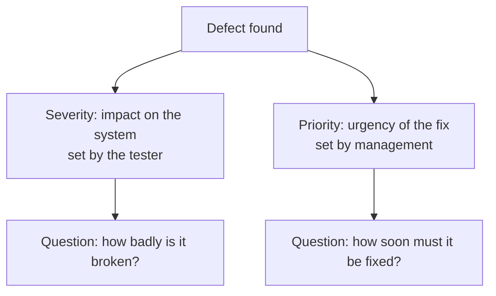

# Severity vs Priority of a Defect

Finding a bug is only half the job — the team also needs to know how bad it is
and when to fix it. That is why every defect carries two distinct attributes:
**severity** and **priority**. They are constantly confused in interviews, so
"what is the difference between severity and priority?" is one of the most
frequent questions for any QA role. Interviewers are not checking textbook
definitions but understanding: severity is about **impact on the system**,
priority is about **urgency of the fix** — and they are two independent axes.

## Severity — impact of the defect

**Severity** is the degree of impact a particular defect has on the development
or operation of a component or system. In plain words: how badly the bug breaks
the product from a technical standpoint.

Severity is set by the **tester** who found the bug. Before assigning it, the
tester asks themselves:

- How does this bug affect the system?
- How does this bug affect the customer?
- How does this bug affect the testing process and its schedule?
- Does this bug block other tests?

### The severity scale

Every company may define its own scale, but there are levels used by almost
every team:

- **Blocker / Show-stopper** — the software or a specific component is unfit
  for use or testing: total failure, system crash — and no workaround exists.
  Examples: the system crashes when the user presses "Start"; the system fails
  to launch after the installer is corrupted; the software shuts down due to a
  hardware failure.
- **Critical** — core functionality does not work as intended. A workaround
  exists, but it may compromise the integrity of testing. Examples: the
  software crashes randomly across different features; the system produces
  contradictory results, so the main requirements cannot be confirmed.
- **Major** — minor functionality is affected, there is no impact on other
  components, and a quick working workaround exists. Example: the user cannot
  use a feature directly but can reach the same feature through another
  module.
- **Minor** — negligible impact in a specific spot, no workaround needed, the
  integrity of the software is unaffected. Examples: spelling mistakes,
  improvement suggestions, change requests.

Some teams add **Trivial** (pure cosmetics) to this scale, but in an interview
it is enough to confidently name the basic Blocker → Critical → Major → Minor
ladder.

> **The 60-second interview answer**
>
> Severity measures the impact of a defect on the system's operation, and it is
> assigned by the tester who found the bug. The classic scale: Blocker — the
> system is unusable with no workaround; Critical — core functionality is
> broken; Major — a secondary feature is broken with a workaround available;
> Minor — a small thing like a typo. Severity answers the question "how badly
> is it broken?".

## Priority — urgency of the fix

**Priority** is the degree of importance assigned to a bug — in other words,
**how urgently it must be fixed**.

Priority is a **management tool**: it is defined not by the tester but by the
product owner, project manager, or team lead, based on the business context.
Before setting the priority, management answers questions like:

- How does the bug affect the release schedule?
- How does the bug affect the testing process and the work of other testers?
- What will it cost to fix the bug?
- Do we need to change the software requirements because of this bug?

A typical priority scale is **High / Medium / Low** (sometimes with Urgent):
High — fix immediately, blocks the release; Medium — fix within the current
release but not first; Low — can be postponed to the backlog.

> **The 60-second interview answer**
>
> Priority is the urgency of fixing a defect from the business perspective, and
> it is set by management (PM, PO, team lead), not by the tester. Priority
> answers the question "when do we fix it?" and depends on release deadlines,
> fix cost, and whether the bug blocks the rest of the team.

## The key difference: who, what, and when

| | Severity | Priority |
|---|---|---|
| What it measures | Impact of the bug on the system | Urgency of the fix |
| Who sets it | Tester | Management (PM / PO / team lead) |
| Based on | Technical impact analysis | Deadlines, budget, business goals |
| Does it change over time | Usually stable | May change as the release approaches |

Severity and priority are independent: a severe bug does not have to be fixed
first, and a trivial one can be urgent. The classic combinations interviewers
love to ask for:

- **High severity + low priority.** A crash triggered by a rare sequence of
  actions almost nobody performs; a bug in a feature used by a fraction of a
  percent of users; a failure on a legacy OS the product is about to drop.
  Bad for the system, but not urgent for the business.
- **Low severity + high priority.** A typo in the company name on the home
  page right before release; the wrong client logo on a demo stand; a mistake
  in an email going out to all users tomorrow. Technically trivial, but it
  hits reputation — fix immediately.
- **High severity + high priority.** Payments fail, data is lost, the app
  does not start for all users. Fix first.
- **Low severity + low priority.** A small cosmetic defect in a rarely
  visited section. Goes to the backlog.

> **Typical follow-up questions**
>
> - Who sets severity and who sets priority — and why?
> - Can priority change while severity stays the same? (Yes: the release is
>   approaching, and a minor bug on the main screen suddenly becomes urgent.)
> - What do you do if you, as a tester, disagree with the priority set by a
>   manager?
> - A blocker is found one day before release — what are your actions?

> **Traps**
>
> - Confusing severity and priority or claiming they are "the same thing" —
>   the main way to fail this question.
> - Claiming that high severity always means high priority — no, they are
>   independent axes.
> - Saying that the tester sets priority. A tester may *recommend* a priority,
>   but the decision belongs to management.
> - Forgetting that scales differ between companies: in an interview, frame it
>   as "in our team the scale was…" rather than presenting one scale as the
>   only standard.

## Related topics

Severity and priority are mandatory fields when filing a defect — see the
[bug report](topic:qa-bug-report) topic for the full structure. For the
difference between an error, a defect, and a failure, see the
[error, defect, and failure](topic:qa-error-defect-failure) topic.
