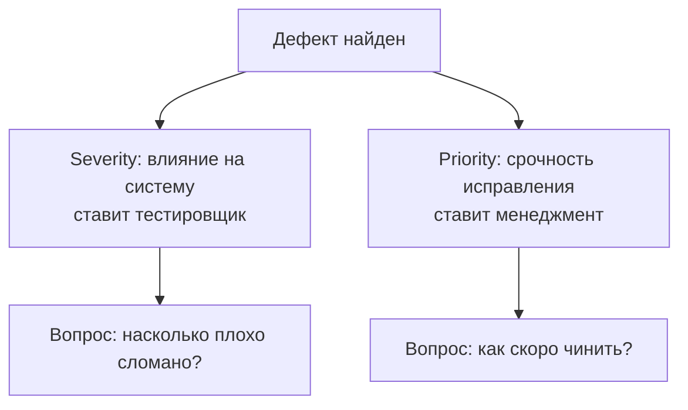

# Критичность и приоритет дефекта

Когда тестировщик находит баг, мало просто описать его — команде нужно понять,
насколько он страшен и когда его чинить. Для этого у дефекта есть два разных
атрибута: **severity** (критичность) и **priority** (приоритет). Их вечно путают
на собеседованиях, поэтому «в чём разница между severity и priority» — один из
самых частых вопросов на позицию QA любого уровня. Проверяют не определения из
учебника, а понимание: severity — про **влияние на систему**, priority — про
**срочность исправления**, и это две независимые оси.

## Severity — критичность дефекта

**Severity (критичность)** — это важность воздействия конкретного дефекта на
разработку или функционирование компонента или системы. Говоря проще: насколько
сильно баг ломает продукт с технической точки зрения.

Критичность определяет **тестировщик**, который обнаружил баг. Прежде чем
выставить её, он задаёт себе вопросы:

- Как эта ошибка влияет на систему?
- Как эта ошибка влияет на клиента?
- Как эта ошибка влияет на процесс тестирования и его сроки?
- Блокирует ли эта ошибка другие тесты?

### Шкала критичности

Каждая компания может определить свою шкалу, но есть уровни, которые
используются почти всеми командами:

- **Blocker / Show-stopper (блокирующий)** — ПО или конкретный компонент не
  подходит для использования или тестирования: полный отказ, краш системы — и
  обходного пути нет. Примеры: система падает, когда пользователь нажимает
  кнопку «Пуск»; система не запускается после повреждения инсталлятора; ПО
  отключается из-за аппаратного сбоя.
- **Critical (критический)** — главная функциональность не работает как надо.
  Обходной путь есть, но он может повлиять на целостность испытаний. Примеры:
  ПО рандомно крашится при использовании различных функций; система выдаёт
  противоречивые результаты, и основные требования не удаётся подтвердить.
- **Major (важный)** — поражены незначительные функции, влияния на другие
  компоненты нет, есть быстрый и работающий обход. Пример: пользователь не
  может воспользоваться функцией напрямую, но может открыть её же через другой
  модуль.
- **Minor (незначительный)** — незначительное воздействие в конкретном месте,
  обходной путь не нужен, целостность ПО не затронута. Примеры: орфографические
  ошибки, предложения по улучшению, запрос на изменение.

Некоторые команды добавляют к этой четвёрке **Trivial** (косметика, совсем ни на
что не влияет), но на собеседовании достаточно уверенно назвать базовую шкалу
Blocker → Critical → Major → Minor.

> **Ответ на собесе за 60 секунд**
>
> Severity — это мера влияния дефекта на работоспособность системы, её выставляет
> тестировщик, нашедший баг. Классическая шкала: Blocker — система непригодна к
> использованию и обхода нет; Critical — сломана основная функциональность;
> Major — сломана второстепенная функция, есть обход; Minor — мелочь вроде
> опечатки. Severity отвечает на вопрос «насколько плохо сломано?».

## Priority — приоритет дефекта

**Priority (приоритет)** — это степень важности, присваиваемая багу, то есть
**насколько срочно его нужно исправить**.

Приоритет — **инструмент менеджмента**: его определяет не тестировщик, а
product owner, project manager или тимлид, глядя на бизнес-контекст. Перед тем
как выставить приоритет, менеджмент отвечает себе на вопросы:

- Как баг влияет на сроки релиза?
- Как баг влияет на процесс тестирования и на работу остальных тестировщиков?
- Каковы затраты на устранение бага?
- Нужно ли из-за бага менять требования к ПО?

Типичная шкала приоритета — **High / Medium / Low** (иногда добавляют Urgent):
High — чинить немедленно, блокирует релиз; Medium — чинить в текущем релизе,
но не в первую очередь; Low — можно отложить в бэклог.

> **Ответ на собесе за 60 секунд**
>
> Priority — это срочность исправления дефекта с точки зрения бизнеса, его
> выставляет менеджмент (PM, PO, тимлид), а не тестировщик. Priority отвечает на
> вопрос «когда чинить?» и зависит от сроков релиза, стоимости исправления и
> того, мешает ли баг остальной команде.

## Главное различие: кто, что и когда

| | Severity | Priority |
|---|---|---|
| Что измеряет | Влияние бага на систему | Срочность исправления |
| Кто выставляет | Тестировщик | Менеджмент (PM / PO / тимлид) |
| На что опирается | Технический анализ влияния | Сроки, бюджет, бизнес-цели |
| Меняется ли со временем | Обычно стабильна | Может меняться по мере приближения релиза |

Severity и priority независимы: тяжёлый баг не обязан чиниться первым, а мелкий
может быть срочным. Классические комбинации, которые любят просить привести на
собеседовании:

- **Высокий severity + низкий priority.** Краш приложения при редкой
  комбинации действий, которую почти никто не воспроизводит; баг в функции,
  которой пользуется доля процента пользователей; падение на устаревшей ОС,
  которую продукт скоро перестанет поддерживать. Системе плохо, но бизнесу
  чинить не срочно.
- **Низкий severity + высокий priority.** Опечатка в названии компании на
  главной странице накануне релиза; неправильный логотип клиента на
  презентационном стенде; ошибка в тексте письма, которое завтра уйдёт всем
  пользователям. Технически мелочь, но бьёт по репутации — чинить немедленно.
- **Высокий severity + высокий priority.** Платёж не проходит, данные
  теряются, приложение не стартует у всех пользователей. Чинить в первую
  очередь.
- **Низкий severity + низкий priority.** Мелкий косметический дефект в
  редко посещаемом разделе. Уходит в бэклог.

> **Типовые follow-up вопросы**
>
> - Кто выставляет severity, а кто priority — и почему?
> - Может ли приоритет измениться, если severity осталась прежней? (Да:
>   например, приблизился релиз, и minor-баг на главном экране стал срочным.)
> - Что делать, если вы как тестировщик не согласны с приоритетом, который
>   поставил менеджер?
> - Блокер найден за день до релиза — ваши действия?

> **Ловушки**
>
> - Путать severity и priority или говорить, что это «одно и то же» — главный
>   провал на этом вопросе.
> - Утверждать, что высокий severity всегда означает высокий priority — нет,
>   это независимые оси.
> - Говорить, что приоритет ставит тестировщик. Тестировщик может
>   *рекомендовать* приоритет, но решение — за менеджментом.
> - Забыть, что шкалы различаются между компаниями: на собесе стоит оговорить
>   «в нашей команде была такая шкала…», а не подавать её как единственный
>   стандарт.

## Связанные темы

Severity и priority — обязательные поля при оформлении дефекта, подробнее о
структуре — в теме [баг-репорт](topic:qa-bug-report). А о том, чем дефект
отличается от ошибки и отказа, — в теме
[ошибка, дефект и отказ](topic:qa-error-defect-failure).
