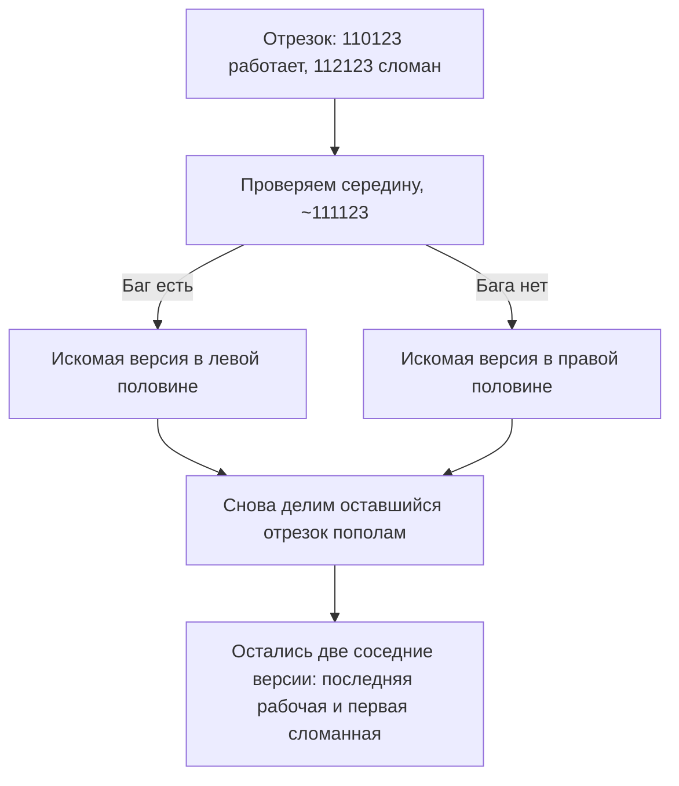

# Ситуационные вопросы: 31 сценарий с разборами

Ситуационные вопросы — любимый инструмент интервьюеров на QA-собеседованиях:
вместо «что такое регресс» вам дают мини-историю («баг найден в день релиза,
тимлид в отпуске, разработчик заболел») и смотрят, как вы рассуждаете. Готового
«правильного» ответа у таких вопросов нет — оценивают **ход мысли**: задаёте ли
уточняющие вопросы, расставляете ли приоритеты, думаете ли о продукте и команде,
а не только о своём участке. Ниже 31 классический сценарий сгруппирован по пяти
классам; для каждого класса дана модель ответа и разбор характерных примеров.

## Общая модель ответа на любой ситуационный вопрос

1. **Уточнить условия.** Почти в каждом сценарии не хватает данных — и это
   сделано намеренно. Вопросы «насколько критичен баг?», «что за релиз?»,
   «кто ещё в курсе?» показывают, что вы не действуете вслепую.
2. **Оценить риск и приоритет.** Что хуже: выпустить с багом или сорвать
   релиз? Ответ зависит от severity бага и цены задержки — проговорите это.
3. **Предложить план действий.** Конкретные шаги, а не «буду разбираться».
4. **Эскалировать и коммуницировать.** Почти всегда часть правильного ответа —
   «сообщу ответственным лицам» (дежурному тимлиду, релиз-менеджеру,
   продакт-оунеру). Решение о релизе с известным крит-багом принимает не
   тестировщик в одиночку.
5. **Подумать о предотвращении.** Сильный кандидат в конце добавляет: «и после
   инцидента я бы разобрал, как мы до этого дошли, чтобы не повторилось».

## Класс 1. Давление релиза и времени (#1, #9, #14, #27)

Общая модель: не паниковать, быстро оценить критичность, максимально сузить
объём проверок до рисковых, подключить всех доступных людей, эскалировать
решение «релизим/не релизим» на тех, кто за него отвечает.

**#1. Критический баг в день релиза, тимлид в отпуске, разработчик заболел.**
Разбор: сначала подтверждаем баг (воспроизводится ли стабильно, на каких
окружениях) и оцениваем severity — насколько он реально критичен для
пользователей. Дальше ищем, кто может помочь: другой разработчик из команды,
дежурный, замещающий тимлида. Фиксируем баг в трекере со всеми деталями и
сообщаем релиз-менеджеру/продакту: «есть крит, вот влияние, вот варианты —
отложить релиз, выпустить с хотфиксом позже, откатить фичу за фича-флагом».
Решение принимает бизнес, но тестировщик обязан дать ему полную картину.

**#14. После ухода программиста найден критический баг, релиз через час.**
Похоже на #1, но с упором на скорость. За час реально: подтвердить баг,
оценить радиус поражения (какие сценарии сломаны), проверить, есть ли
workaround, и вынести вердикт наверх. Отдельный плюс — упомянуть вариант
«откатить последние изменения» вместо «чинить в пожарном режиме».

**#9. Релиз через час, а вы понимаете, что забыли нагрузочный тест.** Модель:
честно признать пропуск, оценить риск (менялся ли вообще код, влияющий на
производительность?), предложить усечённый вариант — короткий смоук-прогон
нагрузки на ключевой операции вместо полного теста, либо релиз с усиленным
мониторингом метрик на проде. И обязательно — вывод на будущее: добавить
нагрузочный тест в чек-лист релиза, чтобы «забыть» было невозможно.

**#27. День рождения, рабочий день закончен, а «маленький фикс» всё сломал.**
Здесь проверяют границы и командность одновременно. Хороший ответ: оценить
масштаб (можно ли откатить фикс?), если откат невозможен — честно сказать,
сколько времени вы готовы дать, и сфокусироваться на смоук-проверке сломанного,
а не на полном регрессе. Героическое «остаюсь до ночи» без оценки рисков —
не лучший ответ, как и демонстративное «мой день окончен».

> Соседние сценарии «критический баг за час до релиза» и «пятница, вечер, три
> задачи одновременно» с эталонными разборами уже есть в теме
> [soft skills и ситуационные вопросы](topic:qa-soft-skills-scenarios) — там
> они разобраны подробно, здесь не дублируем.

## Класс 2. Конфликт и сопротивление (#2, #5, #15, #17, #30, #31)

Общая модель: конфликт решается фактами, а не эмоциями. Ваша задача — сделать
спор предметным: шаги воспроизведения, логи, видео, требования, окружения.
Если фактов не хватает — собрать их. Эскалация к третьей стороне (тимлид,
аналитик) — крайняя мера, а не первая.

**#2. Программист не верит, что это ошибка.** Разбор: сверяемся с источником
истины — требованиями, макетом, аналогами. Если требование есть — показываем
его. Если требования нет (#12 — смежный сценарий) — аргументируем через
ожидания пользователя и консистентность продукта, и привлекаем
аналитика/продакта как арбитра: спор «баг или фича» в отсутствие требований
решает не тестировщик и не разработчик.

**#5 / #31. У вас воспроизводится, у разработчика — нет.** Классика. Модель
ответа: сузить различия — сравнить окружения (версия сборки, ОС, браузер,
тестовые данные, пользователь), собрать доказательства (видео, логи, HAR),
воспроизвести вместе за одним столом или на машине разработчика. Для
«плавающего» бага (#31): собирать статистику — частота, условия, паттерны;
добавить логирование; договориться о критерии «считаем багом, если
воспроизводится N раз из M при таких-то условиях». Возврат бага со статусом
«не воспроизводится» без анализа — проблема процесса, и это стоит спокойно
проговорить.

**#17. Дизайнер отказывается признавать баг.** Тот же паттерн: опора на
артефакт (макет, гайдлайны платформы, доступность), предметный разговор,
в случае тупика — арбитраж продукт-оунера. Важно показать, что вы различаете
«не соответствует макету» (факт) и «мне кажется некрасивым» (мнение).

**#15. Баг нужно фиксить, а автор кода уволился.** Не конфликт, а отсутствие
владельца: завести баг, найти нового владельца компонента, передать максимум
контекста (шаги, данные, гипотезы о причине), при необходимости помочь с
воспроизведением. **#30. Разработчики не говорят по-английски** — проверка на
гибкость коммуникации: письменно, простыми фразами, скриншоты и видео вместо
слов, при необходимости — переводчик или коллега-посредник.

## Класс 3. Нехватка информации и ресурсов (#4, #13, #16, #24, #26, #28)

Общая модель: когда не хватает входа (знаний о фиче, инструментов, доступов),
правильный ответ строится вокруг **быстрого самообучения + фокусировки на
рисках + опоры на людей**, а не на отказе от задачи.

**#4. Фичу в глаза не видели, а завтра показ заказчику.** Разбор: за короткое
время невозможно протестировать всё — значит, тестируем сценарий демо.
Уточняем, что именно будут показывать заказчику, и прогоняем именно этот путь
(plus смоук основной функциональности и проверка на тестовых данных,
максимально похожих на демонстрационные). Быстро изучаем фичу: требования,
макеты, расспросить разработчика и аналитика. Отдельный плюс — упомянуть
подготовку «счастливого пути» для самого демо.

**#16. Очень технический таск в незнакомой области.** Модель: декомпозировать
задачу, найти источники знаний (документация, код, коллеги-эксперты), договориться
о консультации с разработчиком, честно сказать руководителю «мне нужно время на
погружение / нужен ревьюер». Ответ «я не разбираюсь, не могу» — провальный;
ответ «разберусь, вот план» — то, что ждут.

**#24. Jira недоступна, а баги надо выставить.** Не терять информацию: фиксируем
баги локально (текстовый файл, таблица) со всеми атрибутами, переносим в трекер,
когда он поднимется. Простое, но проверяет практичность. **#28. Тестировал на
неправильном окружении, навыставлял невалидных багов** — честно признать,
закрыть невалидные баги с пояснением, перепроверить на правильном окружении,
добавить себе проверку окружения в начало работы. Интервьюеру важно, что вы не
защищаетесь, а чините процесс. **#13 и #26** (нет зелёного прогона автотестов;
предложите свой метод тестирования) — про анализ причин и методологию: сначала
понять, что мешает, потом предлагать решение.

## Класс 4. Странные ограничения (#7, #18, #19, #22, #29)

Это мини-задачи «на сообразительность» — интервьюер смотрит, как вы работаете
в искусственных рамках, и важнее всего здесь **не сдаваться после первых
вариантов**: много сценариев построено по схеме «ждём, пока кончатся идеи,
и просим ещё один».

**#19. Протестировать сайт без мышки.** Разбор: всё делается с клавиатуры —
Tab/Shift+Tab для навигации по элементам, Enter для активации, стрелки для
списков, Esc для закрытия, горячие клавиши браузера. По сути это проверка
доступности (accessibility) и управления фокусом: виден ли фокус, логичен ли
порядок обхода, нет ли «фокусных ловушек». Когда варианты кончились, добавьте:
скринридер, управление голосом, эмуляцию клавиатуры — покажите, что можете
генерировать идеи дальше.

**#22. Найти все баги на сайте за 5 минут. «А ещё?»** Ключевой приём: за 5 минут
«все баги» не находят — и честный ответ это признаёт. Модель: быстрый
исследовательский прогон по главным сценариям (smoke), фиксация всего
подозрительного, затем структурированное перечисление найденного по категориям.
На «А ещё?» — продолжать системно: проверить другой браузер, мобильную версию,
невалидный ввод, консоль ошибок, валидацию форм. Интервьюер проверяет
настойчивость и системность, а не скорость кликов.

**#7. Тест поля даты — пока не кончатся варианты, и ещё +1.** Классический
генератор: валидные форматы, граничные значения (29 февраля високосного и
невисокосного года, 31 апреля, переходы месяцев и лет), невалидные форматы,
пустое поле, ручной ввод против выбора из календаря, часовые пояса, прошлое и
будущее. Приём «+1 после конца» — тренировка техник тест-дизайна: классы
эквивалентности и граничные значения помогают генерировать варианты не
«пока не вспомнил», а по системе (см. [техники тест-дизайна](topic:qa-test-design)).

**#18. Функционал можно протестировать только на продакшене.** Модель:
минимизировать риск — тестировать в часы минимальной нагрузки, на тестовых
данных/тестовых пользователях, согласовать окно с командой, подготовить план
отката, усилить мониторинг. Сначала — вопрос «а точно нельзя вынести на
тестовый стенд или за фича-флаг?». **#29. Составить и выслать тест-кейс,
времени мало** — сжать кейс до сути: предусловия, шаги, ожидаемый результат,
без «воды».

## Класс 5. Организация своего времени (#8, #10, #11, #20, #23, #25)

Общая модель: приоритизация по рискам + декомпозиция + честная коммуникация
о сроках. Интервьюер хочет увидеть, что вы не «работаете быстрее», а работаете
умнее.

**#8. На регресс осталось 2 дня вместо недели.** Разбор: полный регресс невозможен
— значит, выбираем. Приоритеты: критические пользовательские сценарии, области,
затронутые изменениями, исторически «багованные» места, интеграционные точки.
Остальное — честно фиксируем как непокрытый риск и сообщаем стейкхолдерам.
Подробнее техника выбора разобрана в теме
[smoke и регресс: как выбирать проверки](topic:qa-smoke-regress-selection).

**#11. Было 2 проекта в неделю, стало 5.** Модель: прозрачная приоритизация с
руководителем (что важнее), стандартизация (чек-листы вместо написания кейсов
с нуля), делегирование и автоматизация рутины, честное «в это время помещается
столько-то». Ответ «буду работать по ночам» — антипаттерн.

**#23 / #10 / #25. Протестировать продукт за 30 минут; функционал за короткое
время; новая область без запланированного времени.** Один паттерн: timebox +
исследовательское тестирование по чек-листу рисков + явная фиксация, что
осталось непокрытым. **#20. Трудновоспроизводимая ошибка** — про методичность:
сбор логов и условий, статистика, сужение пространства гипотез (пересекается с
#31 из класса конфликтов).

## Остальные сценарии (#3, #6, #12, #21)

- **#3. «Всё работает. Ваши действия?»** Проверка на инициативность: «всё
  работает» — подозрительно само по себе. Перепроверить, тот ли стенд и те ли
  данные; расширить проверки на негативные и граничные случаи; заняться
  исследовательским тестированием.
- **#6. Заболел ребёнок в день релиза.** Жизненный сценарий: честно и заранее
  предупредить команду, предложить план (удалённая работа, перераспределение
  задач, коллега на подхвате). Проверяют не самопожертвование, а зрелую
  коммуникацию.
- **#12. Баг, к которому нет требований, а все «посылают».** Аргументировать
  через UX и консистентность, найти арбитра (аналитик, продакт), зафиксировать
  решение письменно — чтобы через месяц это же не вернулось как «баг».
- **#21. Программа не устанавливается, плюс подцепили вирус.** Изолировать
  проблему (антивирус, откат), сообщить о риске безопасности ответственным,
  не скрывать инцидент.

## Жемчужина файла: биссекция регресса

**Условие.** Известно, что код версии 110123 работает, а в версии 112123 есть
баг. Как найти, в какой версии баг появился?

**Типовой слабый ответ:** идти и тестировать версию за версией от 110123 вверх.
На 2000 версиях это до 2000 прогонов — интервьюер именно этого и ждёт, чтобы
отсеять.

**Эталонный ответ — делить отрезок пополам (бинарный поиск):**

1. Проверяем версию из середины отрезка (примерно 111123).
2. Если баг есть — первая сломанная версия лежит в левой половине; если бага
   нет — в правой.
3. Повторяем, пока не останутся две соседние версии: последняя рабочая и
   первая сломанная.

Для ~2000 версий это около 11 проверок вместо 2000 (log₂ от длины отрезка).
Именно так работает `git bisect` — полезно упомянуть этот инструмент, если
версии лежат в git.

**Бонус, который отличает сильного кандидата — уточняющие вопросы до старта:**
- есть ли подозрение, что баг в коде или в данных? Если в данных — биссекция по
  версиям кода может не помочь, ищем иначе;
- насколько стабильно воспроизводится баг? «Плавающий» баг ломает бинарный
  поиск — результат одной проверки может быть ложным;
- все ли версии между 110123 и 112123 доступны и устанавливаются?

Кандидат, который сначала спросил про дополнительную информацию, показывает,
что выбирает метод под задачу, а не применяет первый попавшийся алгоритм.

## Вопросы из шапки файла

- **«Самый запоминающийся баг»** — заготовьте заранее одну историю: контекст,
  как нашли (чем нестандартнее способ — тем лучше), влияние, чему научились.
  Оценивают увлечённость и реальный опыт.
- **«Идеальный процесс тестирования»** — опишите процесс от требований до
  релиза: раннее вовлечение QA, тест-дизайн до кода, смоук → фича-тестинг →
  регресс, автоматизация рутины, метрики. Важно добавить, что «идеальный»
  зависит от контекста продукта.
- **«Тестирование на продакшене»** — нормальная практика при правильных рамках:
  часы минимальной нагрузки, тестовые данные, фича-флаги, мониторинг. Деплои в
  минимальную нагрузку снижают цену ошибки.
- **«Пропуск критичных багов: как предотвратить»** — анализ пропущенных
  дефектов (почему ушёл на прод), пополнение регресса, приоритизация по рискам,
  автоматизация повторяющихся проверок, ревью тестовых сценариев командой.

## Типовые ошибки кандидата

- Отвечать мгновенно, не задавая ни одного уточняющего вопроса, — интервьюер
  нарочно оставляет условие неполным.
- Искать виноватых вместо решения («пусть разработчик объяснит, почему не
  верит») — вопросы про конфликт проверяют умение работать с людьми.
- Называть героические меры («остаюсь до утра», «протестирую всё») вместо
  приоритизации по рискам.
- Не упоминать эскалацию: тестировщик, который в одиночку решает судьбу релиза,
  — красный флаг.
- В биссекции — предлагать линейный перебор версий.
