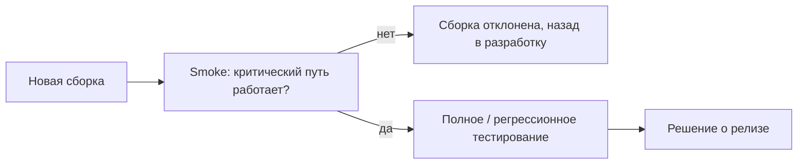

# Отбор кейсов в smoke и регресс

«Как вы отбираете кейсы для регресса и smoke?» — один из самых частых вопросов
теоретического блока, потому что он мгновенно отделяет теоретика от
практикующего инженера. Полное тестирование невозможно, поэтому суть профессии
— выбрать ограниченный набор проверок с максимальной отдачей. Здесь же
классические follow-up: «достаточно ли smoke при хотфиксе?» и «когда
автоматизировать, а когда оставить ручное?». Этот вопрос часто идёт в паре с
«объясните отличия QA, QC и тестирования» — их мы не дублируем, см.
[что такое тестирование ПО](topic:qa-what-is-testing).

## Что отбираем: smoke против регресса

Сначала зафиксируем разницу (подробнее — [виды тестирования](topic:qa-test-types)):

- **Smoke-тестирование** — короткий набор проверок критического пути продукта:
  приложение запускается, основная функциональность работает. Отвечает на
  вопрос «сборка вообще жива и её имеет смысл тестировать дальше?». Прогоняется
  на каждую новую сборку, занимает минуты, а не часы.
- **Регрессионное тестирование** — проверка, что ранее работавшая
  функциональность не сломалась после изменений (новые фичи, фиксы,
  рефакторинг). Объёмный набор, прогоняется перед релизом или после значимых
  изменений.

## Критерии отбора в smoke

Smoke-набор — это «пульс» продукта. Кейс попадает в него, если отвечает
критериям:

- **Критичность функции.** Поломка этой функции делает продукт бесполезным:
  логин, оформление заказа, оплата, главный пользовательский сценарий.
- **Частота использования.** То, чем пользуется большинство пользователей
  ежедневно.
- **Позитивный характер.** Smoke — это happy path: основной сценарий без
  граничных значений и негативных веток.
- **Скорость и стабильность.** Кейс выполняется быстро и не флаки: smoke
  прогоняется часто, медленный или нестабильный набор начинают игнорировать.

Свойства хорошего smoke-набора: десятки, а не сотни кейсов; прогон за 15–30
минут (или минуты, если автоматизирован); покрывает все ключевые подсистемы
по одному-два критичных сценария.

> **Ответ на собесе за 60 секунд**
> «В smoke я беру критичные для бизнеса и самые часто используемые функции —
> позитивные сценарии критического пути: логин, основной сценарий, оплата.
> Набор должен быть коротким и быстрым, потому что гоняется на каждую сборку:
> его задача — за минуты ответить, жива ли сборка».

## Критерии отбора в регресс

Регрессионный набор шире и отбирается по другим критериям:

- **Покрытие изменённых модулей и их связей.** Всё, что изменилось в релизе,
  плюс смежная функциональность: правка в корзине тянет за собой оформление
  заказа и оплату, даже если их «не трогали».
- **История дефектов.** Модули, где баги находили раньше, ломаются снова чаще —
  «скопление дефектов» из [семи принципов тестирования](topic:qa-seven-principles).
  Места, откуда пришли баги из прода, — обязательные жители регресса.
- **Критичность и риск.** Функции с высокой ценой ошибки (деньги, данные,
  безопасность) регрессируют всегда, даже если в релизе не менялись.
- **Частота использования.** Популярные сценарии важнее редких.
- **Стабильность требований.** Кейсы на часто меняющуюся функциональность
  держат в регрессе с оговорками — их дорого поддерживать.

Регрессионный набор — живой: после каждого релиза в него добавляют кейсы на
новую функциональность и найденные баги, а устаревшие и переставшие находить
дефекты — вычищают, иначе набор разрастается до неподъёмного.

## Хотфикс: достаточно ли smoke?

**Условие из источника:** как определить, достаточно ли smoke или нужен
регресс, например при выкатке хотфикса?

**Эталонный разбор (модель ответа):** однозначного правила нет — решение
принимается по **радиусу поражения** фикса:

1. **Оценить, что именно поменялось.** Точечная правка одной функции с
   изолированным эффектом (текст, конфиг, локальная логика) — достаточно
   проверки самого фикса плюс smoke затронутой функциональности.
2. **Оценить связность.** Фикс в общем компоненте (авторизация, платёжный
   модуль, общая библиотека) — обязателен **узкий регресс**: smoke всего
   продукта + регрессионные кейсы на смежные модули, которые используют
   изменённый код. Здесь «просто smoke» — недостаточно.
3. **Учесть контекст.** Критичность функции (деньги, безопасность → проверяем
   шире), время и ресурсы (ночной хотфикс в инциденте — сокращённый, но
   осознанный объём), история модуля (хрупкое место → шире).

Рабочая эвристика: **smoke всего продукта + точечная проверка фикса + узкий
регресс всего, до чего дотягивается изменение**. Ключевая фраза для собеса:
«объём проверок пропорционален риску и радиусу изменения, а не названию
"хотфикс"».

> **Типовые ошибки кандидата**
> «Хотфикс — всегда только smoke» и «хотфикс — всегда полный регресс» — оба
> ответа провальные, потому что игнорируют главное: анализ того, что изменилось
> и на что это влияет. Интервьюер ждёт критерии, а не догму.

## Когда автоматизировать, а когда тестировать руками

Связанный follow-up: где проходит граница между автоматизацией и ручным
тестированием (см. также [автоматизация тестирования](topic:qa-automation)).

**Автоматизируем:**
- повторяющиеся стабильные проверки — в первую очередь smoke и регресс: они
  гоняются часто, и ручной прогон превращается в дорогую рутину;
- проверки на больших объёмах данных и комбинаторике;
- то, что человек делает плохо: точные вычисления, сравнение больших выгрузок,
  параллельные сценарии, нагрузка;
- функциональность со стабильными требованиями — иначе автотесты дороже
  поддерживать, чем писать.

**Оставляем ручным:**
- исследовательское тестирование новых и рискованных мест — там нужна
  интуиция и обратная связь в реальном времени;
- usability, визуал, «ощущение продукта»;
- разовые проверки и быстро меняющуюся функциональность — автотест не окупится;
- сложные в настройке редкие сценарии, где автоматизация стоит дороже пользы.

Критерий окупаемости простой: автотест имеет смысл, когда проверка будет
выполняться **много раз** и требования **достаточно стабильны**.

> **Ответ на собесе за 60 секунд**
> «В smoke — критичные и часто используемые функции, только позитив, быстро и
> стабильно. В регресс — изменённые модули и их связи, места с историей
> дефектов, критичная и массовая функциональность; набор регулярно чищу и
> пополняю. При хотфиксе объём зависит от радиуса изменения: изолированный фикс —
> проверка фикса плюс smoke, общий компонент — ещё и узкий регресс смежных
> модулей. Автоматизирую повторяющиеся стабильные проверки — в первую очередь
> smoke и регресс; исследовательское, usability и разовое оставляю ручным».
