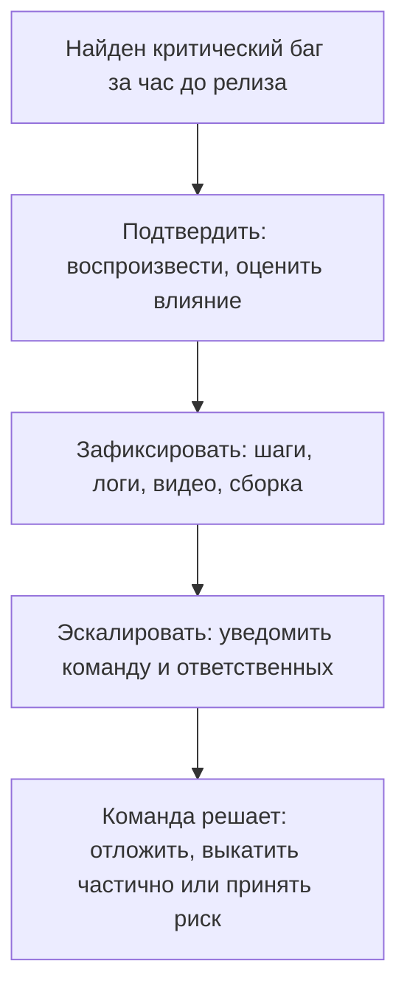

# Soft skills и ситуационные вопросы

На позицию middle QA блок soft skills весит почти столько же, сколько теория:
технические пробелы можно закрыть за пару месяцев, а вот конфликтный или
безынициативный сотрудник обходится команде дорого. Поэтому после рассказа об
опыте (см. [рассказ об опыте на собеседовании](topic:qa-interview-experience-story))
интервьюер обязательно прогоняет серию ситуационных вопросов. Важно понимать:
у этих вопросов **нет единственно правильного ответа** — проверяется ход
рассуждений, зрелость и коммуникативные паттерны. Ниже — не «правильные
ответы», а модели, по которым стоит строить свои.

## Коммуникации

### «Какие рабочие ситуации вызывают наибольшее напряжение?»

Вопрос-ловушка. Ответ «ничего не напрягает» звучит неискренне, ответ «конфликты
с разработчиками» — как прогноз проблем. Сильная модель: назовите реальную, но
**разрешимую** ситуацию (сжатые дедлайны, неопределённые требования, инцидент в
проде) и сразу покажите механизм, как справляетесь: «напрягает, когда требования
меняются в последний момент — я научился фиксировать договорённости письменно и
сразу пересчитывать объём тестирования». Формула: напряжение → осознание →
рабочий механизм.

### «Разработчик без комментариев отклоняет ваш баг»

Классика. Проверяет, не полезете ли вы в конфликт и умеете ли опираться на
факты. Модель ответа по шагам:

1. **Не эскалировать сразу.** Первый шаг — спокойно выяснить причину у самого
   разработчика: «не воспроизводится», «так задумано», «не баг, а фича».
2. **Собрать объективные артефакты.** Ваша сила — не мнение, а доказательства:
   шаги воспроизведения, логи, скриншоты и видео, ссылка на требования или
   макет, окружение и версия сборки. Хорошо оформленный
   [баг-репорт](topic:qa-bug-report) решает половину таких споров ещё до них.
3. **Обсудить по существу.** Если разработчик прав (например, поведение
   соответствует требованиям) — принять и закрыть, это нормально, а не поражение.
4. **Эскалировать, только если не сошлись.** Привлечь аналитика, владельца
   требований или лида — пусть решение принимает тот, кто отвечает за продукт.

> **Что хочет услышать интервьюер**
> Никакой борьбы эго. Кандидат опирается на артефакты (логи, видео,
> требования), а не на «я считаю, что это баг»; эскалация — крайняя мера, а не
> первая реакция.

## Саморазвитие и мотивация

- **«Планы по развитию: ближайшее время и от года?»** Проверяют, что вы
  развиваетесь осознанно и не уйдёте в область, не нужную компании. Рабочая
  модель: ближайшее — углубление в то, что нужно прямо сейчас (автоматизация
  на конкретном стеке, нагрузочное тестирование); долгосрочно — рост в
  направлении, совместимом с вакансией (senior QA, QA-лид, SDET). Ответ «хочу
  через год стать разработчиком» на позицию QA — самоуничтожение.
- **«Какая основная мотивация? Что нравится в работе QA?»** Искренность важнее
  красивости, но «стабильная зарплата» — слабый ответ. Хорошо работают мотивы
  через ценность: видеть, как продукт становится лучше от твоей работы;
  разбираться в сложных системах; предотвращать проблемы пользователей.
- **«Опыт менторства? Что важно при обучении новичка?»** Даже формального
  опыта может не быть — вспомните онбординг коллеги, ревью его кейсов.
  Ключевое в ответе: не вываливать всё сразу, а дать контекст продукта и
  процессов, назначить посильные задачи с нарастающей сложностью, быть
  доступным для вопросов, давать обратную связь по артефактам (кейсам,
  баг-репортам).
- **«Откуда получаете актуальные знания?»** Хотят услышать живую систему, а не
  «иногда читаю статьи». Назовите конкретику: профильные конференции (и их
  записи), книги (Савин, Куликов), блоги и телеграм-каналы по тестированию,
  подкасты, курсы, практика на пет-проектах. Главное — чтобы это было правдой:
  follow-up «о чём была последняя интересная статья?» приходит почти всегда.

## Ответственность — ситуационные задачи

### Критический баг за час до релиза

**Условие:** программист уже ушёл, тестировщик находит критический баг, релиз
через час. Что делать?

**Эталонный разбор (модель, а не единственный верный ответ):**

1. **Подтвердить.** Воспроизвести баг стабильно, проверить, что это не проблема
   окружения или данных, оценить реальную критичность и охват пользователей.
2. **Зафиксировать.** Завести баг с полными артефактами: шаги, логи, видео,
   версия сборки. Через час все детали забудутся — письменная фиксация
   обязательна.
3. **Эскалировать немедленно.** Сообщить ответственным (тимлид, релиз-менеджер,
   продакт): «найден критический баг, вот влияние, вот доказательства, рекомендую
   остановить релиз». Дотянуться до ушедшего разработчика, если это принято.
4. **Дать команде варианты.** Отложить релиз; выкатить без сломанной фичи
   (фича-флаг, откат коммита); выкатить с известным риском и планом хотфикса.
   Какой вариант выбрать — **решение команды и владельца продукта, а не
   тестировщика**. Роль QA — предоставить качественную информацию для решения.

**Чем этот ответ хорош:** он показывает, что кандидат не паникует и не решает
за всех, понимает свою роль (информация для решения), думает о вариантах, а не
только о «стоп-кране».

> **Типовые ошибки кандидата**
> «Отменю релиз сам» — превышение полномочий; «подожду до завтра, раз
> разработчик ушёл» — безответственность; «начну чинить с разработчиком по
> телефону» — героизм вместо процесса.

### «Закончились задачи — что будете делать?»

Проверка самостоятельности. Сильный ответ — список полезной работы, которую вы
находите сами: exploratory-тестирование рискованных мест, актуализация
тестовой документации, разбор бэклога техдолга по тестам, улучшение
автотестов, помощь коллегам, изучение продукта. И обязательное завершение:
«если свободное время стало системным — иду к лиду за задачами». Ответ «буду
ждать, пока дадут» — провал.

### Пятница, вечер, три задачи одновременно

**Условие:** собираетесь домой, и тут одновременно приходят: саппорт —
«пользователи жалуются, помогите воспроизвести»; программист — «нашёл и
пофиксил баг в проде, о нём ещё никто не репортил, давай выкатим хотфикс»;
менеджер — «новая фича, если выкатим сегодня, за выходные заработаем
миллионы».

**Эталонный разбор (модель ответа):**

1. **Приоритизация по риску и импакту, а не по громкости просящего.**
   - Хотфикс уже готов и чинит баг в проде — **проверить фикс и сопутствующий
     узкий регресс**: это быстро, и выкат улучшает прод сегодня. Одновременно
     важный нюанс: «никто не зарепортил» снижает срочность — баг может быть
     малозаметным, и рискованный хотфикс в пятницу вечером может навредить
     больше, чем сам баг. Это стоит проговорить.
   - Жалобы пользователей — **реальная проблема в проде у реальных
     пользователей**: начать воспроизводить, потому что это источник правды о
     серьёзности (возможно, это тот самый баг программиста — тогда всё сходится).
   - Новая фича «на миллионы» — **не делать сегодня**. Выкатывать непроверенную
     фичу в пятницу вечером — классический антипаттерн: выходные без поддержки,
     максимум пользователей, минимум людей на местах. Честно сказать менеджеру
     про риск и предложить план на понедельник.
2. **Коммуникация — половина ответа.** Каждому из троих дать прозрачный статус:
   саппорту — «занимаюсь, вернусь с результатом», программисту — «проверю фикс
   первым», менеджеру — «сегодня выкатывать рискованно, вот почему, вот план».
3. **Не оставаться одному.** Если объём объективно не поднимаем — эскалировать
   к лиду: пусть поможет приоритизировать или подключит людей.

**Чем этот ответ хорош:** кандидат показывает риск-ориентированное мышление
(прод и пользователи важнее обещаний денег), понимание пятничного контекста
(низкая поддержка в выходные) и зрелую коммуникацию вместо молчаливого
переутомления.

## Организация и самостоятельность

- **«Как организуете рабочий процесс? Что помогает концентрации?»** Хотят
  услышать систему: планирование дня от приоритетов, разбивка крупных задач,
  блоки непрерывной работы под прогоны и тест-дизайн, ограничение
  переключений контекста. Конкретика («веду список задач в трекере, первым
  делом — регресс блокеров») лучше абстракций.
- **«Надоела рутинная монотонная работа — что будете делать?»** Зрелый ответ:
  рутина — сигнал к оптимизации. Повторяющиеся прогоны — кандидаты в
  автоматизацию; однотипные проверки — в чек-листы и шаблоны; ротация задач с
  коллегами. Рутину не терпят — её сокращают.
- **«Нет надлежащей документации для тестирования — как преодолеете?»** Модель:
  требования всегда можно восстановить — интервью с аналитиком и разработчиком,
  исследование самого продукта, аналоги и здравый смысл (ожидания пользователя),
  а найденное — **зафиксировать письменно и согласовать**, превратив устные
  договорённости в документацию. См. [тестовая документация](topic:qa-test-documentation).
- **«Несколько срочных задач, в дедлайны не успеваете — приоритеты?»** Критерии:
  влияние на пользователей и бизнес, блокирует ли задача других, риск пропуска
  дефекта, трудоёмкость. И обязательный второй шаг: **прозрачно сообщить
  стейкхолдерам, что в сроки не укладываетесь**, и предложить варианты
  (сократить объём, сдвинуть сроки, подключить людей). Молча провалить дедлайн —
  худший сценарий.
- **«Пропускали баг? Что сделали, чтобы не повторилось?»** Ответ «не пропускал»
  не верят никогда. Модель: честный пример → разбор причины (не было кейса на
  смежную интеграцию, не проверили на конкретных данных) → конкретная
  предотвращающая мера (добавил кейсы в регресс, завёл чек-лист на интеграции).
  Ценится не безгрешность, а работа над ошибками.
- **«Непонятная задача: описания нет, технически непонятно — действия?»** Не
  начинать «как понял» и не сидеть молча. Шаги: попытаться разобраться самому
  ограниченное время (продукт, код, логи), сформулировать конкретные вопросы,
  идти к автору задачи с этими вопросами, зафиксировать ответы письменно.
  Важен баланс: самостоятельность + умение вовремя спросить.
