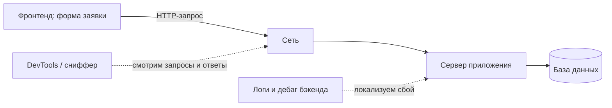

# Задача: ошибка сохранения заявки

Классическая клиент-серверная задача на локализацию дефекта. Здесь интервьюер
проверяет две вещи: знаете ли вы **цепочку диагностики** (как технически
добраться до причины ошибки) и умеете ли строить **карту точек отказа по
слоям** — фронтенд, сеть, сервер, база данных. Сильный ответ звучит как
систематичный обход слоёв, а не хаотичный список «может, что-то с базой».

## Условие задачи

Веб-приложение для создания заявки в техподдержку. Заявка состоит из двух
полей:

- **Номер заявки** в формате «две буквы и 5 цифр» (пример: `AA12345`). Поле
  редактируемое, но при открытии страницы оно **автоматически заполнено**
  данными, полученными от сервиса генерации номеров.
- **Текст заявки** — редактируемое поле.

На странице есть кнопка «Сохранить». При сохранении заявка отправляется на
сервер приложения и сохраняется в базе данных.

**Проблема:** при попытке сохранить заявку со сгенерированным номером и текстом
«Ничего не работает!» получаем сообщение **«Ошибка сохранения»**.

Вопросы интервьюера:

1. Что можно сделать, чтобы понять, почему возникает ошибка сохранения?
2. Где в текущей связке могут быть баги?

## Эталон, часть 1: цепочка локализации

Первая часть ответа — что конкретно делать руками, двигаясь по цепочке
**фронт → трафик → сервер → БД**:

1. **Открыть панель разработчика в браузере (DevTools)** и посмотреть
   запросы/ответы: уходит ли запрос при нажатии «Сохранить», на какой адрес, с
   каким телом, какой код ответа и текст ошибки возвращает сервер. Уже на этом
   шаге половина гипотез отпадает: если запрос вообще не ушёл — проблема на
   фронте; если ушёл и вернулся 400/500 — смотрим дальше.
2. **Включить сниффер** (Charles, Fiddler, mitmproxy) и посмотреть запросы и
   ответы «как есть», без браузерных искажений: реальные заголовки, тело
   запроса, кодировка.
3. **Посмотреть логи приложения** на сервере: стектрейс, сообщение об ошибке,
   дошёл ли запрос до приложения, на каком шаге оно упало.
4. **Если есть доступ к коду бэкенда — отдебажить запрос**: поставить
   точку останова на обработчик сохранения и пройти по шагам до места сбоя.

## Эталон, часть 2: карта точек отказа по слоям

Вторая часть — перечислить, где именно могут быть баги. Ключевое правило:
**идти по слоям**, а не называть варианты вразнобой.

**Слой данных (номер и текст заявки):**

- Заявка с таким номером **уже существует** — сервис генерации выдал дубликат,
  а база отклоняет повтор по уникальному ключу.
- Номер содержит **символы кириллицы** — генератор неправильно сформировал
  номер (внешне «AA» может оказаться русской «А»), и серверная валидация его
  не пропускает.
- Сервер **не принимает кириллицу в тексте** заявки — «Ничего не работает!»
  падает на кодировке или валидации.

**Слой сервера:**

- На стороне сервера стоит **неправильная валидация номера** заявки (например,
  ожидает другой формат, чем выдаёт генератор).
- Сервер **сбоит из-за высокой нагрузки** — под нагрузкой запросы на сохранение
  отваливаются.
- **Неправильный формат сообщения**: фронт обращается по неправильному адресу
  или не на ту версию API.

**Слой сети и окружения:**

- **База данных недоступна** — сервер не может записать заявку.
- **Сеть недоступна** — запрос не доходит до сервера.
- **Долгий ответ сервера** — фронт срабатывает по таймауту и показывает ошибку
  раньше, чем сервер успевает сохранить.

**Слой фронтенда:**

- **Неправильный запрос с фронта** — тело собрано неверно, поля перепутаны,
  не тот метод или адрес.

> **Ответ на собесе за 60 секунд**
> «Сначала локализую: открываю DevTools и смотрю, уходит ли запрос и что
> отвечает сервер; при необходимости включаю сниффер, чтобы увидеть трафик как
> есть; затем смотрю логи приложения, а если есть доступ к коду — дебажу
> обработчик сохранения. Потом перечисляю точки отказа по слоям. Данные:
> дубликат номера от генератора, кириллица в номере или в тексте. Сервер:
> неверная валидация номера, сбой под нагрузкой, не та версия API или адрес.
> Окружение: недоступная база, проблемы сети, таймаут из-за долгого ответа.
> Фронт: некорректно сформированный запрос».

> **Что хочет услышать интервьюер**
> Чёткое разделение ответа на две части: «как буду искать» (инструменты:
> DevTools, сниффер, логи, дебаг) и «где может быть баг» (перечисление **по
> слоям**, с конкретикой вроде дубликата номера и кириллицы от генератора).
> Автозаполнение номера сервисом генерации — намеренно посаженная в условие
> деталь: заметить, что генератор может выдать дубликат или кривой номер, —
> главный «секрет» задачи.

> **Типовые ошибки кандидата**
> - Перескакивает сразу к «базе данных», не проверив, что вообще уходит в
>   запросе.
> - Перечисляет причины хаотично, без структуры по слоям.
> - Не замечает в условии сервис генерации номеров и не подозревает его.
> - Называет только «посмотрю логи» — без DevTools и сниффера картина
>   неполная.

Найденный дефект дальше нужно грамотно оформить — см.
[баг-репорт](topic:qa-bug-report). Та же схема обхода слоёв работает и в задаче
про [разные версии файла](topic:qa-file-version-debug-task).

## Как это переносится на реальную работу

Задача — сжатая модель ежедневной работы QA: воспроизвести, посмотреть трафик,
посмотреть логи, локализовать слой, предложить гипотезы по каждому слою.
Поэтому на собесе не пытайтесь «угадать» единственную причину — покажите
**метод**: сначала инструменты локализации, потом системная карта гипотез.
