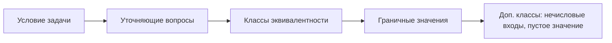

# Задачи на тест-дизайн с собеседований

На собеседованиях QA почти всегда есть блок практических задач: интервьюер даёт
маленькое, нарочито простое условие и смотрит не на то, быстро ли вы выдадите
список проверок, а на то, **как вы думаете**. Эти задачи проверяют два навыка
сразу: владение техниками тест-дизайна (классы эквивалентности, граничные
значения — см. [тест-дизайн](topic:qa-test-design)) и умение **тестировать
требования** — замечать дырки в формулировках и задавать уточняющие вопросы до
того, как писать тесты. Ниже — две классические задачи с эталонным ходом
рассуждений.

## Задача 1. Поле ввода со значениями от 19 до 98

**Условие:** есть поле ввода, принимающее значения от 19 до 98 включительно.
Протестируйте его с помощью техник тест-дизайна.

### Первый шаг — уточняющий вопрос

Прежде чем называть тесты, задайте вопрос про **минимальный шаг** значений:
поле принимает только целые числа (шаг 1), дробные (шаг 0,1? 0,01?), или это,
скажем, слайдер с шагом 5. Это меняет всё дальнейшее:

- при шаге 1 «соседом» границы 19 будет 18 и 20;
- при шаге 0,01 — 18,99 и 19,01, и граничные значения совсем другие.

Интервьюер специально оставляет шаг неуказанным: кандидат, который не спросил,
а сразу начал перечислять числа, показывает, что берёт требования «как есть»,
не проверяя их полноту. В ответе вслух скажите: «Сначала уточню минимальный
шаг; для определённости дальше считаю, что поле принимает целые числа».

### Классы эквивалентности

Разбиваем все возможные входные данные на классы, внутри которых система
ведёт себя одинаково:

- **Валидный класс:** целые от 19 до 98 — должны приниматься.
- **Невалидный класс «меньше»:** всё, что меньше 19 (18, 0, −5, −1000) — должно
  отклоняться.
- **Невалидный класс «больше»:** всё, что больше 98 (99, 150, 999999) — должно
  отклоняться.
- **Нечисловые классы:** буквы, спецсимволы, пустая строка, пробелы, вставка из
  буфера, очень длинная строка цифр — поведение на них тоже должно быть
  определено (игнор, блокировка ввода, сообщение об ошибке).

### Граничные значения

Опыт показывает: дефекты чаще всего живут именно на границах (ошибки вида
`<` вместо `<=`). Поэтому для каждой границы берём само граничное значение и
его соседей с двух сторон. При целочисленном шаге:

| Проверка | Значение | Ожидание |
|---|---|---|
| нижняя граница | 18, **19**, 20 | 18 — отказ; 19 и 20 — принять |
| верхняя граница | 97, **98**, 99 | 97 и 98 — принять; 99 — отказ |

Итого минимальный набор: 18, 19, 20, 97, 98, 99 — шесть значений покрывают обе
границы и все три числовых класса. Это и есть суть пары техник: классы
эквивалентности сокращают бесконечное множество входов до нескольких
представителей, а границы концентрируют проверки там, где баги вероятнее всего.

> **Ответ на собесе за 60 секунд**
> «Сначала уточню минимальный шаг — целые числа или дробные, это меняет
> граничные значения. Для целых: классы эквивалентности — валидный 19–98,
> невалидные "меньше 19" и "больше 98", плюс нечисловые входы. Граничные
> значения: 18, 19, 20 внизу и 97, 98, 99 наверху. Итого шесть проверок
> покрывают все классы и обе границы».

**Типовые ошибки кандидата:**
- начать перечислять тесты, не уточнив шаг;
- проверить только сами границы (19 и 98), но не их соседей (18 и 99) — именно
  там ошибка в операторе сравнения;
- забыть нечисловые классы: буквы, пустое значение, вставку из буфера.

## Задача 2. Функция скидки по возрасту — тестируем требования

**Условие:** есть функция расчёта скидки в зависимости от возраста:

- до 18 лет — скидка 15%;
- от 19 до 35 лет — скидка 15%;
- от 35 лет — скидка 20%.

### Эталонный ход рассуждений

Здесь правильный ответ — это не список тестов, а **список вопросов**. Читаем
требование построчно и ищем дырки:

1. **Дыра в диапазоне 18–19.** «До 18» и «от 19» — а что с возрастом между 18 и
   19 годами (например, 18 лет и 3 месяца)? Это первое, что кандидат обязан
   спросить. Реальный пользователь почти никогда не бывает «ровно 19,0 лет» —
   диапазон 18–19 покрывает целый год жизни.
2. **Строгие ли границы?** «До 18» — включительно или строго меньше? «От 35» —
   человеку 35 лет и 1 день это уже «от 35» или ещё нет? Заметьте: «от 19 до
   35» и «от 35» пересекаются в точке 35 — какая скидка у 35-летнего, 15%
   или 20%?
3. **День или время?** Возраст меняется в день рождения — но в какой момент
   дня? Если скидка считается в момент покупки, человек, родившийся 35 лет
   назад в 23:59 и покупающий в 00:01 своего дня рождения, попадает в какую
   категорию?
4. **Есть ли максимальный возраст?** Требование ничего не говорит про, скажем,
   150 или 500 лет — валидируется ли дата рождения вообще?
5. **Локальное время или UTC?** Если сервер считает возраст по UTC, а
   пользователь живёт во Владивостоке, его «день рождения» для системы наступит
   на много часов позже или раньше — скидка «перескочит» не в тот день.
6. **Откуда берётся возраст?** Из даты рождения в профиле (тогда что при её
   отсутствии или изменении?) или пользователь вводит возраст руками (тогда
   нужна валидация)?

Только после ответов на эти вопросы можно строить классы эквивалентности и
граничные значения. Допустим, требование уточнили так: «18 лет и младше — 15%;
от 19 до 35 лет включительно — 15%; строго старше 35 — 20%». Тогда граничные
возрасты: 17/18/19, 34/35/36, плюс крайние случаи (0, отрицательный возраст,
150 лет).

> **Ответ на собесе за 60 секунд**
> «Первым делом спрошу, что происходит в диапазоне от 18 до 19 лет — требование
> его не покрывает. Дальше уточню: строгие ли границы (35-летний получает 15%
> или 20%?), считается ли возраст по дню или по времени рождения, есть ли
> максимальный возраст, и возраст считается по локальному времени пользователя
> или по UTC. После уточнений построю классы эквивалентности и граничные
> значения: 17/18/19 и 34/35/36».

**Чем этот ответ хорош:**
- он демонстрирует главный навык тестировщика — тестировать требования **до**
  кода: дефект, найденный в формулировке, стоит в разы дешевле дефекта в
  проде (см. [стадии тестирования и работу с требованиями](topic:qa-testing-stages-requirements));
- показывает системность: вопросы идут от очевидной дыры к тонким (время,
  часовые пояса);
- завершается техниками тест-дизайна — вопросы не самоцель, а подготовка тестов.

**Типовые ошибки кандидата:**
- молча принять формулировку и сразу назвать «проверю 17, 18, 35, 36» — дыра
  18–19 осталась незамеченной;
- заметить дыру, но не спросить остальное (строгость границ, часовой пояс);
- начать спорить, «как должно быть», вместо того чтобы зафиксировать вопросы
  аналитику — тестировщик подсвечивает неопределённость, решение принимает не он.

## Что хочет услышать интервьюер

В обеих задачах проверяется один и тот же паттерн поведения:

Кандидат, который идёт по этой цепочке слева направо и **вслух проговаривает
ход мысли**, выглядит сильнее кандидата, который молча выдаёт «правильный»
набор чисел. Интервьюер покупает не ответ, а способ мышления.
