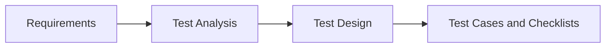

# Test Design Techniques

**Test design** is the stage where requirements turn into concrete checks:
which data to feed in, which steps to perform, and what counts as the correct
result. Interviewers love this topic because it instantly separates someone who
just "clicks around the app" from an engineer who can get maximum coverage out
of a minimal set of meaningful tests. The two evergreen questions — equivalence
partitioning and boundary value analysis — are almost guaranteed to come up in
a junior interview.

## Test Analysis vs Test Design

These two terms are often confused, and the interviewer expects you to tell
them apart.

- **Test analysis** — working with the requirements *before* writing any
  checks: studying what the system is supposed to do, looking for
  contradictions, gaps, and ambiguities in the specifications, and deciding
  *what* needs to be tested and what the risks are. The outcome is an
  understanding of the test object and questions for the analysts.
- **Test design** — answers the question of *how* to test: choosing
  techniques, picking concrete input data, and building checks so they cover
  the requirements without redundant duplication. The outcome is test cases,
  checklists, and test data (see [test documentation](topic:qa-test-documentation)).

The short formula: **test analysis is "what do we test", test design is "how
exactly do we test it"**.

## Equivalence Partitioning

The idea: the entire huge set of possible inputs is split into groups —
**equivalence classes** — within which the system is expected to behave the
same way. Then a **single check** from each class is enough: if the system
handles one representative of the class correctly, the other values of that
class will most likely pass too. This radically shrinks the number of tests
without losing meaning.

Classes come in two flavors: **valid** (correct data) and **invalid** (data the
system should reject) — you must test both.

### Example: a field accepts integers from 1 to 100

The partitioning:

| Class | Range | Type | Example check |
|---|---|---|---|
| 1 | below 1 (…, -1, 0) | invalid | enter 0 → error |
| 2 | from 1 to 100 | valid | enter 50 → accepted |
| 3 | above 100 (101, …) | invalid | enter 150 → error |

Three checks instead of an endless enumeration. In practice, more invalid
classes are added: fractional numbers, letters, an empty value, special
characters.

## Boundary Value Analysis

Experience shows that most defects hide **at the edges of the allowed
range** — that is exactly where developers slip with strict vs non-strict
inequalities (`>` instead of `>=`). So the boundaries get dedicated checks: the
boundary value itself and its neighbors on both sides.

### Example: the same 1–100 field

The classic boundary set:

- **0, 1, 2** — lower boundary: just below, the boundary itself, just above;
- **99, 100, 101** — upper boundary: just below, the boundary itself, just
  above.

Note that boundary values complement rather than replace equivalence classes —
they are usually applied together: first partition into classes, then add the
boundary checks.

> **The 60-second interview answer**
>
> Equivalence partitioning — split all possible inputs into groups where the
> system behaves identically, and take one check per group, including invalid
> classes. Boundary value analysis — check the values right at the edges of the
> range and next to them, because that is where bugs live most often. For a
> 1–100 field: classes are "below 1", "1–100", "above 100"; boundaries are 0,
> 1, 2 and 99, 100, 101. The techniques work as a pair and give good coverage
> with few tests.

## The Other Techniques

Beyond the two "big ones", several more approaches are commonly listed:

- **Testing software functions** — walk through the list of functions the
  system performs and check each one: does it do what is claimed, and does it
  break anything else?
- **Risk-based testing** — identify where a failure would hurt the most
  (payments, data loss, security) and test those areas first, reinforcing them
  with extra checks.
- **Use case testing** — take the main user scenarios (the basic flow and its
  alternatives) and walk them end-to-end, the way a real user would.
- **Exploratory testing** — simultaneously learn the system, design, and
  execute checks without pre-written test cases; useful when documentation is
  scarce or time is short.
- **Traceability matrix** — a matrix that links requirements to checks: it
  shows that every requirement is covered by at least one test, and that no
  test floats around without a requirement behind it.

> **Typical follow-up questions**
>
> - How many tests do you get for a 1–100 field if you combine equivalence
>   classes and boundaries? (Answer: usually they expect the combined set —
>   0, 1, 2, 50, 99, 100, 101, plus invalid data types.)
> - What do you do when there are no requirements? (Exploratory testing,
>   checking against analogous products, clarifying expectations with the
>   team.)
> - Why bother with invalid classes — "a user would never do that"? (They
>   would — typos, pasting from the clipboard, malicious input; negative
>   checks are mandatory, see
>   [positive and negative testing](topic:qa-positive-negative).)

> **Traps**
>
> - Confusing test analysis with test design: the former is about *what* and
>   the requirements, the latter about *how* and the concrete data.
> - Naming only the boundary values themselves (1 and 100): the neighbors on
>   both sides — 0/2 and 99/101 — are expected.
> - Treating the traceability matrix as a "matrix of parameters and values":
>   strictly speaking, it is a "requirement ↔ test" traceability matrix, while
>   parameter-combination tables are a separate technique (pairwise testing and
>   decision tables).
> - Believing equivalence classes give a 100% guarantee: it is a heuristic
>   based on the assumption of identical behavior within a class.
