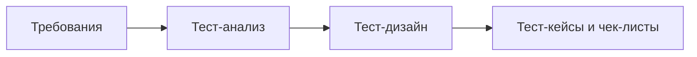

# Тест-дизайн и его техники

**Тест-дизайн** — это этап, на котором из требований рождаются конкретные проверки:
какие данные подать на вход, какие шаги выполнить и что считать правильным
результатом. На собеседовании эту тему любят, потому что она мгновенно отделяет
человека, который «кликает по приложению», от инженера, который умеет получить
максимум покрытия минимальным набором осмысленных тестов. Два вечных вопроса —
классы эквивалентности и граничные значения — почти гарантированно встретятся на
собеседовании джуна.

## Тест-анализ vs тест-дизайн

Эти два термина часто путают, а интервьюер ждёт, что вы их различите.

- **Тест-анализ** — работа с требованиями *до* написания проверок: изучаем,
  что система вообще должна делать, ищем противоречия, пробелы и неоднозначности
  в спецификациях, определяем, *что* нужно протестировать и с какими рисками.
  Результат — понимание объекта тестирования и вопросы к аналитикам.
- **Тест-дизайн** — отвечает на вопрос *как* тестировать: выбираем техники,
  подбираем конкретные входные данные и строим проверки так, чтобы они
  покрывали требования без лишнего дублирования. Результат — тест-кейсы,
  чек-листы, тестовые данные (см. [тестовую документацию](topic:qa-test-documentation)).

Короткая формула: **тест-анализ — «что тестируем», тест-дизайн — «как именно
тестируем»**.

## Классы эквивалентности (Equivalence Partitioning)

Идея: весь огромный набор возможных входных данных разбивается на группы —
**классы эквивалентности** — внутри которых система, как мы предполагаем, ведёт
себя одинаково. Тогда из каждого класса достаточно взять **одну проверку**:
если система обработала репрезентанта класса верно, остальные значения класса,
скорее всего, тоже пройдут. Это радикально сокращает число тестов без потери
смысла.

Классы бывают **валидные** (корректные данные) и **невалидные** (данные,
которые система должна отвергнуть) — тестировать нужно оба типа.

### Пример: поле принимает целые числа от 1 до 100

Разбиение на классы:

| Класс | Диапазон | Тип | Пример проверки |
|---|---|---|---|
| 1 | меньше 1 (…, -1, 0) | невалидный | ввести 0 → ошибка |
| 2 | от 1 до 100 | валидный | ввести 50 → принято |
| 3 | больше 100 (101, …) | невалидный | ввести 150 → ошибка |

Три проверки вместо бесконечного перебора. На практике добавляют ещё классы
невалидных данных: дробные числа, буквы, пустое значение, спецсимволы.

## Граничные значения (Boundary Value Analysis)

Опыт показывает: больше всего дефектов прячется **на границах допустимых
значений** — именно там разработчики ошибаются со строгими/нестрогими
неравенствами (`>` вместо `>=`). Поэтому на границах выполняются отдельные
проверки: само граничное значение и его соседи по обе стороны.

### Пример: то же поле 1–100

Классический набор проверок по границам:

- **0, 1, 2** — нижняя граница: чуть ниже, сама граница, чуть выше;
- **99, 100, 101** — верхняя граница: чуть ниже, сама граница, чуть выше.

Заметьте: граничные значения дополняют, а не заменяют классы эквивалентности —
обычно их применяют вместе: сначала разбили на классы, потом добавили проверки
на границах.

> **Ответ на собесе за 60 секунд**
>
> Классы эквивалентности — разбиваем все возможные входные данные на группы,
> внутри которых система ведёт себя одинаково, и берём по одной проверке из
> каждой группы, включая невалидные классы. Граничные значения — проверяем
> значения на самих границах диапазона и рядом с ними, потому что там чаще
> всего живут баги. Для поля 1–100: классы — «меньше 1», «1–100», «больше
> 100»; границы — 0, 1, 2 и 99, 100, 101. Техники работают в паре и дают
> хорошее покрытие малым числом тестов.

## Остальные техники

Кроме двух «главных», перечисляют ещё несколько подходов:

- **Тестирование функций ПО** — идём по списку функций, которые выполняет
  система, и проверяем каждую: делает ли она заявленное и не ломает ли
  остальное.
- **Проверка основных рисков** — определяем, где сбой будет наиболее
  болезненным (платежи, потеря данных, безопасность), и тестируем эти места в
  первую очередь, усиливая их дополнительными проверками.
- **Проверки по сценариям использования (Use Cases)** — берём основные
  пользовательские сценарии (основной поток и альтернативные) и проходим их
 end-to-end, как реальный пользователь.
- **Исследовательское тестирование** — одновременно изучаем систему,
  проектируем и выполняем проверки, без заранее написанных кейсов; полезно,
  когда документации мало или времени в обрез.
- **Traceability matrix** — матрица трассируемости, связывающая требования с
  проверками: по ней видно, что каждое требование покрыто хотя бы одним
  тестом, и ни один тест не «висит в воздухе» без требования.

> **Типовые follow-up вопросы**
>
> - Сколько тестов получится для поля 1–100, если объединить классы
>   эквивалентности и границы? (Ответ: обычно пересчитывают набор —
>   0, 1, 2, 50, 99, 100, 101 плюс невалидные типы данных.)
> - Что делать, если требований нет? (Исследовательское тестирование,
>   проверка по аналогам, уточнение ожиданий у команды.)
> - Зачем нужны невалидные классы, ведь «пользователь так не сделает»?
>   (Сделает — опечатки, вставка из буфера, злонамеренный ввод; негативные
>   проверки обязательны, см. [позитивное и негативное тестирование](topic:qa-positive-negative).)

> **Ловушки**
>
> - Путать тест-анализ и тест-дизайн: первое — про *что* и требования, второе —
>   про *как* и конкретные данные.
> - Называть границей только само значение (1 и 100): ждут соседей по обе
>   стороны — 0/2 и 99/101.
> - Считать traceability matrix «матрицей параметров и значений»: строго
>   говоря, это матрица трассируемости «требование ↔ тест», а таблицы
>   комбинаций параметров — это отдельная техника (pairwise и таблицы решений).
> - Думать, что классы эквивалентности дают 100% гарантию: это эвристика,
>   основанная на предположении об одинаковом поведении внутри класса.
