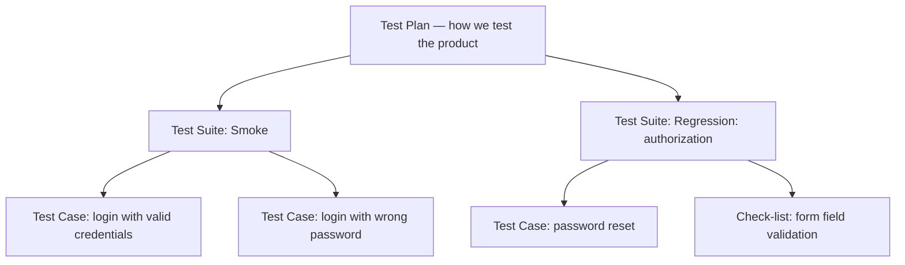
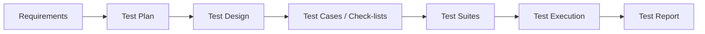

# Test Documentation and Artifacts

Testing is not just "clicking buttons." To keep checks reproducible and
results understandable to the team and the customer, QA maintains
documentation: it plans the work, describes the checks, and reports on the
outcomes. The interview question "what kinds of test documentation do you
know?" is a junior classic — it checks whether the candidate understands
what a tester's workflow actually consists of, not just whether they
memorized the definition of a bug.

Why documentation matters:

- **Transparency** — it is visible what has been tested, what has not, and
  why.
- **Reproducibility** — any team member can repeat a check from its
  description instead of relying on the author's memory.
- **Knowledge transfer** — when a tester leaves, the product does not lose
  its accumulated coverage.
- **A basis for metrics** — coverage, failure statistics, and release
  status are computed from artifacts, not from gut feeling.

## Test Plan

A **test plan** is a document that describes *how we are going to test* a
specific product, release, or feature. It answers the questions "what, by
whom, when, and with what do we test" — it does not contain the checks
themselves.

Typical test plan contents:

- **Object and goals of testing** — what we test and why.
- **Scope** — what is included in testing and what is deliberately
  excluded.
- **Strategy and test types** — functional, regression, load testing, etc.;
  manual vs automated.
- **Resources** — who tests, which environments, devices, and test data
  are needed.
- **Schedule** — start and end dates of the testing phases.
- **Entry and exit criteria** — conditions under which testing may start
  and under which it may be considered complete (for example, "no open
  blocker/critical defects, 100% of the smoke suite passed").
- **Risks** — what could derail the plan (unstable environment, late
  builds) and how we mitigate it.

A test plan is written at the start of work on a product or release —
usually after requirements analysis — and lives with the project, being
updated as things change.

**Interview trap:** do not confuse a test plan with a test strategy. A
strategy is the general long-term approach to quality at the product or
company level, while a test plan is a concrete document for a specific test
object that *implements* the strategy.

## Test Case

A **test case** is the atomic unit of documentation: a detailed description
of a single check that anyone — even someone unfamiliar with the product —
can execute.

The classic structure:

- **Title** — the short essence of the check.
- **Preconditions** — what must hold before starting (user is logged in,
  the cart contains an item).
- **Steps** — numbered, unambiguous, reproducible actions.
- **Expected result** — what the system must do after each step or at the
  end.
- **Postconditions** — what to do after the check (clean up test data).
- Optionally: priority, a link to the requirement, test data.

A good test case verifies one thing, does not depend on other cases, and
yields an unambiguous pass/fail verdict.

## Check-list

A **check-list** is the lightweight alternative to test cases: a list of
"what to check" without detailing "how exactly." One item — one check in a
single line: "Registration with a valid email," "Empty password field,"
"Payment with an insufficient-funds card."

Key differences from a test case:

- No steps or preconditions — only the idea of the check.
- Aimed at someone already familiar with the product.
- Cheaper to create and maintain, but less formal: a newcomer cannot
  reproduce a check from a check-list alone.

**When to use which:** check-lists fit early stages, smoke testing, fast
iterations, and exploratory testing; test cases are needed where formality
and reproducibility matter: regression, acceptance testing, handover to
automation, regulatory requirements.

**The 60-second interview answer:** "A check-list is a list of check ideas
without details, one line per check; a test case is a full description of
one check with preconditions, steps, and an expected result. A check-list
is faster to write and maintain, but only someone who knows the product can
execute it; a test case is reproducible by anyone and suits regression and
automation."

## Test Suite

A **test suite** is a named collection of test cases (and/or check-lists)
grouped by some criterion: a functional area (the "authorization suite"),
a test type (smoke suite, regression suite), or a release. A suite is the
unit of *execution*: you run whole suites, not individual cases.

The hierarchy looks like this:

## Test Reports

A **test report** is a document summarizing the results of test execution
for stakeholders: managers, developers, the customer. It answers the
question "what state is product quality in right now?"

What it usually contains:

- What was tested (build version, scope, period).
- Run statistics: how many cases were executed / passed / failed / blocked /
  skipped.
- A list of found defects with links to bug reports, their severity and
  status.
- Deviations from the test plan (what was not finished, what was blocked).
- A conclusion and recommendation: is the product ready for release, and
  what risks remain.

Interim status reports (daily/weekly during the work) are distinguished
from the final report at the end of a phase or before a release.

**Typical follow-up questions:**

- What is the difference between severity and priority in a defect report?
  (See [Severity vs Priority](topic:qa-severity-vs-priority); the structure
  of the bug report itself is covered in [Bug Report](topic:qa-bug-report).)
- How do you build a requirements traceability matrix from these artifacts?
- Which artifacts would you automate first, and why?

## How the Artifacts Fit Together

The documentation forms a chain "planning → design → execution →
reporting": the test plan sets the frame → checks are designed from it and
the requirements (see [Test Design](topic:qa-test-design)) → the checks are
formalized as test cases and check-lists → grouped into suites → executed →
and the outcomes are compiled into a test report. A break anywhere in this
chain is a typical source of trouble: without a plan, testing is chaotic;
without cases, it is irreproducible; without a report, it is invisible to
the team.

