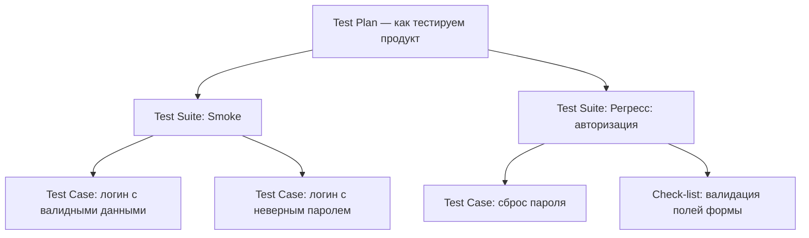
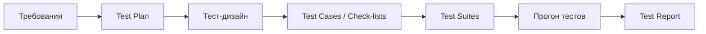

# Тестовая документация и артефакты

Тестирование — это не только «понажимать кнопки». Чтобы проверки были
воспроизводимыми, а результаты — понятными команде и заказчику, QA ведёт
документацию: планирует работу, описывает проверки и отчитывается об итогах.
На собеседовании вопрос «какие виды тестовой документации ты знаешь?» —
классика для junior: по нему проверяют, понимает ли кандидат, из чего вообще
состоит рабочий процесс тестировщика, а не только заучил ли определение
бага.

Зачем нужна документация:

- **Прозрачность** — видно, что уже проверено, что нет и почему.
- **Воспроизводимость** — любой член команды может повторить проверку по
  описанию, а не «по памяти автора».
- **Передача знаний** — при смене тестировщика продукт не теряет
  накопленное покрытие.
- **Основа для метрик** — покрытие, статистика падений, статус релиза
  считаются по артефактам, а не по ощущениям.

## Тест-план

**Тест-план (test plan)** — документ, описывающий *как мы будем тестировать*
конкретный продукт, релиз или фичу. Он отвечает на вопросы «что, кем, когда
и чем тестируем», а не содержит сами проверки.

Типовое содержание тест-плана:

- **Объект и цели тестирования** — что тестируем и зачем.
- **Объём (scope)** — что входит в тестирование и что осознанно не входит.
- **Стратегия и виды тестирования** — функциональное, регрессионное,
  нагрузочное и т.д.; ручное/автоматизированное.
- **Ресурсы** — кто тестирует, какие стенды, устройства, тестовые данные
  нужны.
- **Расписание** — сроки начала и окончания этапов.
- **Критерии входа и выхода (entry/exit criteria)** — условия, при которых
  можно начинать тестирование и при которых его можно считать завершённым
  (например, «нет открытых blocker/critical дефектов, пройдено 100%
  тест-кейсов smoke-сьюта»).
- **Риски** — что может сорвать план (нестабильный стенд, поздняя
  готовность сборки) и как это митируем.

Тест-план составляется в начале работ над продуктом/релизом — обычно после
анализа требований — и живёт вместе с проектом, обновляясь по мере изменений.

**Ловушка на собесе:** не путай тест-план с тестовой стратегией. Стратегия —
общий долгосрочный подход к качеству на уровне продукта или компании, а
тест-план — конкретный документ под конкретный объект тестирования, который
*реализует* стратегию.

## Тест-кейс

**Тест-кейс (test case)** — атомарная единица документации: детальное
описание одной проверки, по которому её может выполнить любой человек,
даже не знакомый с продуктом.

Классическая структура:

- **Заголовок** — короткая суть проверки.
- **Предусловия (preconditions)** — что должно быть выполнено до начала
  (пользователь авторизован, в корзине есть товар).
- **Шаги (steps)** — нумерованные действия, однозначные и воспроизводимые.
- **Ожидаемый результат (expected result)** — что система должна сделать
  после каждого шага или в конце.
- **Постусловия (postconditions)** — что сделать после проверки (удалить
  тестовые данные).
- Дополнительно: приоритет, связь с требованием, тестовые данные.

Хороший тест-кейс проверяет одну вещь, не зависит от других кейсов и даёт
однозначный вердикт pass/fail.

## Чек-лист

**Чек-лист (check-list)** — облегчённая альтернатива тест-кейсам: список
проверок «что проверить» без детализации «как именно». Один пункт — одна
проверка в одну строку: «Регистрация с валидным email», «Пустое поле
пароля», «Оплата картой с недостатком средств».

Ключевые отличия от тест-кейса:

- Нет шагов и предусловий — только идея проверки.
- Рассчитан на того, кто уже знаком с продуктом.
- Дешевле в создании и поддержке, но менее формален: новичок по чек-листу
  не воспроизведёт проверку.

**Когда что использовать:** чек-листы — на ранних этапах, при smoke-
тестировании, в быстрых итерациях и при исследовательском тестировании;
тест-кейсы — там, где нужны формальность и воспроизводимость: регресс,
приёмочное тестирование, передача на автоматизацию, регуляторные требования.

**Ответ на собесе за 60 секунд:** «Чек-лист — это список идей проверок без
деталей, одна строка на проверку; тест-кейс — полное описание одной проверки
с предусловиями, шагами и ожидаемым результатом. Чек-лист быстрее писать и
поддерживать, но выполнить его может только знающий продукт человек;
тест-кейс воспроизводим кем угодно и годится для регресса и автоматизации».

## Тест-сьют

**Тест-сьют (test suite)** — именованный набор тест-кейсов (и/или чек-
листов), объединённых по какому-то признаку: функциональная область
(«сьют авторизации»), вид тестирования (smoke-сьют, регрессионный сьют),
релиз. Сьют — это единица *выполнения*: прогоняют не отдельные кейсы, а
сьюты целиком.

Иерархия выглядит так:

## Тест-репорты

**Тест-репорт (test report / отчёт о тестировании)** — документ, подводящий
итоги выполнения тестирования для стейкхолдеров: менеджеров, разработчиков,
заказчика. Отвечает на вопрос «в каком состоянии качество продукта прямо
сейчас?».

Что обычно содержит:

- Что тестировалось (версия сборки, scope, период).
- Статистика прогона: сколько кейсов выполнено / passed / failed / blocked /
  skipped.
- Список найденных дефектов со ссылками на баг-репорты, их severity и
  статус.
- Отклонения от тест-плана (что не успели, что было заблокировано).
- Вывод и рекомендация: готов ли продукт к релизу, какие риски остаются.

Различают промежуточные статус-репорты (ежедневные/еженедельные в ходе
работ) и итоговый отчёт по завершении этапа или перед релизом.

**Типовые follow-up вопросы:**

- Чем отличается severity от priority в репорте о дефектах? (См.
  [Severity vs Priority](topic:qa-severity-vs-priority); состав самого
  баг-репорта разбирается в теме [Баг-репорт](topic:qa-bug-report).)
- Как из артефактов собрать матрицу покрытия требований?
- Какие артефакты вы бы автоматизировали в первую очередь и почему?

## Как артефакты связаны между собой

Документация образует цепочку «планирование → описание → выполнение →
отчётность»: тест-план задаёт рамки → по нему и требованиям проектируются
проверки (см. [Тест-дизайн](topic:qa-test-design)) → проверки оформляются
как тест-кейсы и чек-листы → группируются в сьюты → прогоняются → итоги
сводятся в тест-репорт. Разрыв в любой точке этой цепочки — типичный
источник проблем: без плана тестирование хаотично, без кейсов —
невоспроизводимо, без репорта — невидимо для команды.

