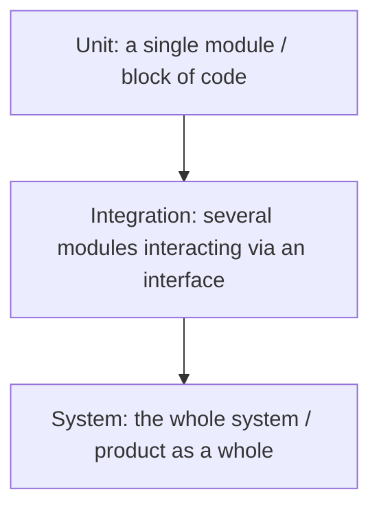

# Types of Testing

"Name the types of testing" is one of the most frequent questions at any QA
interview, for any grade. The interviewer wants to see two things: that you
speak the common vocabulary of the profession, and that you understand *which
axis* each classification is built on. The rookie mistake is to dump "regression,
smoke, load, black box" in one unstructured pile. A correct answer always starts
with "testing types are classified along several axes" — and then you walk
through those axes one by one. Below are the seven classic classifications that
cover practically any question in this group.

## By test object: functional and non-functional

The very first axis — *what exactly* we are checking.

**Functional testing** verifies that the product serves its direct purpose:
it provides the features required by the customer and the users. The "Pay"
button actually processes payment, search finds products, the report is built
for the selected period.

**Non-functional testing** verifies the quality attributes of the product:
performance, reliability, security and so on. A system can do everything
correctly but take 30 seconds per request, crash under load or leak other
users' data — and only non-functional testing will catch that. The main types:

- **Performance testing** — response times, throughput, resource consumption
  (load testing belongs here too).
- **Configuration testing** — working on different configurations: operating
  systems, browser versions, hardware.
- **Usability testing** — how convenient and understandable the product is for
  the user.
- **User interface (GUI) testing** — the interface matching mockups and
  requirements: layout, fonts, element states.
- **Security testing** — hunting for vulnerabilities: authorization flaws,
  injections, access to other users' data.
- **Compatibility testing** — working together with other systems and in
  different environments.

## By component isolation: unit, integration, system

This classification is also called "by level" or "by testing scale" — it
describes which slice of the system is under the microscope.

- **Unit testing** — verifying a single separate program module or block.
  Usually written by the developers themselves as unit tests.
- **Integration testing** — verifying the interaction of several modules with
  each other through some interface: a service with its database, frontend with
  backend, microservice with microservice.
- **System testing** — the largest scale: verifying the operability of the
  entire system, the whole product, in conditions as close to production as
  possible.

A typical follow-up is how these levels are distributed in volume and why —
that is covered in [test pyramid and shift-left](topic:qa-pyramid-shift-left).

## By functionality version: new features and regression

On one hand, we test **new features** included in the latest product build. On
the other, we run **regression testing**: we make sure that the functionality
from previous versions was not broken by the new changes. The concept and goals
of regression testing are an important and very common interview question:
regression is needed because any code change (a new feature, a bug fix, a
refactoring) can break what used to work — often in the most unexpected places.

Separately, there is **smoke testing** — it is not covered in the source notes,
but the question "what is the difference between smoke and regression" is the
headline of this topic. Smoke testing is a short, shallow run of the most
critical product features on a fresh build, answering a single question: "is
the build alive at all — should we accept it for testing?" The name comes from
electronics: you power the device on, no smoke comes out — you can proceed with
deeper checks.

> **The 60-second interview answer: smoke vs regression.** Smoke is a fast
> check of a new build: 15–30 minutes, only the critical path (login, the core
> operations); the goal is to decide whether to accept the build for testing.
> Smoke fails — the build goes back to the developers and deep testing never
> starts. Regression is a full check of the existing functionality: hours or
> days, broad coverage; the goal is to confirm the old behavior still works.
> There is no point in making smoke deep, or regression short: they solve
> different problems and usually run in sequence — smoke first, then full
> testing and regression.

A neighboring term sometimes asked about is **sanity testing** — a narrow check
that a specific fixed functionality (for example, a particular bug fix) works,
so the build is worth accepting. Sanity is narrower than smoke and focused on
the specific change.

## By expected result: positive and negative

- **Positive testing** — checks aimed at getting a positive result, correct
  system behavior on valid data and in standard scenarios.
- **Negative testing** — checking scenarios where the action cannot be
  performed by the system: analyzing how the system reacts to errors and
  incorrect requests. A proper reaction to invalid input is a requirement too.

This is covered in detail with examples in
[positive and negative testing](topic:qa-positive-negative).

## By knowledge of the system: black, white and grey box

- **Black box** — testing the software from the outside world's point of view,
  when the internal structure of the product is unknown. We focus on
  functionality: feed an input — compare the output with the expected one from
  the requirements.
- **White box** — testing the implementation: we understand the internal
  structure, have access to the code and test based on it (branch, path and
  condition coverage).
- **Grey box** — a combination of the first two. We concentrate on the end
  functionality but know the internal implementation — which gives more ideas
  about how to test the product: knowing the data is cached, for example, we
  will check cache invalidation scenarios.

A manual QA engineer usually works black-box or grey-box; white box is more the
domain of developers and automation engineers at the code level.

## By degree of automation: manual and automated

The difference is simple: **manual** testing is performed by a human,
**automated** testing uses automation tools, software means — one program tests
another.

The harder part is the follow-up question: when automation pays off and when it
does not. Automation pays off for stable, frequently repeated checks
(regression, smoke, routine data validation) — the script pays for itself
through repetition. It does not pay off, or is impossible, for one-off checks,
for rapidly changing functionality (the tests would need constant rewriting),
for usability and "subjective" checks, and for scenarios that need a human eye
and intuition — for example, exploratory testing. More on this in
[test automation](topic:qa-automation).

## By planning level: scripted and exploratory

- **Scripted testing (by test cases)** — we plan in advance which checks to
  perform and prepare them as test cases and test scenarios with expected
  results.
- **Exploratory testing** — we explore the product in "free swimming": we run
  the checks in whatever order seems necessary at the moment, relying on
  experience and on what we observe along the way. Learning, test design and
  test execution happen simultaneously.

> **Trap.** "Exploratory testing is chaotic clicking." No: exploratory is a
> managed technique with a session goal, a time box and notes on what was
> found. Chaotic clicking is monkey testing — also a separate term you may be
> asked about.

> **Typical follow-up questions.** "Which classification does load testing
> belong to?" (non-functional → performance). "Is smoke testing manual or
> automated?" (it can be either — the classifications are independent, and one
> kind of testing is described along several axes at once). "Give an example of
> a negative grey-box test" — here they check that you have not just memorized
> definitions but can combine them.
