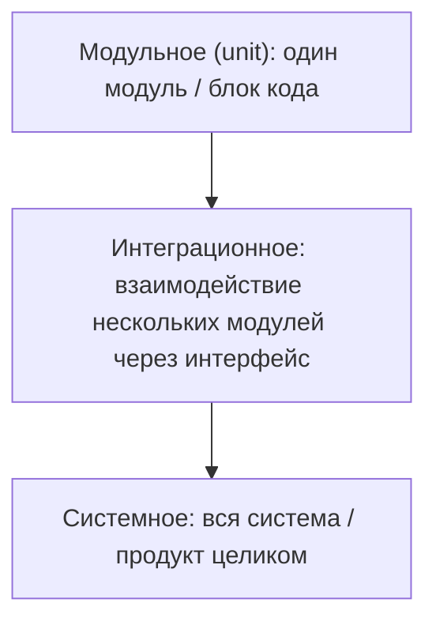

# Виды и типы тестирования

«Перечислите виды тестирования» — один из самых частых вопросов на собеседовании
QA-инженера любого грейда. Проверяющий хочет увидеть две вещи: что вы владеете
общим словарём профессии и что вы понимаете, *по какому основанию* строится каждая
классификация. Ошибка новичка — вывалить вперемешку «регресс, смоук, нагрузочное,
чёрный ящик» без структуры. Правильный ответ всегда начинается со слов «виды
тестирования классифицируют по нескольким основаниям» — и дальше вы перебираете
эти основания одно за другим. Ниже — семь классических классификаций, которые
закрывают практически любой вопрос этой группы.

## По объекту тестирования: функциональное и нефункциональное

Самое первое основание — *что именно* мы проверяем.

**Функциональное тестирование** — проверка того, что продукт выполняет своё
прямое назначение: предоставляет функции, требуемые заказчиком и пользователями.
Кнопка «Оплатить» проводит оплату, поиск находит товары, отчёт строится по
выбранному периоду.

**Нефункциональное тестирование** — проверка качественных характеристик продукта:
скорости работы, надёжности, безопасности и т.п. Система может делать всё
правильно, но делать это за 30 секунд, падать под нагрузкой или отдавать чужие
данные — и всё это поймает только нефункциональное тестирование. Основные виды:

- **Тестирование производительности** — скорость отклика, пропускная способность,
  потребление ресурсов (сюда же относится нагрузочное).
- **Конфигурационное тестирование** — работа на разных конфигурациях:
  операционные системы, версии браузеров, железо.
- **Юзабилити-тестирование** — удобство и понятность продукта для пользователя.
- **Тестирование пользовательского интерфейса (GUI)** — соответствие интерфейса
  макетам и требованиям: верстка, шрифты, состояния элементов.
- **Тестирование безопасности** — поиск уязвимостей: авторизация, инъекции,
  доступ к чужим данным.
- **Тестирование совместимости** — работа вместе с другими системами и в разных
  окружениях.

## По изолированности компонент: модульное, интеграционное, системное

Эту классификацию называют ещё «по уровню» или «по масштабности» тестирования —
она описывает, какой кусок системы находится под прицелом.

- **Модульное тестирование** — проверка работоспособности одного отдельного
  программного модуля или блока. Обычно его пишут сами разработчики в виде
  unit-тестов.
- **Интеграционное тестирование** — проверка взаимодействия нескольких модулей
  друг с другом через какой-либо интерфейс: сервис с базой данных, frontend с
  backend, микросервис с микросервисом.
- **Системное тестирование** — самый большой масштаб: проверка работоспособности
  всей системы, всего продукта в целом, в условиях, максимально близких к боевым.

Типовой follow-up — как эти уровни распределяются по объёму и почему: об этом
тема [пирамида тестирования и shift-left](topic:qa-pyramid-shift-left).

## По версии функционала: новая функциональность и регрессионное

С одной стороны, мы проверяем **новые функции**, которые вошли в последнюю сборку
продукта. С другой — проводим **регрессионное тестирование**: убеждаемся, что
функционал из предыдущих версий не пострадал после внедрения нового. Понятие и
цели регрессионного тестирования — важный и частый вопрос на интервью: регресс
нужен потому, что любое изменение кода (новая фича, исправление бага, рефакторинг)
может сломать то, что раньше работало, причём в самых неожиданных местах.

Отдельно стоит **smoke-тестирование** — в источнике его нет, но вопрос «в чём
отличия смоука от регресса» стоит в заголовке темы. Smoke-тестирование (дымовое)
— это короткий поверхностный прогон самых критичных функций продукта на новой
сборке, чтобы ответить на один вопрос: «живая ли сборка вообще, можно ли её
принимать в тестирование». Название пришло из электрики: включил устройство —
не пошёл дым — можно проверять дальше.

> **Ответ на собесе за 60 секунд: смоук vs регресс.** Smoke — это быстрая
> проверка новой сборки: 15–30 минут, только критический путь (логин, основные
> операции), цель — решить, принимаем ли сборку в тестирование. Падает смоук —
> сборка уходит обратно разработчикам, глубокое тестирование не начинаем.
> Регресс — это полная проверка существующей функциональности: часы или дни,
> широкое покрытие, цель — убедиться, что старое не сломалось. Smoke глубокий
> нет смысла делать, регресс коротким — тоже: они решают разные задачи и обычно
> идут последовательно: сначала смоук, потом полноценное тестирование и регресс.

Рядом иногда спрашивают про **sanity-тестирование** — узкую проверку того, что
конкретная исправленная функциональность (например, конкретный багфикс) работает,
и ради неё можно принимать сборку. Sanity уже смоука и глубже по конкретному
изменению.

## По ожидаемому результату: позитивное и негативное

- **Позитивное тестирование** — проверки, цель которых получить положительный
  результат, правильную отработку системы на корректных данных и в штатных
  сценариях.
- **Негативное тестирование** — проверка сценариев, когда действие не может быть
  выполнено системой: анализ того, как система реагирует на ошибки и
  некорректные запросы. Правильная реакция на неверный ввод — тоже требование.

Подробно с примерами это разобрано в теме
[позитивное и негативное тестирование](topic:qa-positive-negative).

## По уровню знаний системы: чёрный, белый и серый ящик

- **Чёрный ящик (black box)** — проверка ПО с точки зрения внешнего мира, когда
  внутреннее устройство продукта неизвестно. Мы сосредоточены на проверке
  функциональности: подали вход — сравнили выход с ожидаемым по требованиям.
- **Белый ящик (white box)** — проверка реализации ПО: мы представляем внутреннюю
  структуру, имеем доступ к коду и тестируем с опорой на него (покрытие веток,
  путей, условий).
- **Серый ящик (grey box)** — комбинация первых двух. Мы концентрируемся на
  конечной функциональности, но знаем внутреннюю реализацию — и это даёт больше
  идей о том, как продукт тестировать: например, зная, что данные кэшируются,
  проверим сценарии сброса кэша.

Ручной QA обычно работает методом чёрного или серого ящика; белый ящик чаще —
удел разработчиков и автоматизаторов на уровне кода.

## По степени автоматизации: ручное и автоматизированное

Разница проста: **ручное** тестирование выполняется человеком вручную,
**автоматизированное** — с использованием средств автоматизации, программных
средств: одна программа тестирует другую.

Сложнее второй вопрос, который задают следом: когда автоматизация выгодна, а
когда нет. Автоматизация выгодна для стабильных, часто повторяемых проверок
(регресс, смоук, рутинные проверки данных) — скрипт отобьётся за счёт
повторяемости. Не выгодна или невозможна для разовых проверок, для
быстроменяющегося функционала (тесты придётся вечно переписывать), для
юзабилити и «субъективных» проверок и для сценариев, где нужен человеческий
глаз и интуиция — например, в исследовательском тестировании. Больше об этом —
в теме [автоматизация тестирования](topic:qa-automation).

## По уровню планирования: по тест-кейсам и исследовательское

- **Тестирование по тестовым кейсам (scripted)** — мы заранее планируем, какие
  проверки будем выполнять, и готовим их в виде тестовых кейсов и тестовых
  сценариев с ожидаемыми результатами.
- **Исследовательское тестирование (exploratory)** — мы исследуем продукт в
  «свободном плавании»: выполняем те проверки и в той последовательности,
  которые кажутся необходимыми в данный момент, опираясь на опыт и на то, что
  видим по ходу. Обучение, проектирование тестов и их выполнение идут
  одновременно.

> **Ловушка.** «Исследовательское — это хаотичный кликинг». Нет: exploratory —
> это управляемая техника с целью сессии, тайм-боксом и заметками о найденном.
> Хаотичное кликанье — это monkey testing, и это тоже отдельный термин, который
> могут спросить.

> **Типовые follow-up вопросы.** «К какой классификации относится нагрузочное?»
> (нефункциональное → производительность). «Смоук — это ручное или
> автоматизированное?» (может быть любым — классификации независимы, один вид
> тестирования описывается сразу по нескольким осям). «Приведите пример
> негативного теста серым ящиком» — здесь проверяют, что вы не зазубрили
> определения, а умеете их комбинировать.
