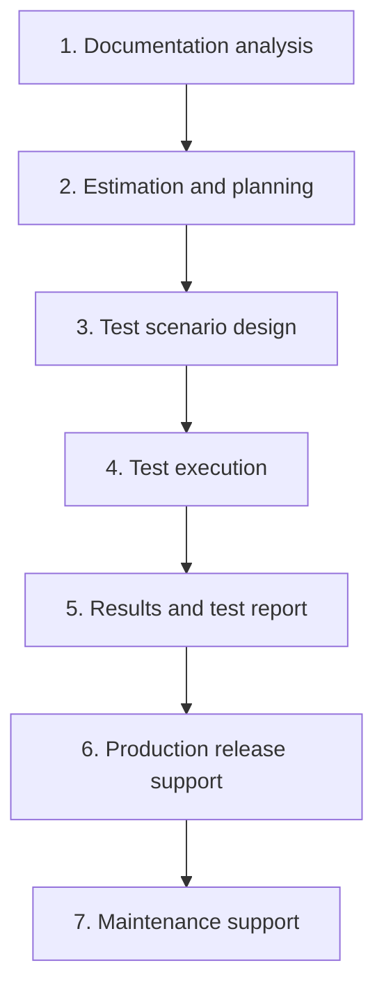

# Testing Stages and Requirements Quality

Testing is not just "clicking through the app". It is a process that starts long
before the first program launch (with reading the requirements) and ends well
after the release (product maintenance). Interviewers ask this question to almost
every junior candidate: it shows whether you understand that QA is part of the
software development lifecycle, not a standalone phase "at the end". The second
half of the topic is the requirements quality criteria — the ability to find a
defect in the spec itself, before it ever reaches the code.

## The Seven Stages of Software Testing

The classic scheme looks like this (you must be able to list them in order):

1. **Documentation analysis** — studying business requirements and functional
   specifications. The goal is to understand what is supposed to work and to
   find defects in the requirements themselves (see the criteria below). This is
   where testing actually begins, not at the execution stage.
2. **Test estimation and planning** — defining the scope, effort, schedule,
   resources and risks. The output is a test plan and estimates.
3. **Test scenario design** — writing test cases and checklists, preparing test
   data and environments. See [test documentation](topic:qa-test-documentation)
   for the artifacts and [test design](topic:qa-test-design) for case design
   techniques.
4. **Test execution** — running the scenarios, recording results, filing
   [bug reports](topic:qa-bug-report), performing retesting and regression after
   fixes.
5. **Summarizing results and reporting** — producing the test summary report:
   what was verified, how many defects were found and fixed, which risks remain.
   The release decision is made based on this report.
6. **Production release support** — participating in the rollout: smoke tests on
   the live environment, configuration checks, readiness for a fast rollback.
7. **Product maintenance support** — triaging user incidents, reproducing
   production defects, testing hotfixes and patches.

> **The 60-second interview answer.** "Testing starts with analyzing requirements
> and specifications. Then we estimate and plan the work, design test scenarios,
> execute tests while filing defects, summarize results in a report, support the
> production release, and support ongoing maintenance. In other words, QA works
> across the whole product lifecycle, not just right before the release."

## Requirements Quality Criteria

Requirements analysis is the first stage of testing, and a defect found in the
spec is many times cheaper than one found in code. A good requirement is checked
against six criteria:

- **Completeness** — the requirement contains all the information needed for
  implementation and verification; nothing is left "implied". Bad example: "The
  user can reset their password" — it does not say how (email? SMS?), or whether
  the reset link expires.
- **Unambiguity** — the requirement allows exactly one interpretation for every
  reader. Bad example: "The system must process requests quickly" — what is
  "quickly": 100 ms or 5 seconds?
- **Consistency** — the requirement does not conflict with other requirements in
  the document. Bad example: one section says "registration is required to make a
  purchase", another says "a guest can place an order without registering".
- **Necessity** — the requirement is genuinely needed by the business and users,
  not added "just in case". Bad example: "The system must export reports in 12
  formats" when users only asked for PDF and Excel — extra work and extra
  testing.
- **Feasibility** — the requirement can be implemented within the project's
  technology, budget and schedule. Bad example: "The app must recognize speech
  with 100% accuracy" — unattainable at the current state of technology.
- **Testability** — you can write a concrete, verifiable test case with a
  measurable expected result from the requirement. Bad example: "The interface
  must be user-friendly" — subjective and unverifiable; good: "The main purchase
  flow takes no more than 3 clicks".

> **Typical follow-up questions.** How does "unambiguity" differ from
> "testability"? (Unambiguity is about how people read the text; testability is
> about whether you can objectively verify it.) Which stages did you perform on
> your own project? Who takes part in requirements analysis? (The whole triad:
> analyst, developer, QA — often in "three amigos" sessions.)

> **Traps.** Don't confuse testing stages (the QA workflow) with testing levels
> (unit → integration → system → acceptance) or with SDLC phases — these are
> three different classifications, and interviewers love mixing them up. Second
> trap: forgetting that release support and maintenance are also testing stages,
> not "someone else's job".

## Why memorize this

The stages give you a skeleton for any process question: "how would you organize
testing for a new feature" essentially comes down to walking through these seven
steps with an example. And the requirements criteria are a working tool: when
reviewing a spec you literally go down the checklist "completeness, unambiguity,
consistency, necessity, feasibility, testability" and raise questions to the
analyst before development even starts.
