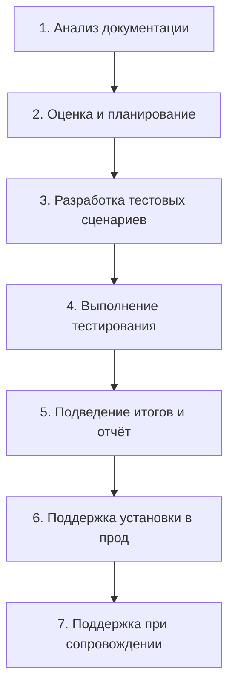

# Этапы тестирования и критерии требований

Тестирование — это не только «покликать приложение». Это процесс, который начинается
задолго до первого запуска программы (с чтения требований) и заканчивается далеко
после релиза (сопровождением продукта). На собеседовании этот вопрос задают почти
каждому джуну: он показывает, понимает ли кандидат, что QA — часть жизненного цикла
разработки, а не отдельный этап «в конце». Вторая половина темы — критерии качества
требований: умение найти дефект ещё в тексте ТЗ, до того как дефект попадёт в код.

## Семь этапов тестирования ПО

Классическая схема выглядит так (важно уметь перечислить по порядку):

1. **Анализ документации** — изучаем бизнес-требования и функциональные
   спецификации. Цель — понять, что вообще должно работать, и найти дефекты в
   самих требованиях (см. критерии ниже). Именно здесь начинается тестирование,
   а не на этапе выполнения.
2. **Оценка и планирование тестирования** — определяем объём работ, трудозатраты,
   сроки, ресурсы, риски. Результат — тест-план и оценки (estimation).
3. **Разработка сценариев тестирования** — пишем тест-кейсы и чек-листы, готовим
   тестовые данные и окружение. Подробнее о документах — в теме
   [тестовая документация](topic:qa-test-documentation), о техниках создания
   кейсов — в [тест-дизайне](topic:qa-test-design).
4. **Выполнение тестирования ПО** — прогоняем сценарии, фиксируем результаты,
   заводим [баг-репорты](topic:qa-bug-report), после исправлений проводим
   ретест и регрессию.
5. **Подведение итогов и подготовка результатов** — формируем отчёт о
   тестировании (test summary report): что проверено, сколько дефектов найдено
   и исправлено, какие риски остались. На основе этого отчёта принимается
   решение о релизе.
6. **Поддержка во время установки в прод** — участвуем в выкатке: smoke-тесты на
   боевом окружении, проверка конфигурации, готовность к быстрому откату.
7. **Поддержка во время сопровождения продукта** — разбираем инциденты от
   пользователей, воспроизводим продакшн-дефекты, тестируем hotfix-ы и
   патчи.

> **Ответ на собесе за 60 секунд.** «Тестирование начинается с анализа требований и
> спецификаций. Затем мы оцениваем и планируем работы, разрабатываем тестовые
> сценарии, выполняем тестирование с заведением дефектов, подводим итоги в отчёте,
> поддерживаем установку в прод и дальнейшее сопровождение. То есть QA работает на
> всём жизненном цикле продукта, а не только перед релизом».

## Критерии качества требований

Анализ требований — первый этап тестирования, и дефект, найденный в ТЗ, в разы
дешевле дефекта, найденного в коде. Хорошее требование проверяется по шести
критериям:

- **Полнота** — требование содержит всю информацию, необходимую для реализации и
  проверки; ничего не «подразумевается». Плохо: «Пользователь может восстановить
  пароль» — не сказано, как (по email? по SMS?), есть ли ограничения по времени
  жизни ссылки.
- **Однозначность** — требование допускает ровно одну трактовку у всех читателей.
  Плохо: «Система должна быстро обрабатывать запросы» — что такое «быстро»:
  100 мс или 5 секунд?
- **Непротиворечивость** — требование не конфликтует с другими требованиями в
  документе. Плохо: в одном разделе «регистрация обязательна для покупки», в
  другом — «гость может оформить заказ без регистрации».
- **Необходимость** — требование действительно нужно бизнесу и пользователям, а не
  добавлено «на всякий случай». Плохо: «Система должна экспортировать отчёт в
  12 форматах», когда пользователи просили только PDF и Excel — лишняя работа и
  лишнее тестирование.
- **Осуществимость** — требование можно реализовать в рамках технологий, бюджета и
  сроков проекта. Плохо: «Приложение должно распознавать речь с точностью 100%»
  — недостижимо на текущем уровне технологий.
- **Тестируемость** — по требованию можно написать конкретный проверяемый
  тест-кейс с измеримым ожидаемым результатом. Плохо: «Интерфейс должен быть
  удобным» — субъективно и непроверяемо; хорошо: «Основной сценарий покупки
  выполняется не более чем в 3 клика».

> **Типовые follow-up вопросы.** Чем критерий «однозначность» отличается от
> «тестируемости»? (Однозначность — про трактовку текста людьми, тестируемость —
> про возможность объективно проверить выполнение.) Какие этапы тестирования вы
> делали на своём проекте? Кто участвует в анализе требований? (Весь триумвират:
> аналитик, разработчик, QA — часто на встречах вроде three amigos.)

> **Ловушки.** Не путайте этапы тестирования (процесс работы QA) с уровнями
> тестирования (unit → integration → system → acceptance) и с этапами SDLC —
> это три разные классификации, и на собеседовании их любят смешивать. Вторая
> ловушка: забыть, что поддержка прода и сопровождение — тоже этапы
> тестирования, а не «чужая работа».

## Зачем это запоминать

Этапы дают «скелет» ответа на любой процессный вопрос: «как вы организуете
тестирование новой фичи» по сути сводится к перечислению этих семи шагов на
примере. А критерии требований — рабочий инструмент: на ревью ТЗ вы буквально
проходите списком «полнота, однозначность, непротиворечивость, необходимость,
осуществимость, тестируемость» и задаёте вопросы аналитику до начала разработки.
