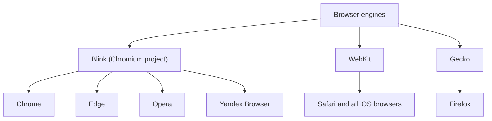
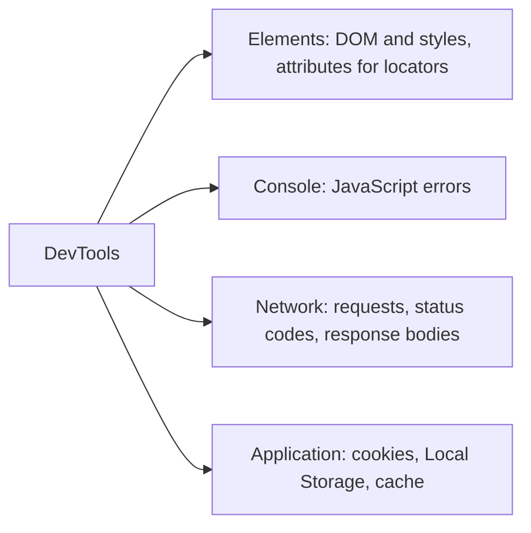

# Web Testing Essentials

Web testing is the most common area of a QA engineer's work: even if you plan
to move into automation or API testing, an interview will expect you to
confidently explain *how a browser works inside*. Three classic questions:
what DevTools can do, what a browser engine is and which engines exist, and
what the DOM is and how a tester uses it. All of them check one thing — do you
understand where "the picture on the screen" ends and the code you can inspect
begins.

## Browser engine: who renders the page

A **browser engine** is the core software component of a browser that parses
HTML and CSS, builds the DOM, performs layout and paints the page. Next to it
runs a JavaScript engine (e.g. V8) that executes scripts. For a tester this
matters because the same site can behave differently in different engines —
that is exactly why cross-browser testing exists.

The main engines:

- **Blink** — the engine of the **Chromium** project. Google Chrome, Microsoft
  Edge, Opera, Yandex Browser, Brave and most modern browsers are built on it.
- **WebKit** — the engine of **Safari** (and of every browser on iOS: Apple
  requires all iOS browsers to use WebKit).
- **Gecko** — the engine of **Firefox** (Mozilla).

### Trap: "Chrome != Chromium"

The most common interview mistake is naming browsers instead of engines.
Chrome is a *product*, a wrapper around an engine; **Chromium** is the
open-source project, and **Blink** is its rendering engine. And you definitely
should not say that Safari and Firefox are "also Chromium-based": Safari runs
WebKit, Firefox runs Gecko. That is exactly what the interviewer checks when
asking to "list the main browser engines".

> **The 60-second interview answer.** A browser engine is the core that parses
> HTML/CSS, builds the DOM and renders the page. The main engines: Blink from
> the Chromium project (Chrome, Edge, Opera), WebKit in Safari and all iOS
> browsers, Gecko in Firefox. The key distinction: Chrome is a product,
> Chromium is a project, Blink is the engine. Since there are essentially three
> engines, cross-browser testing boils down to checking Blink, WebKit and
> Gecko rather than dozens of browsers.

## The DOM: the tree a tester walks

The **DOM (Document Object Model)** is an object representation of a page as a
tree: the browser parses the HTML document and turns every tag into a node
with parents, children and attributes. The DOM is a "live" structure:
JavaScript can add, remove and modify nodes, and the page re-renders
immediately.

How a tester uses the DOM:

- **Inspecting elements.** Via DevTools → Elements we find the element we need
  and look at its tag, attributes (`id`, `class`, `data-*`), text and
  hierarchy.
- **Building locators.** For manual checks and especially for automated tests
  (Selenium, Playwright) we build locators — XPath or CSS selectors — that
  walk the DOM tree: by `id`, classes, attributes, position among siblings.
- **Checking dynamic behaviour.** We watch in real time how the DOM changes in
  response to user actions: did an error block appear, was the `active` class
  added, did the element render after data loaded.
- **Manual experiments.** Right in DevTools you can change text or styles, or
  delete a node, to quickly test a hypothesis ("what if this block were
  missing?") — this only changes the page locally, of course.

> **The 60-second interview answer.** The DOM is a tree-like object
> representation of an HTML page in the browser's memory. In testing I use it
> to find elements and their attributes, build locators for automated tests
> (CSS selectors, XPath) and observe how the page changes in response to user
> actions.

## DevTools: the web tester's main tool

**DevTools** (opened with F12 or Ctrl+Shift+I) is the set of developer tools
built into the browser that a tester uses every day. Four panels are
mandatory knowledge:

- **Elements** — the page's DOM tree and styles. We inspect element structure,
  attributes for locators, applied CSS rules and states (`:hover`,
  `:disabled`). Markup can be edited on the fly.
- **Console** — JavaScript errors and warnings. Red errors in the Console are
  almost always a reason to file a bug, even if the page visually "works". You
  can also run JS commands manually here.
- **Network** — all of the page's network requests. We look at the HTTP
  method, URL, status code (200/400/500), request/response headers and body,
  and response time. This is the first place to go when a bug appears: did the
  front end send wrong data, or did the back end return an error? It lets you
  separate a client-side problem from a server-side one — see
  [API testing](topic:qa-api-testing).
- **Application** — client-side storage: cookies, Local Storage, Session
  Storage, IndexedDB, cache and service workers. We clear cookies and storage
  to verify "first login" scenarios and peek at tokens and sessions.

Other panels are useful too: **Sources** (JS debugging, breakpoints),
**Performance** (rendering bottlenecks), and device emulation (device toolbar)
for checking responsive layouts and mobile views — see
[mobile testing](topic:qa-mobile-testing).

> **The 60-second interview answer.** DevTools are the browser's built-in
> tools. I mostly work with four panels: Elements — I inspect the DOM and
> styles and grab attributes for locators; Console — I watch for JS errors;
> Network — I analyse requests: method, status code, headers and response body,
> to tell whether a bug is on the front end or the back end; Application — I
> work with cookies and Local Storage, e.g. clearing them to test first-login
> scenarios.

### Typical follow-up questions

- How can you tell from a Network request that a bug is on the back end rather
  than the front end?
- How does Local Storage differ from Session Storage and from cookies?
- What do you do if an element is visible on the page but an automated test
  "cannot see" it?
- How do you check what a site looks like on a mobile screen without a phone?

### Traps

- Confusing browsers and engines: Chrome is not an engine; Safari and Firefox
  are not Chromium-based.
- Saying "the DOM is the page source code". No: View Source shows the HTML *as
  loaded*, while the DOM is the live tree already modified by scripts.
- Forgetting that DevTools edits are local and vanish after a reload.
