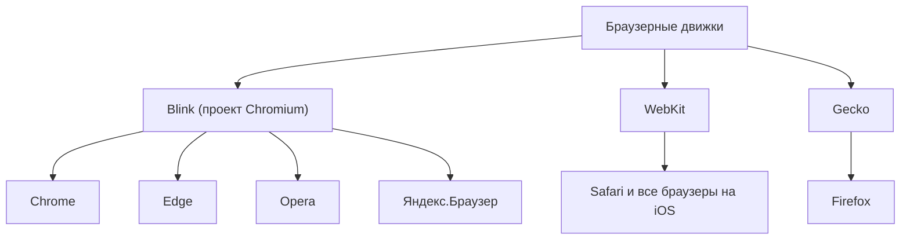
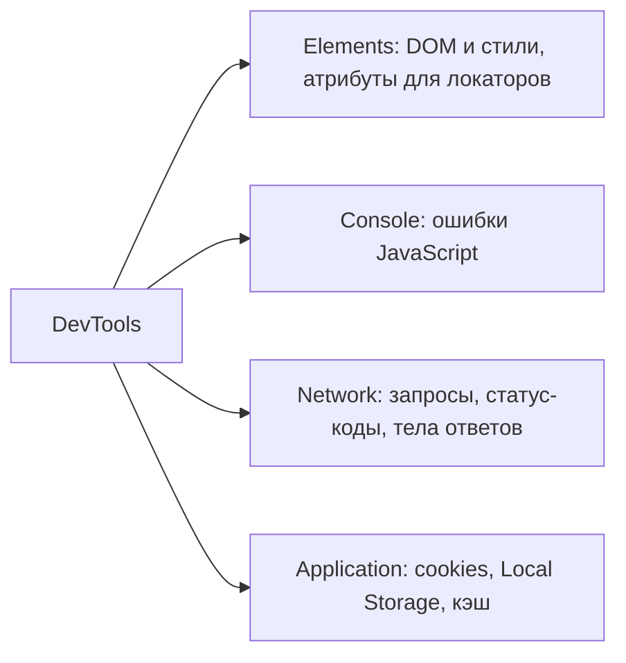

# Основы тестирования web

Web-тестирование — самый массовый участок работы QA-инженера: даже если вы
собираетесь в автоматизацию или API, на собеседовании от вас ждут уверенного
понимания того, *как устроен браузер изнутри*. Три классических вопроса: какие
возможности есть у DevTools, что такое браузерный движок и какие движки
существуют, что такое DOM и как тестировщик его использует. Всё это проверяет
одну вещь — понимаете ли вы, где заканчивается «картинка на экране» и
начинается код, который можно исследовать.

## Браузерный движок: кто рендерит страницу

**Браузерный движок (browser engine)** — это программное ядро браузера, которое
парсит HTML и CSS, строит DOM, выполняет раскладку (layout) и отрисовывает
страницу. Рядом с ним работает JavaScript-движок (например, V8), исполняющий
скрипты. Для тестировщика это важно, потому что один и тот же сайт может
вести себя по-разному в разных движках — отсюда и кросс-браузерное
тестирование.

Основные движки:

- **Blink** — движок проекта **Chromium**. На нём построены Google Chrome,
  Microsoft Edge, Opera, Яндекс.Браузер, Brave и большинство современных
  браузеров.
- **WebKit** — движок **Safari** (а также всех браузеров на iOS: Apple требует,
  чтобы любой браузер в iOS использовал WebKit).
- **Gecko** — движок **Firefox** (Mozilla).

### Ловушка: «Хром != Chromium»

Самая частая ошибка на собеседовании — назвать браузеры вместо движков.
Chrome — это *продукт*, обёртка вокруг движка; **Chromium** — open-source
проект, а **Blink** — его движок рендеринга. И уж точно не стоит говорить, что
Safari и Firefox «тоже на Chromium»: у Safari — WebKit, у Firefox — Gecko.
Именно это интервьюер и проверяет, когда просит «перечислить основные
браузерные движки».

> **Ответ на собесе за 60 секунд.** Браузерный движок — ядро, которое парсит
> HTML/CSS, строит DOM и отрисовывает страницу. Основные движки: Blink из
> проекта Chromium (Chrome, Edge, Opera), WebKit у Safari и всех браузеров на
> iOS, Gecko у Firefox. Важно не путать: Chrome — продукт, Chromium — проект,
> Blink — движок. Потому что движков по сути три, кросс-браузерное
> тестирование сводится к проверке на Blink, WebKit и Gecko, а не к перебору
> десятков браузеров.

## DOM: дерево, по которому ходит тестировщик

**DOM (Document Object Model)** — объектное представление страницы в виде
дерева: браузер парсит HTML-документ и превращает каждый тег в узел (node) с
родителями, дочерними элементами и атрибутами. DOM — это «живая» структура:
JavaScript может добавлять, удалять и менять узлы, и страница тут же
перерисовывается.

Как тестировщик использует DOM:

- **Исследование элементов.** Через DevTools → Elements находим нужный элемент
  и смотрим его тег, атрибуты (`id`, `class`, `data-*`), текст и иерархию.
- **Построение локаторов.** Для ручной проверки и особенно для автотестов
  (Selenium, Playwright) мы строим локаторы — XPath или CSS-селекторы, — которые
  идут именно по дереву DOM: по `id`, классам, атрибутам, позиции среди соседей.
- **Проверка динамики.** Видим в реальном времени, как меняется DOM при
  действиях пользователя: появился ли блок ошибки, добавился ли класс `active`,
  отрисовался ли элемент после загрузки данных.
- **Ручные эксперименты.** Можно прямо в DevTools изменить текст, стили или
  удалить узел, чтобы быстро проверить гипотезу («а что будет, если этого блока
  нет?») — разумеется, это меняет страницу только локально.

> **Ответ на собесе за 60 секунд.** DOM — это древовидное объектное
> представление HTML-страницы в памяти браузера. При тестировании я использую
> его, чтобы находить элементы и их атрибуты, строить локаторы для автотестов
> (CSS-селекторы, XPath) и наблюдать, как страница меняется в ответ на действия
> пользователя.

## DevTools: главный инструмент web-тестировщика

**DevTools** (открывается по F12 или Ctrl+Shift+I) — встроенный в браузер
набор инструментов разработчика, которым тестировщик пользуется ежедневно.
Четыре вкладки нужно знать обязательно:

- **Elements** — DOM-дерево и стили страницы. Смотрим структуру элементов,
  атрибуты для локаторов, применённые CSS-правила, состояния (`:hover`,
  `:disabled`). Можно править разметку на лету.
- **Console** — ошибки и предупреждения JavaScript. Красные ошибки в Console —
  почти всегда повод завести баг, даже если визуально страница «работает».
  Здесь же можно вручную выполнять JS-команды.
- **Network** — все сетевые запросы страницы. Смотрим HTTP-метод, URL, статус-код
  (200/400/500), request/response headers и body, время ответа. Это первое
  место, куда идём при баге: фронт отправил не те данные или бэкенд вернул
  ошибку? Позволяет отделить проблему клиента от проблемы сервера — см.
  [тестирование API](topic:qa-api-testing).
- **Application** — клиентское хранилище: cookies, Local Storage, Session
  Storage, IndexedDB, кэш и service workers. Очищаем cookies и storage, чтобы
  проверить сценарии «первого входа», подсматриваем токены и сессии.

Полезны и остальные: **Sources** (отладка JS, брейкпоинты), **Performance**
(узкие места рендеринга), эмуляция устройств (device toolbar) для проверки
адаптивной вёрстки и мобильных видов — см.
[тестирование мобильных приложений](topic:qa-mobile-testing).

> **Ответ на собесе за 60 секунд.** DevTools — встроенные инструменты браузера.
> Я чаще всего работаю с четырьмя вкладками: Elements — изучаю DOM и стили,
> беру атрибуты для локаторов; Console — смотрю JS-ошибки; Network — анализирую
> запросы: метод, статус-код, headers и тело ответа, чтобы понять, где баг — на
> фронте или на бэке; Application — работаю с cookies и Local Storage, например
> очищаю их для проверки сценариев первого входа.

### Типовые follow-up вопросы

- Как по Network-запросу понять, что баг на бэкенде, а не на фронтенде?
- Чем Local Storage отличается от Session Storage и от cookies?
- Что вы сделаете, если элемент на странице есть визуально, но автотест его
  «не видит»?
- Как проверить, как сайт выглядит на мобильном экране, не имея телефона?

### Ловушки

- Путать браузеры и движки: Chrome — не движок; Safari и Firefox — не на
  Chromium.
- Говорить «DOM — это исходный код страницы». Нет: View Source показывает HTML
  *на момент загрузки*, а DOM — живое дерево, уже изменённое скриптами.
- Забыть, что правки в DevTools локальны и исчезают после перезагрузки.
