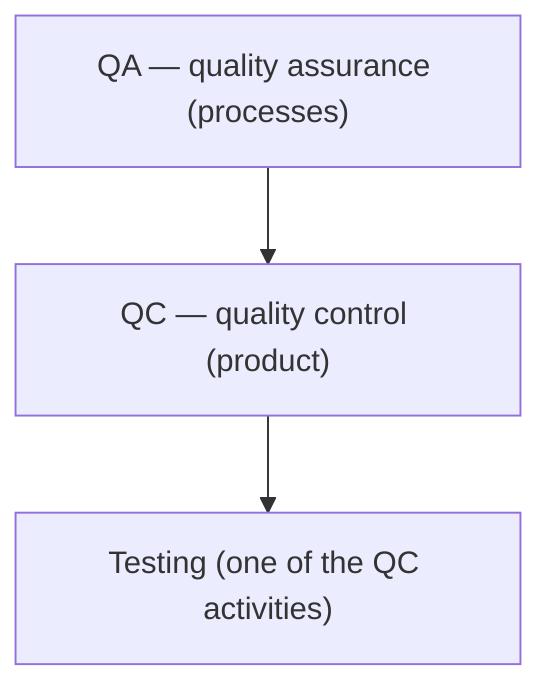

# What Is Software Testing

"What is testing?" is the opening question of almost any QA engineer interview.
It sounds trivial, but this is exactly how an interviewer tells within a minute
whether a candidate studied the theory deliberately or just skimmed a couple of
articles. You are expected to give not one "correct" definition but 2–3
formulations from different authoritative sources, plus a crisp separation of
**QA / QC / Testing** and **verification / validation** — the two most common
follow-up questions.

## Definitions of Testing

There is no single canonical definition — different sources have described
testing differently over time. Here are the ones worth knowing by heart:

- **ISTQB**: testing is the process consisting of all lifecycle activities,
  both static and dynamic, concerned with planning, preparation and evaluation
  of software products and related work products to determine that they satisfy
  specified requirements, to demonstrate that they are fit for purpose and to
  detect defects. Note that ISTQB deliberately includes **static** activities
  (requirements analysis, code reviews) — not just running the program.
- **Svyatoslav Kulikov**: software testing is the process of analyzing the
  software and its accompanying documentation in order to find defects and
  improve product quality. Short and practical — a good "conversational"
  definition.
- **Roman Savin**: any testing is a search for bugs. The most hardline
  formulation: if you are not looking for bugs, you are not testing.
- **James Bach**: testing is the gathering, updating and prioritization of
  information about the product in order to deliver it to stakeholders and
  decision-makers. Here the focus shifts from bugs to **information**: the
  tester is a supplier of data for the "do we release or not" decision.

**The most popular working definition**: software testing is checking the
correspondence between the actual and the expected behavior of a program. If
asked to answer "in your own words" at an interview, start with this formula
and then add one or two authored definitions.

> **The 60-second interview answer**
> "Testing is checking the correspondence between the actual and the expected
> behavior of a program. Per ISTQB, it is the whole set of static and dynamic
> lifecycle activities — planning, preparation and evaluation of the product to
> confirm compliance with requirements and to find defects. Per Savin, it is
> simply a search for bugs. Per Bach, it is gathering and prioritizing
> information about the product for decision-making."

**Typical follow-up questions:**
- "Which definition do you prefer and why?" — there is no right answer; what
  matters is the reasoning.
- "How does the ISTQB definition differ from Savin's?" — ISTQB includes static
  and process-wide activities; Savin reduces everything to defect hunting.

## QA, QC, and Testing — Three Levels, Not Synonyms

A common trap is treating QA (Quality Assurance), QC (Quality Control) and
testing as the same thing. In reality they are nested levels:

- **Quality Assurance (QA)** — the set of activities covering all technological
  stages of software development, release and operation across the lifecycle
  stages, undertaken to ensure the required quality level of the released
  product. QA is about the **process**: how we organize work so that defects do
  not appear in the first place. This is the broadest level.
- **Quality Control (QC)** — the set of actions performed on the software
  during development to obtain information about its current state: readiness
  for release, compliance with documented requirements and the declared quality
  level. QC is about the **product**: measuring and checking what has already
  been built.
- **Testing** — one of the activities inside QC: planning, preparation,
  execution of tests and evaluation of the product to confirm compliance with
  requirements and to detect defects.

A simple mnemonic: **QA prevents defects, QC detects them, testing is the
detection tool**. The word Assurance ("guarantee") implies proactive work with
the process, while Control implies checking the result.

> **The 60-second interview answer**
> "QA is work with the process across all lifecycle stages so that quality is
> built into the product. QC is control of the product itself: a set of actions
> that provide information about its state and compliance with requirements.
> Testing is part of QC: the concrete activity of checking the product and
> finding defects."

**Trap:** in the industry, a "QA engineer" is often a person who in fact does
testing. It is worth mentioning this at an interview — it shows you understand
both the theory and the real hiring practice.

## Verification and Validation

The second mandatory pair of concepts. The formal definitions sound similar, so
people mix them up all the time:

- **Verification** — confirmation, backed by objective examination results,
  that **specified requirements have been fulfilled**. In other words: we check
  the product against the specification. The question: "Are we building the
  product right?"
- **Validation** — confirmation, backed by objective examination results, that
  **the requirements for a specific intended use of the product have been
  fulfilled**. In other words: the product actually solves the user's problem.
  The question: "Are we building the right product?"

A classic example of the difference: a taxi-ordering app fully matches its
spec — verification passed. But the customer wanted to call a car in one tap
and got five screens instead — validation failed: the product is correct per
specification yet unfit for real use.

In terms of timing, verification usually happens during development
(requirements reviews, code reviews, unit tests — "are we doing everything per
the spec"), while validation happens closer to the finished product
(acceptance testing, beta testing, work with the customer — "did we get what is
actually needed"). See also [testing stages](topic:qa-testing-stages-requirements)
and [alpha, beta, and A/B testing](topic:qa-alpha-beta-ab).

> **The 60-second interview answer**
> "Verification is confirmation that specified requirements are fulfilled: we
> are building the product right, checking it against the specification.
> Validation is confirmation that the requirements for a specific intended use
> are fulfilled: we are building the product the user actually needs.
> Verification — 'building the product right', validation — 'building the right
> product'."

**Traps:**
- "Is verification the same as validation?" — no, they are different
  activities; substituting one for the other is the most common mistake on this
  question.
- "Which one matters more?" — both: a product can be verified and still
  useless, and vice versa.

## The Main Goals of Testing

If asked "why do we test at all", answer with three points:

1. **Clean the software of errors** — find defects and get them fixed. 100%
   coverage is unattainable (this is one of the testing principles, see
   [the seven testing principles](topic:qa-seven-principles)), so the goal is
   to guarantee that the obvious errors are fixed and the risks are known.
2. **Make sure the software meets the original requirements and
   specification** — the product does what is documented in the requirements.
3. **Build confidence in the product** — users, customers and the team should
   have a justified confidence that the product can be used.

It is also important to understand how a defect differs from an error and a
failure — another frequent question, see
[error, defect, failure](topic:qa-error-defect-failure).

**Typical follow-up questions:**
- "Can testing prove the absence of bugs?" — no, testing shows the presence of
  defects, not their absence.
- "Is the goal of testing to find all the bugs?" — no, that is impossible; the
  goal is to find as many critical defects as possible within the available
  time and to provide information about quality.
