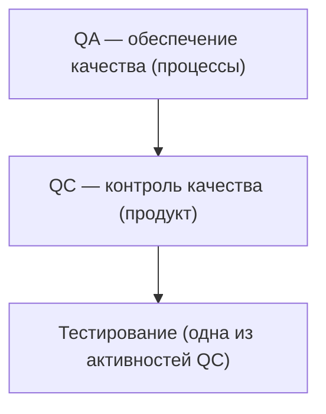

# Что такое тестирование ПО

«Что такое тестирование?» — первый вопрос почти любого собеседования на
QA-инженера. Кажется простым, но именно по нему интервьюер за минуту понимает,
учил ли кандидат теорию осознанно или просто прочитал пару статей. От вас ждут
не одно «правильное» определение, а 2–3 формулировки от разных авторитетных
источников и чёткое разделение понятий **QA / QC / Testing** и
**верификация / валидация** — это два самых частых follow-up вопроса.

## Определения тестирования

Единого канонического определения не существует — в разное время и в разных
источниках тестирование описывали по-разному. Вот те, которые стоит знать
наизусть:

- **ISTQB**: тестирование — это процесс, содержащий в себе все активности
  жизненного цикла, как динамические, так и статические, касающиеся
  планирования, подготовки и оценки программного продукта и связанных с ним
  результатов работ, с целью определить, что они соответствуют описанным
  требованиям, показать, что они подходят для заявленных целей, и обнаружить
  дефекты. Обратите внимание: ISTQB сознательно включает в тестирование
  **статические** активности (анализ требований, ревью кода) — не только
  запуск программы.
- **Святослав Куликов**: тестирование ПО — процесс анализа программного
  средства и сопутствующей документации с целью выявления дефектов и повышения
  качества продукта. Коротко и практично — хорошее «разговорное» определение.
- **Роман Савин**: любое тестирование — это поиск багов. Максимально жёсткая
  формулировка: если вы не ищете баги, вы не тестируете.
- **Джеймс Бах**: тестирование — это сбор, актуализация и приоритизация
  информации о продукте с целью передачи её заинтересованным лицам и лицам,
  принимающим решения. Здесь фокус смещён с багов на **информацию**: тестировщик
  — поставщик данных для решения «релизим или нет».

**Самое популярное рабочее определение**: тестирование ПО — это проверка
соответствия между реальным и ожидаемым поведением программы. Если на собесе
просят «своими словами» — начинайте с этой формулы, а затем приводите одно-два
авторских определения.

> **Ответ на собесе за 60 секунд**
> «Тестирование — это проверка соответствия между реальным и ожидаемым
> поведением программы. По ISTQB — это весь комплекс статических и динамических
> активностей жизненного цикла: планирование, подготовка и оценка продукта,
> чтобы подтвердить соответствие требованиям и найти дефекты. По Савину —
> попросту поиск багов. По Баху — сбор и приоритизация информации о продукте
> для принятия решений».

**Типовые follow-up вопросы:**
- «Какое определение вам ближе и почему?» — правильного ответа нет, важна
  аргументация.
- «Чем определение ISTQB отличается от определения Савина?» — ISTQB включает
  статику и процессные активности, Савин сводит всё к поиску дефектов.

## QA, QC и тестирование — три уровня, а не синонимы

Частая ловушка — считать QA (обеспечение качества), QC (контроль качества) и
тестирование одним и тем же. На деле это вложенные друг в друга уровни:

- **Обеспечение качества (Quality Assurance, QA)** — совокупность мероприятий,
  охватывающих все технологические этапы разработки, выпуска и эксплуатации ПО
  на разных стадиях его жизненного цикла, для обеспечения требуемого уровня
  качества выпускаемого продукта. QA — про **процесс**: как мы строим работу,
  чтобы дефекты не появлялись. Это самый широкий уровень.
- **Контроль качества (Quality Control, QC)** — совокупность действий,
  проводимых над ПО в процессе разработки, для получения информации о его
  актуальном состоянии: готовности к выпуску, соответствия зафиксированным
  требованиям и заявленному уровню качества. QC — про **продукт**: измеряем и
  проверяем то, что уже сделано.
- **Тестирование** — одна из активностей внутри QC: планирование, подготовка,
  выполнение тестов и оценка продукта для подтверждения соответствия
  требованиям и обнаружения дефектов.

Простая мнемоника: **QA предотвращает дефекты, QC обнаруживает их,
тестирование — инструмент обнаружения**. Слово Assurance («гарантия») говорит о
проактивной работе с процессом, Control — о проверке результата.

> **Ответ на собесе за 60 секунд**
> «QA — это работа с процессом на всех этапах жизненного цикла, чтобы качество
> закладывалось в продукт. QC — контроль самого продукта: набор действий,
> дающих информацию о его состоянии и соответствии требованиям. Тестирование —
> часть QC: конкретная деятельность по проверке продукта и поиску дефектов».

**Ловушка:** в индустрии QA-инженером часто называют человека, который по факту
занимается тестированием. На собесе это стоит упомянуть — показывает, что вы
понимаете и теорию, и реальную практику найма.

## Верификация и валидация

Вторая обязательная пара понятий. Формальные определения звучат похоже, поэтому
их вечно путают:

- **Верификация (verification)** — доказанное объективными результатами
  исследования подтверждение того, что **определённые требования были
  выполнены**. То есть: мы проверяем продукт против спецификации. Вопрос:
  «Правильно ли мы делаем продукт?»
- **Валидация (validation)** — доказанное объективными результатами
  исследования подтверждение того, что **требования для конкретного
  определённого использования продукта были выполнены**. То есть: продукт
  реально решает задачу пользователя. Вопрос: «Тот ли продукт мы делаем?»

Классический пример разницы: приложение для заказа такси полностью соответствует
ТЗ — верификация пройдена. Но заказчик хотел вызов машины в одно нажатие, а
получилось пять экранов — валидация провалена: продукт верный по спецификации,
но не подходит для реального использования.

По времени верификация обычно идёт в ходе разработки (ревью требований, ревью
кода, unit-тесты — «делаем ли мы всё по спецификации»), а валидация — ближе к
готовому продукту (приёмочное тестирование, бета-тестирование, работа с
заказчиком — «получилось ли то, что нужно»). См. также
[стадии тестирования](topic:qa-testing-stages-requirements) и
[альфа-, бета- и A/B-тестирование](topic:qa-alpha-beta-ab).

> **Ответ на собесе за 60 секунд**
> «Верификация — подтверждение, что определённые требования выполнены: мы
> правильно строим продукт, сверяясь со спецификацией. Валидация —
> подтверждение, что выполнены требования для конкретного использования: мы
> строим тот продукт, который нужен пользователю. Verification — "building the
> product right", validation — "building the right product"».

**Ловушки:**
- «Verification — это валидация?» — нет, это разные активности; подмена одного
  другим — самая частая ошибка на этом вопросе.
- «Что важнее?» — оба: продукт может быть верифицирован и при этом бесполезен,
  и наоборот.

## Основные цели тестирования

Если спросят «зачем вообще тестируют», отвечайте тремя пунктами:

1. **Очистить ПО от ошибок** — найти и дать исправить дефекты. 100%-е покрытие
   недостижимо (это один из принципов тестирования, см.
   [семь принципов тестирования](topic:qa-seven-principles)), поэтому цель —
   гарантировать, что очевидные ошибки исправлены, а риски известны.
2. **Убедиться, что ПО отвечает оригинальным требованиям и спецификации** —
   продукт делает то, что зафиксировано в требованиях.
3. **Обеспечить уверенность в продукте** — у пользователей, заказчиков и
   команды должна быть обоснованная уверенность, что продуктом можно
   пользоваться.

Важно понимать, чем дефект отличается от ошибки и отказа — это отдельный
частый вопрос, см. [ошибка, дефект, отказ](topic:qa-error-defect-failure).

**Типовые follow-up вопросы:**
- «Может ли тестирование доказать отсутствие багов?» — нет, тестирование
  показывает наличие дефектов, а не их отсутствие.
- «Какова цель тестирования — найти все баги?» — нет, это невозможно; цель —
  найти максимум критичных дефектов за отведённое время и дать информацию о
  качестве.
