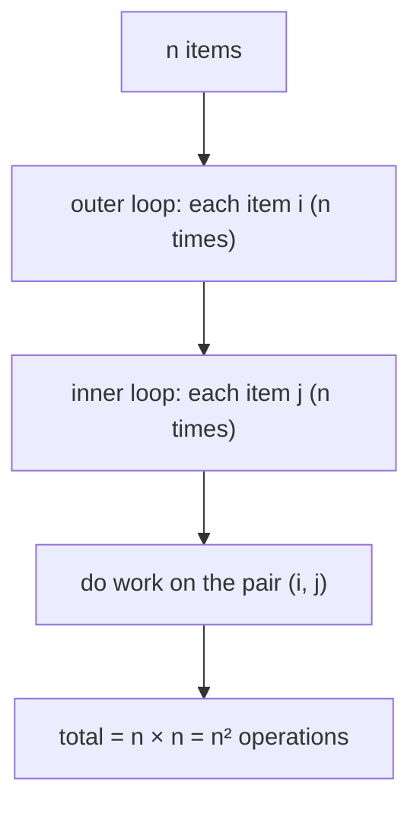
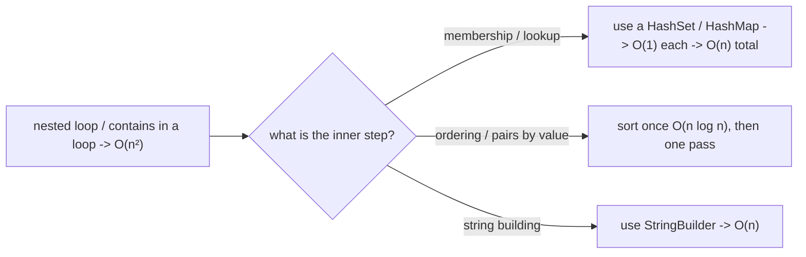

# Why O(n²) Complexity Is Bad

## The short answer

**O(n²)** means the amount of work grows with the **square** of the input size.
Add a little data and the cost explodes:

- Double the input (×2) → **4×** the work.
- Tenfold the input (×10) → **100×** the work.
- A thousandfold (×1000) → **a million times** the work.

It is usually harmless on tiny inputs and a disaster on large ones. That gap is the
whole problem: code that flies in a demo with 100 rows can freeze in production with
100,000.

> Real life: imagine introducing every guest at a party to **every other guest** with
> a handshake. Ten guests is 45 handshakes — a few minutes. A hundred guests is ~5,000
> handshakes; a thousand guests is ~500,000. The room size grew ×100 but the greeting
> time grew ×10,000. That "every-pair" pattern is exactly O(n²).

## Where O(n²) comes from

The textbook source is a **loop inside a loop** over the same collection — you touch
every element, and for each one you touch every element again:

You also get O(n²) **without** writing two visible loops, when a cheap-looking call
hides a scan:

- Calling `list.contains(x)` inside a loop — `contains` on an `ArrayList` is itself an
  O(n) [linear scan](topic:array-search-complexity), so n calls = O(n²).
- Bubble sort / selection sort / insertion sort (compare-and-swap every pair).
- Building a big String with `+=` in a loop — each concatenation copies the whole
  string so far, so a million appends cost O(n²); see
  [Concatenating a Million Strings](topic:string-concatenation).
- A naive growable array that copies on every add, instead of doubling — see
  [Naive ArrayList Growth Complexity](topic:arraylist-naive-growth-complexity).

> Real life: a new postal clerk who, for **every** letter, walks the whole row of
> mailboxes from the start to find the right one. One letter is a short walk; sorting
> the day's sack means walking the full row once per letter — the effort squares.

## Why it actually hurts

Big-O is about **scaling**, not the speed on one fixed input. Compare how the number
of operations grows:

| n | O(n) | O(n log n) | O(n²) |
| --- | --- | --- | --- |
| 10 | 10 | ~33 | 100 |
| 1,000 | 1,000 | ~10,000 | 1,000,000 |
| 1,000,000 | 1,000,000 | ~20,000,000 | 1,000,000,000,000 |

At a million items, an O(n) pass is a million steps; the O(n²) version is a
**trillion** — the difference between "instant" and "never finishes." This is why a
feature can pass every test with small fixtures and then melt down the first time a
real customer uploads a large file.

> Real life: a small café can seat everyone by walking each new diner to each open
> table to check it's free. A 2,000-seat stadium running the same "check every seat for
> every fan" policy would never get the crowd seated before the game ends. The policy
> didn't change — the size did, and O(n²) punishes size.

## How to fix a quadratic algorithm

The cure is almost always **a better data structure or a smarter algorithm** that
removes the inner scan:

- **Replace the inner scan with a hash lookup.** Finding duplicates by comparing every
  pair is O(n²); putting items in a [HashSet](topic:java-set-implementations) and asking
  "seen it?" is O(1) average per item, so the whole job becomes
  [O(n)](topic:hashmap-lookup-complexity). This single swap — list scan → hash lookup —
  is the most common fix in interviews.
- **Sort first, then make one linear pass.** Many "compare every pair" problems become
  trivial once data is ordered; sorting is O(n log n), far below O(n²). See
  [Search Complexity After Sorting](topic:search-complexity-after-sorting).
- **Use the right collection.** [ArrayList vs LinkedList](topic:arraylist-vs-linkedlist)
  and the [Java Collections Overview](topic:java-collections-overview) decide whether
  your inner operation is O(1) or O(n).
- **Don't optimize what's already tiny.** If n is bounded and small (a fixed 8-team
  bracket), an O(n²) loop is perfectly fine and may be clearer than a clever one.

> Real life: instead of walking the whole mailbox row per letter, the post office sorts
> mail into pigeonholes labelled by route — now each letter drops into its slot in one
> move. Same letters, but the per-letter scan is gone, so the day's work grows in line
> with the number of letters, not its square.

## n² vs n log n

The line interviewers care about is **O(n²) vs O(n log n)**. Good sorting and
divide-and-conquer algorithms are O(n log n), which stays close to linear even for huge
n; O(n²) leaves it far behind. "Can you get this below n²?" usually means "can you sort,
hash, or otherwise avoid comparing every pair?" The same instinct is why databases add
[indexes](topic:database-indexes) instead of scanning every row against every row.

## 60-second interview answer

> O(n²) means the work grows with the square of the input — double the data, quadruple
> the work; ten times the data, a hundred times the work. It's fine for small inputs but
> scales terribly: at a million items it's a trillion operations versus a million for
> O(n). It typically comes from a nested loop over the same data, or a hidden scan like
> calling `contains` on a list inside a loop. The usual fix is to remove the inner scan:
> swap the list lookup for a `HashSet`/`HashMap` to drop from O(n²) to O(n), or sort
> once (O(n log n)) and make a single pass. I only worry about it when n can grow large;
> for a small, bounded n a quadratic loop is fine and often clearer.

## Common misconceptions

- ❌ "O(n²) is just slow code." — It's not about constant speed; it's about **scaling**.
  It can be the fastest choice for tiny n and unusable for large n.
- ❌ "Two loops always mean O(n²)." — Only when both loops scale with n over the **same**
  data. Looping over n items and, inside, over a **fixed** 7 days is O(n), not O(n²).
- ❌ "One loop is always O(n)." — A single loop that calls an O(n) operation (like
  `list.contains` or string `+=`) each iteration is O(n²) in disguise.
- ❌ "n² and n log n are about the same." — At a million items that's a trillion vs ~20
  million — about 50,000× apart. The gap widens with size.
- ❌ "Always eliminate O(n²)." — If n is small and bounded, a clear quadratic loop beats
  a complex 'optimal' one. Optimize where n actually grows.
