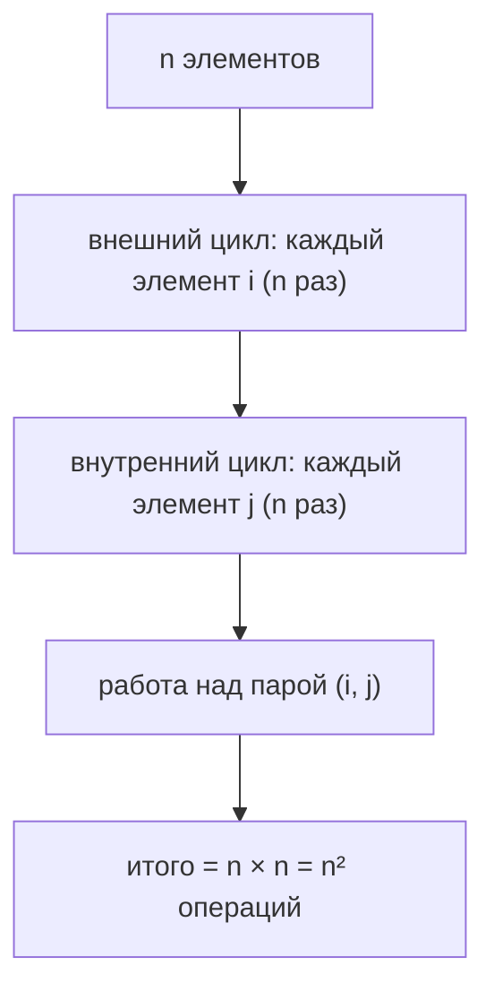
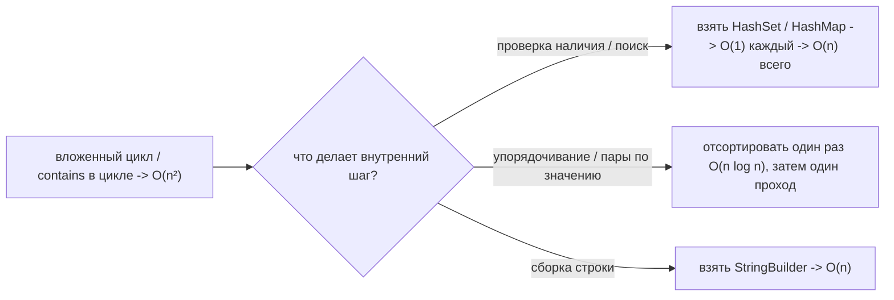

# Чем плоха сложность O(n²)

## Короткий ответ

**O(n²)** означает, что объём работы растёт как **квадрат** размера входа. Добавь
немного данных — и затраты взрываются:

- Удвоить вход (×2) → работы в **4 раза** больше.
- Увеличить в десять раз (×10) → работы в **100 раз** больше.
- В тысячу раз (×1000) → работы **в миллион раз** больше.

На крошечных входах это обычно безобидно, а на больших — катастрофа. Именно в этом
разрыве вся проблема: код, который летает в демо на 100 строках, может зависнуть в
продакшене на 100 000.

> Из жизни: представь, что на вечеринке каждого гостя знакомят с **каждым другим**
> рукопожатием. Десять гостей — 45 рукопожатий, пара минут. Сто гостей — около 5000;
> тысяча — около 500 000. Зал вырос в 100 раз, а время на приветствия — в 10 000 раз.
> Этот шаблон «каждый с каждым» и есть O(n²).

## Откуда берётся O(n²)

Классический источник — **цикл внутри цикла** по одной и той же коллекции: ты
проходишь по каждому элементу, и для каждого снова проходишь по всем элементам:

O(n²) можно получить и **без** двух видимых циклов, когда дешёвый на вид вызов прячет
обход:

- Вызов `list.contains(x)` внутри цикла — `contains` у `ArrayList` это сам по себе
  O(n) [линейный обход](topic:array-search-complexity), значит n вызовов = O(n²).
- Пузырьковая сортировка / сортировка выбором / вставками (сравнить и переставить
  каждую пару).
- Сборка большой строки через `+=` в цикле — каждая конкатенация копирует всю строку
  целиком, поэтому миллион добавлений стоит O(n²); см.
  [Конкатенация миллиона строк](topic:string-concatenation).
- Наивный растущий массив, который копируется при каждом добавлении вместо удвоения —
  см. [Сложность наивного роста ArrayList](topic:arraylist-naive-growth-complexity).

> Из жизни: новый почтовый работник, который для **каждого** письма обходит весь ряд
> ящиков с начала, чтобы найти нужный. Одно письмо — короткая прогулка; разобрать
> дневной мешок — значит пройти весь ряд по разу на каждое письмо, и усилия растут
> квадратично.

## Почему это действительно бьёт

Big-O — про **масштабирование**, а не про скорость на одном фиксированном входе.
Сравним, как растёт число операций:

| n | O(n) | O(n log n) | O(n²) |
| --- | --- | --- | --- |
| 10 | 10 | ~33 | 100 |
| 1 000 | 1 000 | ~10 000 | 1 000 000 |
| 1 000 000 | 1 000 000 | ~20 000 000 | 1 000 000 000 000 |

На миллионе элементов проход O(n) — это миллион шагов, а версия O(n²) — **триллион**:
разница между «мгновенно» и «никогда не закончится». Поэтому фича может пройти все
тесты на маленьких данных, а потом рухнуть, как только реальный клиент впервые
загрузит большой файл.

> Из жизни: маленькое кафе может рассадить всех, подводя каждого нового гостя к каждому
> свободному столику, чтобы проверить, что он пуст. Стадион на 2000 мест с той же
> политикой «проверить каждое место для каждого болельщика» не успеет рассадить толпу
> до конца матча. Политика не изменилась — изменился размер, а O(n²) наказывает за
> размер.

## Как чинить квадратичный алгоритм

Лекарство почти всегда — **лучшая структура данных или более умный алгоритм**,
который убирает внутренний обход:

- **Замени внутренний обход на хеш-поиск.** Искать дубликаты сравнением каждой пары —
  это O(n²); сложить элементы в [HashSet](topic:java-set-implementations) и спросить
  «видели?» — это в среднем O(1) на элемент, и вся задача становится
  [O(n)](topic:hashmap-lookup-complexity). Именно эта замена — обход списка → хеш-поиск —
  самый частый фикс на собеседованиях.
- **Сначала отсортируй, потом один линейный проход.** Многие задачи «сравнить каждую
  пару» становятся тривиальными, как только данные упорядочены; сортировка — O(n log n),
  это намного ниже O(n²). См.
  [Сложность поиска после сортировки](topic:search-complexity-after-sorting).
- **Бери правильную коллекцию.** [ArrayList vs LinkedList](topic:arraylist-vs-linkedlist)
  и [Обзор коллекций Java](topic:java-collections-overview) определяют, будет ли твоя
  внутренняя операция O(1) или O(n).
- **Не оптимизируй то, что и так крошечное.** Если n ограничено и мало (фиксированная
  сетка из 8 команд), цикл O(n²) совершенно нормален и может быть понятнее хитрого.

> Из жизни: вместо того чтобы обходить весь ряд ящиков на каждое письмо, почта
> раскладывает корреспонденцию по ячейкам, подписанным по маршрутам — теперь каждое
> письмо ложится в свою ячейку за одно движение. Письма те же, но обход на каждое
> исчез, и дневная работа растёт пропорционально числу писем, а не его квадрату.

## n² против n log n

Граница, которая волнует интервьюеров, — это **O(n²) против O(n log n)**. Хорошие
сортировки и алгоритмы «разделяй и властвуй» — это O(n log n), что остаётся близко к
линейному даже для огромных n; O(n²) остаётся далеко позади. Вопрос «можешь сделать
быстрее, чем n²?» обычно означает «можешь отсортировать, захешировать или иначе
избежать сравнения каждой пары?». Тот же инстинкт стоит за тем, почему базы данных
добавляют [индексы](topic:database-indexes) вместо того, чтобы сканировать каждую строку
против каждой.

## Ответ за 60 секунд

> O(n²) означает, что работа растёт как квадрат входа: удвоишь данные — работы вчетверо
> больше; в десять раз больше данных — в сто раз больше работы. Для маленьких входов это
> нормально, но масштабируется ужасно: на миллионе элементов это триллион операций
> против миллиона у O(n). Обычно он берётся из вложенного цикла по одним и тем же данным
> или из скрытого обхода, например вызова `contains` у списка внутри цикла. Типичный
> фикс — убрать внутренний обход: заменить поиск по списку на `HashSet`/`HashMap` и упасть
> с O(n²) до O(n), либо отсортировать один раз (O(n log n)) и сделать один проход. Я
> беспокоюсь об этом, только когда n может вырасти; для малого ограниченного n
> квадратичный цикл нормален и часто понятнее.

## Частые заблуждения

- ❌ «O(n²) — это просто медленный код.» — Дело не в постоянной скорости, а в
  **масштабировании**. Для крошечного n он может быть самым быстрым выбором, а для
  большого — неюзабельным.
- ❌ «Два цикла всегда значат O(n²).» — Только если оба растут с n по **одним и тем же**
  данным. Цикл по n элементам, а внутри — по **фиксированным** 7 дням, это O(n), а не
  O(n²).
- ❌ «Один цикл — всегда O(n).» — Одиночный цикл, который на каждой итерации вызывает
  O(n)-операцию (вроде `list.contains` или строкового `+=`), это замаскированный O(n²).
- ❌ «n² и n log n примерно одинаковы.» — На миллионе элементов это триллион против ~20
  миллионов — разница примерно в 50 000 раз. С ростом размера разрыв ширится.
- ❌ «O(n²) надо устранять всегда.» — Если n мало и ограничено, понятный квадратичный
  цикл лучше сложного «оптимального». Оптимизируй там, где n действительно растёт.
